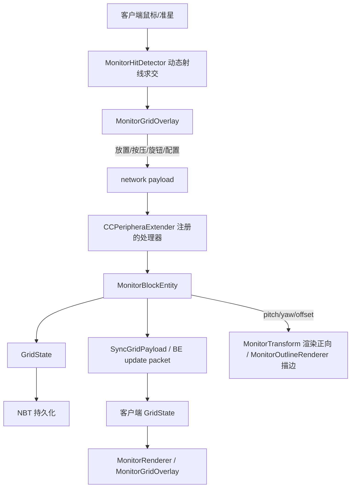
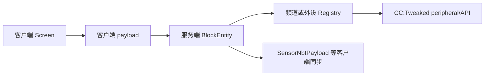

# Java 代码地图

> 用途：按行为快速定位 `src/main/java/com/zzy205/myfirstmod` 中负责该行为的代码。
> 本文记录职责、边界和数据流，不替代源码注释。新增或移动 Java 类时同步更新对应条目。

## Agent 查阅规则

- `memo/` 不会被 agent 自动全部读取；只有当前任务匹配 memo 说明，或明确要求查阅代码地图时，才应读取本文。
- 修改 Monitor、GUI、网络、渲染或兼容层时，先查本文的对应模块和“按修改目标定位”。
- 本文中的路径均相对于仓库根目录；`client/` 和 `screen/` 中具体的 `*Screen` 类只应由客户端代码加载，`*Menu` 类属于可被服务端加载的菜单逻辑。

## 总体结构

```text
com.zzy205.myfirstmod
├── CCPeripheraExtender.java       模组入口、注册和网络处理器
├── CCPeripheralExtenderClient.java 客户端注册入口
├── Config.java                    COMMON / CLIENT 配置
├── block/                         方块、方块实体、动态模型和渲染
├── channel/                       通用频道注册表与滚轮选择
├── client/                        客户端命中检测/描边/变换/背景/交互与物品渲染
├── compat/cc/                     CC:Tweaked 外设与 Lua API
├── compat/create/                 Create 红石兼容
├── compat/jei/                    JEI 配方/幽灵物品集成
├── compat/sable/                  Sable 兼容
├── foundation/gui/                可复用 GUI 图标和控件
├── item/                          物品与创造模式物品栏
├── monitor/                       Monitor 网格状态和模块模型
├── network/                       客户端/服务端自定义 payload
└── screen/                        菜单、GUI 和模块配置区
```

## 启动与注册

| 文件 | 职责 | 修改场景 |
|---|---|---|
| `src/main/java/com/zzy205/myfirstmod/CCPeripheraExtender.java` | 模组主入口；注册物品、方块、方块实体、菜单、payload、能力和配置；payload 的服务端处理逻辑也集中在这里（含 `MonitorTransformPayload` 应用 `setAngles`、`PlayOrderEffectPayload` 广播等） | 新注册表、网络处理器、能力注册、通用初始化 |
| `src/main/java/com/zzy205/myfirstmod/CCPeripheralExtenderClient.java` | 客户端专属初始化：注册 Monitor 渲染器与预加载模型、MonitorGridOverlay/OutlineRenderer 事件、Flywheel Visual、PartialModels、外部背景扫描和 GUI | 客户端注册或服务端崩溃排查 |
| `src/main/java/com/zzy205/myfirstmod/Config.java` | 模组 COMMON / CLIENT 配置项（含 Monitor 网格线/预览颜色、传动外设舵机应力 `servoStressImpact`） | 新增配置或修改配置默认值 |

## 方块与方块实体

### 注册和模型

| 文件 | 职责 |
|---|---|
| `block/MyModBlocks.java` | DeferredRegister 中的方块注册；新增方块先看这里 |
| `block/MyModBlockEntities.java` | 方块实体类型注册及方块实体与方块的绑定 |
| `block/MyModPartialModels.java` | Create/Catnip 部分模型资源位置集中定义（传动外设、控制台控件踏板/操纵杆/底座、Monitor 部件等） |

### Monitor

Monitor 为可动显示器：水平 `facing` + 偏航（yaw，-180..180）+ 俯仰（pitch，-90..90）+ 前后偏移（offset，-6..6）。渲染正向与射线求交共用同一套枢轴常量（定义在 `MonitorBlock`），严格互逆、单一来源。

| 文件 | 职责 | 修改场景 |
|---|---|---|
| `block/MonitorBlock.java` | Monitor 方块：水平朝向、放置/掉落、右键消费；可动变换的枢轴常量（`ROT_ORIGIN`/`HINGE_*`/`NECK_*`）与纯数学（`inverseToModel`/`transformPointToLocal`/`intersectScreen`/`isOnPanel`/`localToGrid`/`rayToGrid`）；碰撞体仅静态底座，选择框为静态 case（轴对齐） | 方块交互、朝向、枢轴常量、动态射线命中、掉落 |
| `block/MonitorBlockEntity.java` | 持有 `GridState`；服务端执行放置、移除、按压/释放（含玩家锁定与点击计数）、钮子开关、旋钮（含卡位吸附）、屏幕、模块/屏幕配置修改、按钮标签与灯带；保存 pitch/yaw/offset（`setAngles`）；屏幕文本/图形入口（`screen*`，格子模型：setGrid/write/setCursor/fill/draw 等）；NBT 和 BE 更新包；注册/注销 `MonitorClientRegistry` 与 `MonitorRegistry` | Monitor 状态、持久化、服务端行为、同步问题 |
| `block/MonitorRenderer.java` | BER：用 `MonitorTransform` 渲染可动 bearing/case、背景 quad（内置贴图/外部图片）、模块模型与动画（按 `(BlockPos,moduleId)` 隔离）、旋钮角度文字、按钮标签、屏幕 9 宫格 + 屏幕格子/图形（委托 `ScreenTextRenderer`） | Monitor 本体渲染、背景、模块动画、屏幕文本 |
| `block/MonitorPreloadedModels.java` | 预加载 Monitor 动态渲染所需模型：模块主模型、额外部件（钮子拉杆/旋钮把手/按钮头/指示灯）、屏幕 9 宫格部件、可动 case/bearing、6 张背景贴图精灵 | 模型加载或资源找不到 |
| `client/MonitorGridOverlay.java` | 客户端 Monitor 网格线、模块边框、放置预览（Catnip Outliner，key 按 BlockPos 前缀隔离）、鼠标交互（按钮/钮子/旋钮拖拽/屏幕两点放置）、payload 发送、打开模块配置与 Monitor 菜单；持有按 BlockPos 隔离的 `InteractionState` | 网格显示、模块交互、放置预览、多 Monitor 状态隔离 |
| `client/MonitorHitDetector.java` | 独立动态命中检测：遍历 `MonitorClientRegistry` 的候选 Monitor，用实时变换做屏幕面板正面求交，含背面剔除、距离受限、遮挡检测与 Sable 子次元坐标回投；不依赖原版 `mc.hitResult` | 命中检测、屏幕旋出方块后的交互、遮挡 |
| `client/MonitorOutlineRenderer.java` | 取消原版方块选择框（`RenderHighlightEvent.Block`），按 offset/yaw/pitch 自绘底座/bearing/case 描边（VoxelShape 无法表达连续旋转） | 选择框描边 |
| `client/MonitorTransform.java` | 渲染正向变换 helper：facing → offset → yaw → pitch；枢轴常量单一来源在 `MonitorBlock` | 渲染变换、与检测互逆 |
| `client/MonitorClientRegistry.java` | 客户端已加载 Monitor 坐标集合（`onLoad`/`setRemoved`/`onChunkUnloaded` 维护），供独立命中检测枚举候选 | 命中检测候选枚举 |
| `client/MonitorBackgrounds.java` | 扫描运行目录 `ccpe_res/monitor_bg` 的外部背景图片，注册为动态纹理（键 `custom/xxx.png`） | 外部背景、纹理加载 |
| `client/ScreenTextRenderer.java` | 屏幕渲染（格子模型）：背景格 quad（fill 填充）与字形 quad（`RenderType.textPolygonOffset` 防 z-fighting）、图形层（纯色 `POSITION_COLOR` quad）；格子坐标每帧计算；可绘制区边界 `DRAWABLE_INSET`；调试网格线开关 `DEBUG_DRAW_GRID` | 屏幕字符/背景格/图形渲染、深度、镜像问题 |

### 独立方块

| 文件 | 职责 |
|---|---|
| `block/PeripheralExtenderBlock.java` | Peripheral Extender 方块状态、交互和方块实体创建 |
| `block/PeripheralExtenderBlockEntity.java` | Peripheral Extender 的频道、过滤器、负载模式和缓存传感器 NBT |
| `screen/PeripheralExtenderMenu.java` | Peripheral Extender 服务端菜单和数据同步 |
| `screen/PeripheralExtenderScreen.java` | Peripheral Extender 客户端 GUI、过滤器/频道/传感器数据显示 |
| `block/RedstoneTransceiverBlock.java` | Redstone Transceiver 方块交互和方块实体创建 |
| `block/RedstoneTransceiverBlockEntity.java` | Receiver 的频道、横幅数据、负载模式和持久化状态 |
| `screen/RedstoneTransceiverMenu.java` | Redstone Transceiver 服务端菜单 |
| `screen/RedstoneTransceiverScreen.java` | Redstone Transceiver 客户端 GUI和输入处理 |
| `block/TransmissionPeripheralBlock.java` | Create 传动外设方块及其朝向/轴行为；`tick()` 在舵机输出 modifier 变化后重新接入动力网络 |
| `block/TransmissionPeripheralBlockEntity.java` | 传动外设方块实体：变速器模式（ratio/targetSpeed）与舵机模式（服务器权威 ±180° 角度定位 + Lua 控制 + 每 tick 同步，类 TiltAdapter）及 CC 外设实例 |
| `block/TransmissionPeripheralRenderer.java` | 传动外设的 Create 动态方块实体渲染（舵机模式下输出端按权威角度渲染） |
| `block/TransmissionPeripheralVisual.java` | 传动外设的 Create Flywheel Visual 实现（OrientedInstance，舵机模式输出端角度渲染） |
| `block/ControlDeskBlock.java` | 控制台方块：底座由 blockstate 静态模型渲染；控件安装/卸载/菜单交互（手持 pedal/joystick 右键安装、扳手蹲下右键按点击位置拆单个模块、`getDrops` 破坏掉落、`onWrenched`/`useItemOn`（空手蹲下）一律消费右键供配置菜单打开——扳手不再旋转方块）；选择框/碰撞箱 = 单块 `[0,0,8]~[16,8,16]`；`installBounds` 安装位 AABB + `hitBounds` 闭区间容差命中（不能用 `AABB.contains`，点击位置在桌体面 z=8 = 框的 maxZ）；`FACING` 四向朝向 | 控制台朝向、碰撞、控件安装/卸载、菜单交互、安装位 |
| `block/ControlDeskBlockEntity.java` | 控制台方块实体：`ControlType`（PEDAL 一对 / JOYSTICK）+ `install`/`remove`/`isInstalled`；全局频道（`ControlDeskRegistry` 注册/注销 + `occupiedChannels` 快照同步，`setChannel`/`getChannel`）；NBT 持久化（`PedalInstalled`/`JoystickInstalled`/频道/控件配置）+ `getUpdatePacket`/`writeSafe`（`PartialSafeNBT`，蓝图兼容）；服务端 ticker 模拟操纵杆轴动力学 | 控制台控件状态、频道、蓝图兼容、动画数据接入 |
| `block/ControlDeskVisual.java` | 控制台 Flywheel Visual（`SimpleDynamicVisual`）：按 BE 安装状态**动态创建/删除** TransformedInstance，叠加 底座→本体（踏板双底座/双踏板、操纵杆底座/杆把手）；每帧 `setIdentityTransform()` 必须（translate 累加语义，否则漂移） | 控制台 Flywheel 渲染、安装控件渲染、动画 |
| `block/ControlDeskRenderer.java` | 控制台原版 BER 回退渲染（Flywheel 不可用时）：按 BE 安装状态叠加控件 PartialModel（底座→本体）；渲染盒 1.5³ 防操纵杆把手（y≈17.4/16）被视锥剔除 | 控制台 BER 回退路径 |
| `client/ControlDeskPlacementOverlay.java` | 控制台客户端交互：控件安装预览（手持物品，绿=可装/红=已装）；扳手拆除预览（已装控件默认绿、视角命中安装位变红）；**控制台配置菜单打开**（右键边沿 +（扳手右键 或 空手蹲下右键）+ 准星指向控制台 → `ControlDeskConfigScreen`）；拆除预览命中判定共用 `ControlDeskBlock.hitBounds` | 安装预览、拆除预览、菜单打开、安装位调整 |

### 控制台模型布局（北向基准）

- 底座（blockstate 静态模型 `control_desk_1/my_control_desk_base.json`）：**单块桌体 `x0..16, y0..8, z8..16`**（北侧 z0..8 为空区，控件安装于此侧）。
- 控件模型（已独立为物品，位于 `models/block/pedal/`、`models/block/joystick/`，本体与底座**分开建模**）：
  - 脚踏板：`pedal.json` 左踏板（脚踏面 `x12..15, y2..7, z3..4`，22.5° x 轴倾斜，枢轴 `[13,2,3]` + 踏板杆 `x13..14, y3..4, z4..9`）；`pedal_right.json` 右踏板（x 镜像，脚踏面 `x1..4`）；`pedal_base.json` **一个模型含左右双底座**（`x12..15`/`x1..4`, `z7.5..9.5`）。
  - 操纵杆：`joystick.json`（杆 `x7..9, y3..12, z2..4` + 把手 `x6.8..9.2, y12..17.4, z1.8..4.2`）；`joystick_base.json`（底座 `x5..11, y0..8, z0..8`）。
  - 物品栏模型：`models/item/pedal.json` → `block/pedal/pedal_item`；`models/item/joystick.json` → `block/joystick/joystick_item`（均带 display 变换）。
- 安装位（预览/拆除/菜单命中共用）：`ControlDeskBlock.installBounds`，北向基准 `*_SHAPE` 常量 + `VoxelShaper` 随 FACING 旋转；北侧空区 z0..8 分三块：左踏板 `x11..16`、操纵杆 `x5..11`、右踏板 `x0..5`（操作者面朝南，左=东=+X）。调整位置改 `ControlDeskBlock` 顶部 `*_SHAPE` 常量。
- 渲染约定（已实现）：模型按与底座相同的方块空间（北向）建模，渲染时绕方块中心 Y 旋转到 FACING（与 blockstate 对底座模型的 y 旋转一致）；叠加顺序 底座→本体。
- 控件物品注册：`item/MyModItems.java` 的 `CONTROL_PEDAL`（"pedal"）/ `CONTROL_JOYSTICK`（"joystick"）。

## Monitor 状态与模块模型

| 文件 | 职责 | 修改场景 |
|---|---|---|
| `monitor/GridState.java` | 12×10 网格核心状态（屏幕面板 14×12，四周各留 1 格边框，屏幕占用格标记 `-2`）；模块/屏幕占用、ID（`0..9999` 共享命名空间）、按压/点击计数、玩家锁定、灯带、旋钮角度（含卡位步长）、模块配置、按钮标签、`ScreenRegion` 与屏幕文本缓冲（`screenTexts`）、NBT 序列化 | 任何 Monitor 数据结构或状态转移 |
| `monitor/MonitorModule.java` | 不可变模块记录：ID、类型和网格坐标（宽高取自类型） |
| `monitor/ModuleType.java` | 模块类型：`button_1`(1×1)、`toggle_switch`(1×1)、`knob`(2×2)；名称/尺寸/物品映射（`byName`/`fromItem`） | 新模块类型、尺寸或物品关联 |
| `monitor/MonitorBackground.java` | Monitor 背景选项（6 个内置键 + 外部 `custom/` 键）与默认值（蓝色棋盘）；显示名可翻译 | 背景选项/默认值变更 |
| `monitor/ScreenText.java` | 单个屏幕的格子文本缓冲（方案三，LCD 帧缓冲语义）：定长格子数组（字符 + 前景色 + 背景色，写入即覆盖）、光标制（1 起）、`setGrid`/`fill`/`replaceAll`（draw 整屏原子替换）、溢出模式、`setTextScale`（可配格子高宽比）；图形层（矩形/线段/圆）自由定位 + z 层级；NBT 紧凑序列化（int[]） | 屏幕文本/图形数据结构、格子布局、溢出模式 |
| `monitor/ButtonLabel.java` | 按钮（`button_1`）表面标签数据：文本、位置偏移、字号、颜色、投影；默认值与钳制 | 按钮标签数据或渲染 |
| `block/ModuleRenderBehavior.java` | 按模块类型选择渲染行为：Button（按压深度 + 灯带指示灯）、Toggle、Knob（旋转）；含灯带纯色面片渲染类型 | 模块动态渲染、按压/旋钮视觉状态 |

重要约束：模块和屏幕在同一 Monitor 内共享 `0..9999` ID 命名空间。`GridState.trySetId` 修改 ID 时必须同步 re-key：`modules`、`grid[][]`、`pressedModules`、`knobAngles`、`moduleConfigs`、`buttonLabels`（新增字段时别漏）。

## GUI 与配置

| 文件 | 职责 |
|---|---|
| `screen/MyModMenus.java` | 容器菜单类型注册（Peripheral Extender / Redstone Transceiver）；Monitor 的两个 GUI 不走菜单系统，由客户端直接 `mc.setScreen` 打开 |
| `screen/AbstractMonitorScreen.java` | 中间层 Screen 基类：统一在控件之上渲染子控件 tooltip（`TooltipWidget` 与 Catnip `AbstractSimiWidget`），禁用原版渐变背景，非暂停界面 |
| `screen/MonitorModuleScreen.java` | Monitor 模块/屏幕通用配置界面（继承 `AbstractMonitorScreen`）；ID 滚轮 + 悬浮文本输入条 + 类型专属配置区，汇总后发送 `ModuleConfigPayload` |
| `screen/ControlDeskConfigScreen.java` | controlDesk 配置菜单（继承 `AbstractMonitorScreen`）：背景复用 JoystickModuleScreen（`MyUIElements.BACKGROUND` 192×169）；当前含**频道滚轮条**（第一条配置，对齐 MonitorMenuScreen：跳过已占用频道，关闭时经 `ControlDeskChannelPayload` 保存），其余控件后续接入（模块设置区块、按键绑定等） |
| `screen/JoystickModuleScreen.java` / `screen/PedalModuleScreen.java` | controlDesk 控件（模块）设置菜单（继承 `AbstractMonitorScreen`）：背景复用 MonitorModuleScreen（`MyUIElements.BACKGROUND` 192×169）；操纵杆双按键绑定条 + 双滚轮条、脚踏板按键绑定条 + 回正时间条，配置经 `ControlDeskConfigPayload`/`PedalConfigPayload` 持久化。**入口 = 控制台配置菜单中点击已安装控件行**（`InstalledModulesList` 点击回调按控件类型分发）；`withReturnTo(Screen)` 设置关闭后返回的上级菜单（配置菜单传入自身，模块菜单关闭后回到配置菜单） |
| `screen/MonitorMenuScreen.java` | Monitor 自身菜单（蹲下+右键空白处/扳手右键打开，继承 `AbstractMonitorScreen`）；频道、背景、俯仰/偏航/偏移共五条滚轮，关闭时发送 `MonitorChannelPayload`/`MonitorBackgroundPayload`/`MonitorTransformPayload` |
| `screen/ModuleConfigSection.java` | 模块专属配置区接口及空实现 |
| `screen/ModuleConfigSections.java` | 按模块名称创建配置区的工厂（目前仅 KNOB → `KnobConfigSection`，其余走 Empty）；每次必须创建新实例 |
| `screen/KnobConfigSection.java` | 旋钮专属配置区：角度范围滚轮条（0-360）+ 卡位开关 |
| `screen/LoadModeHelper.java` | GUI 中负载模式的显示和选择辅助逻辑 |
| `foundation/gui/MyIcons.java` | Create 风格 GUI 图标定义（频道/背景/俯仰/偏航/偏移/ID/提示/旋钮、控制台 UP/DOWN/LEFT/RIGHT/鼠标/键盘/PEDAL_* 等） |
| `foundation/gui/MyUIElements.java` | GUI 背景元素（横条/输入框背景、控制台窗口背景 `BACKGROUND` 192×169、双输入背景 `INPUT_DOUBLE` 等）定义 |
| `foundation/gui/widget/TooltipWidget.java` | 具备独立 tooltip 渲染能力的控件接口，由 Screen（如 `AbstractMonitorScreen`）统一调用 |
| `foundation/gui/widget/HoverTintIconButton.java` | 带悬停染色的图标按钮 |
| `foundation/gui/widget/ToggleButton.java` | 可选中状态的图标切换按钮 |
| `foundation/gui/widget/ScrollValueBar.java` | 滚轮数值输入条：频道/ID 跳过占用、数值范围模式（`range`）、离散选项模式、内嵌开关（`withToggleButton`）、tooltip |
| `foundation/gui/widget/TextInputBar.java` | 长文本输入条（横条 + 图标 + 长输入框 + 内嵌 EditBox） |
| `foundation/gui/widget/DoubleInputBar.java` | 双按键绑定条（横条 + 左右两个按键槽位）：点击进入捕获（键盘/鼠标键可绑，存 `InputConstants.Key.getName()` 字符串）、ESC 取消、右键清除；捕获态显示 `> 内容(下划线) <` 居中；点击/改键音效；`onBindCaptured(side, keyName)` 回调（参考 aeroworks ModuleScreen） |
| `foundation/gui/widget/InstalledModulesList.java` | 已安装控件列表（每行 = 黑色底条 + 图标槽 + 16×16 物品栏图标 `renderItem` + 控件名称；数据构造时传入、对齐 ScrollValueBar 模式，不读 BE；悬停整行高亮；左键点击触发 `onModuleClicked` 回调（参数 = 行号）；空列表显示提示文本） |

GUI 数据流：`MonitorGridOverlay` 打开 `MonitorModuleScreen` → GUI 发送 `ModuleConfigPayload` → `CCPeripheraExtender` 在服务端调用 `MonitorBlockEntity.applyModuleConfig` → `GridState` 保存。`MonitorMenuScreen` 关闭时发送频道/背景/可动变换三个 payload。

## 网络 payload

所有 payload 的注册和处理器在 `CCPeripheraExtender`；以下文件只定义传输数据、类型和 codec。

| 文件 | 方向 | 用途 |
|---|---|---|
| `network/SyncGridPayload.java` | 服务端 → 客户端 | 同步 Monitor 的完整 GridState NBT（含模块/屏幕/文本/配置） |
| `network/ModulePressPayload.java` | 客户端 → 服务端 | Button 按下/释放或 Toggle 切换 |
| `network/ModuleKnobRotatePayload.java` | 客户端 → 服务端 | 同步旋钮累计角度 |
| `network/PlaceModulePayload.java` | 客户端 → 服务端 | 请求放置模块 |
| `network/RemoveModulePayload.java` | 客户端 → 服务端 | 请求移除模块 |
| `network/ModuleConfigPayload.java` | 客户端 → 服务端 | 修改模块/屏幕 ID 和配置（name/oldId/newId/config） |
| `network/PlaceScreenPayload.java` | 客户端 → 服务端 | 请求放置矩形屏幕 |
| `network/RemoveScreenPayload.java` | 客户端 → 服务端 | 请求移除屏幕 |
| `network/MonitorChannelPayload.java` | 客户端 → 服务端 | 保存 Monitor 全局频道号 |
| `network/ControlDeskChannelPayload.java` | 客户端 → 服务端 | 保存 controlDesk 全局频道号 |
| `network/MonitorBackgroundPayload.java` | 客户端 → 服务端 | 保存 Monitor 背景选项 |
| `network/MonitorTransformPayload.java` | 客户端 → 服务端 | 保存 Monitor 俯仰/偏航角度与前后偏移（`setAngles`） |
| `network/PlayOrderEffectPayload.java` | 服务端 → 客户端 | 广播下单 WiFi 粒子播放位置；客户端本地 `addParticle`（`WiFiParticle.Data` 无法走网络编码） |
| `network/SensorFilterPayload.java` | 客户端 → 服务端 | 保存传感器频道和负载模式 |
| `network/SensorNbtPayload.java` | 服务端 → 客户端 | 推送传感器缓存 NBT |
| `network/ReceiverSyncPayload.java` | 客户端 → 服务端 | 保存 Receiver 数据和负载模式 |

## 频道系统

| 文件 | 职责 |
|---|---|
| `channel/ChannelRegistry.java` | 通用频道注册表 `ChannelRegistry<O>`：按频道登记、查询和释放外围设备；最小空闲分配、冲突顺延、僵尸清理、占用变化回调 |
| `channel/ChannelScrollHelper.java` | GUI 滚轮选择频道/ID：钳位 → 跳过占用 → 边界反向再跳占，支持 Shift 步进 |

传感器、显示器与控制台共享同一全局频道命名空间（`compat/cc/GlobalChannelRegistry`，内部是同一个 `ChannelRegistry` 实例），保证频道全局唯一。

## CC:Tweaked 与其他兼容层

| 文件 | 职责 |
|---|---|
| `compat/cc/CCPeripheralExtenderSetup.java` | 注册 CC:Tweaked Lua API |
| `compat/cc/PeripheralExtenderAPI.java` | Peripheral Extender 的 Lua 全局 API |
| `compat/cc/GlobalChannelRegistry.java` | 传感器+显示器+控制台共享的全局频道注册表 |
| `compat/cc/PeripheralExtenderRegistry.java` | 传感器频道登记表（委托全局注册表） |
| `compat/cc/MonitorRegistry.java` | Monitor 频道登记表（委托全局注册表） |
| `compat/cc/ControlDeskRegistry.java` | 控制台频道登记表（委托全局注册表，`get(channel)` 供 `pe.getPeripheral` 查找） |
| `compat/cc/ControlDeskPeripheral.java` | 控制台的 `IPeripheral` 实现（`getType()` = `"ccpe:control_desk"`；Lua API：操纵杆原始值/轴值/带符号 + 踏板踩下判断，读 BE 数值层） |
| `compat/cc/MonitorPeripheral.java` | Monitor 的 `IPeripheral` 实现（模块/屏幕查询入口） |
| `compat/cc/ModuleHandle.java` | 模块/屏幕 Lua 实例的抽象基类（通用 get/set/tooltip） |
| `compat/cc/ModuleHandleRegistry.java` | 按模块类型把 Java 记录包装成对应的 Lua handle |
| `compat/cc/ButtonModuleHandle.java` | 按钮的 Lua API（按下/弹起/点击检测/玩家锁/灯带/标签 setLabel 系列） |
| `compat/cc/ToggleSwitchModuleHandle.java` | 钮子开关的 Lua API（锁存状态） |
| `compat/cc/KnobModuleHandle.java` | 旋钮的 Lua API（角度读写，归一化/绝对角度、档位、百分比读取） |
| `compat/cc/ScreenModuleHandle.java` | 屏幕的 Lua API（格子模型：setGrid/getGrid、光标 write/setCursorPos、fill、draw(batch) 整屏原子替换、tooltip、图形层 drawRect/Line/Circle/Point） |
| `compat/cc/RedstoneTransceiverPeripheral.java` | Redstone Transceiver 的 `IPeripheral` 实现 |
| `compat/cc/RedstoneTransceiverRegistry.java` | Receiver 频道和外设实例登记 |
| `compat/create/CreateRedstoneCompat.java` | Create 红石链接兼容，建立虚拟红石连接 |
| `compat/jei/AddonJEIPlugin.java` | JEI 分类/配方及 Receiver 的幽灵物品处理 |
| `compat/sable/SableCompat.java` | Sable 模组兼容入口（子次元 plot/world 坐标互转，命中检测用） |

## 物品

| 文件 | 职责 |
|---|---|
| `item/MyModItems.java` | 模块、方块物品和其他物品注册 |
| `item/MyModCreativeModeTabs.java` | 创造模式物品栏注册及内容 |
| `client/ToggleSwitchItemRenderer.java` | 钮子开关物品的自定义多部件渲染 |

## 按修改目标定位

| 需求 | 首先查看 | 通常还要检查 |
|---|---|---|
| 新增方块/物品 | `block/MyModBlocks.java` / `item/MyModItems.java` | `MyModBlockEntities.java`、资源模型、语言文件、创造模式物品栏 |
| 修改控制台（Control Desk）朝向、碰撞或控件安装 | `block/ControlDeskBlock.java`（朝向/碰撞/安装/卸载/安装位）、`block/ControlDeskBlockEntity.java`（控件状态/NBT/蓝图） | `ControlDeskVisual.java` / `ControlDeskRenderer.java`（渲染）、`client/ControlDeskPlacementOverlay.java`（预览）、`assets/ccpe/models/block/control_desk_1/` |
| 修改控制台控件物品（踏板/操纵杆）或安装位 | `item/MyModItems.java`（`CONTROL_PEDAL` / `CONTROL_JOYSTICK`）、`ControlDeskBlock.installBounds`（安装位 shape 常量） | `assets/ccpe/models/item/pedal.json` / `joystick.json`、`assets/ccpe/models/block/pedal/`、`assets/ccpe/models/block/joystick/`、语言文件 |
| 修改控制台配置/模块设置菜单 | `screen/ControlDeskConfigScreen.java`、`screen/JoystickModuleScreen.java`、`foundation/gui/widget/DoubleInputBar.java`（按键捕获） | `ControlDeskPlacementOverlay`（菜单打开）、`ControlDeskBlock`（右键消费）、`ControlDeskBlockEntity`（频道/配置 NBT）、`ControlDeskChannelPayload`、语言文件、`MyUIElements`/`MyIcons` |
| 修改 Monitor 右键或射线命中 | `block/MonitorBlock.java`（`intersectScreen`/`rayToGrid`）、`client/MonitorHitDetector.java` | `client/MonitorGridOverlay.java`、`MonitorClientRegistry.java` |
| 修改可动变换（俯仰/偏航/偏移） | `block/MonitorBlock.java`（枢轴常量）、`client/MonitorTransform.java` | `MonitorBlockEntity.setAngles`、`MonitorTransformPayload`、`MonitorMenuScreen`、`MonitorRenderer` |
| 修改 Monitor 选择框描边 | `client/MonitorOutlineRenderer.java` | `MonitorTransform`、`MonitorBlock` 枢轴常量 |
| 修改模块放置/删除/按压/旋钮服务端行为 | `block/MonitorBlockEntity.java`、`monitor/GridState.java` | 对应 payload、`CCPeripheraExtender.java`、渲染行为 |
| 新增 Monitor 模块类型 | `monitor/ModuleType.java` | `MyModItems.java`、`ModuleRenderBehavior.java`、`ModuleConfigSections.java`、`MonitorGridOverlay.java`、资源模型 |
| 新增模块专属配置 | `screen/ModuleConfigSection.java`、`ModuleConfigSections.java` | 新配置 section、`MonitorModuleScreen.java`、`GridState.java` |
| 修改网格尺寸、占用或 ID | `monitor/GridState.java` | Monitor 渲染、客户端命中检测、NBT 兼容、`ChannelScrollHelper` |
| 修改模块动态模型/角度/按压外观 | `block/ModuleRenderBehavior.java` | `MonitorRenderer.java`、`MonitorPreloadedModels.java`、模型资源 |
| 修改 Monitor 网格线、预览或鼠标交互 | `client/MonitorGridOverlay.java` | `MonitorHitDetector.java`、相关 payload、`Config.java`、Outliner/Catnip 规则 |
| 修改 Monitor 背景或外部图片 | `monitor/MonitorBackground.java`、`client/MonitorBackgrounds.java` | `MonitorRenderer`（renderBackground）、`MonitorPreloadedModels`（bg 精灵）、`MonitorMenuScreen` |
| 修改按钮标签 | `monitor/ButtonLabel.java`、`compat/cc/ButtonModuleHandle.java` | `MonitorBlockEntity`（setButtonLabel*）、`MonitorRenderer`（renderButtonLabel） |
| 修改 Monitor GUI 布局或公共配置 | `screen/MonitorModuleScreen.java` / `MonitorMenuScreen.java` | 对应 payload、`MonitorBlockEntity.java`、语言文件 |
| 修改客户端/服务端同步 | `CCPeripheraExtender.java`、`MonitorBlockEntity.java` | 对应 payload 的 codec、NBT 字段、客户端接收逻辑 |
| 修改传感器 GUI 或数据 | `PeripheralExtenderScreen.java` / `Menu.java` / `BlockEntity.java` | `SensorFilterPayload.java`、`SensorNbtPayload.java`、CC registry |
| 修改 Receiver GUI 或数据 | `RedstoneTransceiverScreen.java` / `Menu.java` / `BlockEntity.java` | `ReceiverSyncPayload.java`、`RedstoneTransceiverPeripheral.java` |
| 修改 CC:Tweaked Lua API | `compat/cc/PeripheralExtenderAPI.java` | `CCPeripheralExtenderSetup.java`、相关 BlockEntity 和 registry |
| 修改屏幕文本/图形渲染或 Lua API | `monitor/ScreenText.java`、`compat/cc/ScreenModuleHandle.java`、`client/ScreenTextRenderer.java` | `MonitorBlockEntity.java`（screenWrite/screenDrawRect 等）、`MonitorRenderer.java`、`SyncGridPayload` |
| 修改 Create 兼容或传动渲染 | `compat/create/CreateRedstoneCompat.java` / `TransmissionPeripheral*` | Create 源码参考和客户端注册 |
| 修改资源模型、纹理或语言 | `src/main/resources/assets/ccpe/` | 对应 Java 注册/渲染类、资源 instruction |

## 核心数据流

### Monitor 交互



### 独立外设



## 当前已知边界

- `client/`、`screen/` 中具体的 `*Screen` 类、渲染器和客户端事件不得在专用服务端加载路径中被直接引用；`*Menu` 类是服务端菜单逻辑，不属于此限制。
- 服务端是 Monitor 状态的权威来源；客户端交互类负责命中检测和发送请求，不能只修改客户端 `GridState`。
- `MonitorBlockEntity` 的 `getUpdatePacket()` 不能恢复为默认实现，否则方块更新时 BE 快照不会同步。
- 多个 Monitor 的客户端交互缓存（`MonitorGridOverlay.InteractionState`、`MonitorRenderer.animProgress`、Outliner key）必须按 `BlockPos` 隔离。
- 修改 NBT 字段时同时检查 `GridState.save/load`、`MonitorBlockEntity.saveAdditional/loadAdditional` 以及客户端同步 payload。
- 可动变换的枢轴常量统一定义在 `MonitorBlock`；渲染正向（`client/MonitorTransform`）与射线求交（`MonitorBlock.inverseToModel`/`intersectScreen`）必须严格互逆、单一来源。
- Monitor 碰撞体只有静态底座（case 不参与碰撞）；选择框由 `client/MonitorOutlineRenderer` 取消原版事件后自绘，因为 `VoxelShape` 无法表达连续旋转。
- 客户端命中检测不依赖原版 `mc.hitResult`：`MonitorHitDetector` 遍历 `MonitorClientRegistry` 枚举候选，Sable 子次元下需把视线射线回投到 plot 坐标（`SableCompat.toLocalPosition/toLocalDirection`）再求交。
- 屏幕文本（`screen*`，格子模型）走 `SyncGridPayload`（gzip 压缩 + 紧凑 int[] 编码），经 `ScreenTextRenderer` 渲染；monitor 背景平面已不可绘制（`monitorDisplay*` 通道已移除，内容只能在 screen 模块上绘制）。
- 屏幕字形用 `RenderType.textPolygonOffset(ascii.png)` 渲染（polygonOffset 防 z-fighting）：顶点格式含 UV2（必须 `.setLight`），且「北面局部 X 轴与逻辑列轴相反」（字形/矩形需水平翻转、文本列锚定右缘），详见 `memo/record_screen_text.md`。
