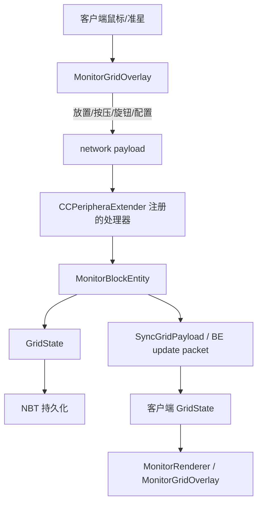
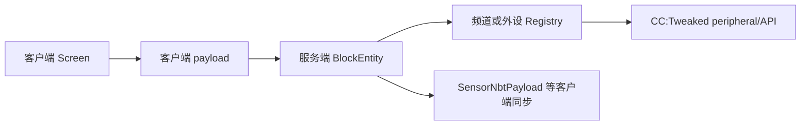

# Java 代码地图

> 用途：按行为快速定位 `src/main/java/com/zzy205/myfirstmod` 中负责该行为的代码。
> 本文记录职责、边界和数据流，不替代源码注释。新增或移动 Java 类时同步更新对应条目。

## Agent 查阅规则

- `memo/` 不会被 agent 自动全部读取；只有当前任务匹配 memo 说明，或明确要求查阅代码地图时，才应读取本文。
- 修改 Monitor、GUI、网络、渲染或兼容层时，先查本文的对应模块和“按修改目标定位”。
- 本文中的路径均相对于仓库根目录；`client/` 和 `screen/` 中具体的 `*Screen` 类只应由客户端代码加载，`*Menu` 类属于可被服务端加载的菜单逻辑。

## 总体结构

```text
com.zzy205.myfirstmod
├── CCPeripheraExtender.java       模组入口、注册和网络处理器
├── CCPeripheralExtenderClient.java 客户端注册入口
├── Config.java                    COMMON / CLIENT 配置
├── block/                         方块、方块实体、动态模型和渲染
├── channel/                       频道分配与滚轮选择
├── client/                        客户端事件、Monitor 交互和物品渲染
├── compat/cc/                     CC:Tweaked 外设与 Lua API
├── compat/create/                 Create 红石兼容
├── compat/jei/                    JEI 配方/幽灵物品集成
├── compat/sable/                  Sable 兼容
├── foundation/gui/                可复用 GUI 图标和控件
├── item/                          物品与创造模式物品栏
├── monitor/                       Monitor 网格状态和模块模型
├── network/                       客户端/服务端自定义 payload
└── screen/                        菜单、GUI 和模块配置区
```

## 启动与注册

| 文件 | 职责 | 修改场景 |
|---|---|---|
| `src/main/java/com/zzy205/myfirstmod/CCPeripheraExtender.java` | 模组主入口；注册物品、方块、方块实体、菜单、payload、能力和配置；payload 的服务端处理逻辑也集中在这里 | 新注册表、网络处理器、能力注册、通用初始化 |
| `src/main/java/com/zzy205/myfirstmod/CCPeripheralExtenderClient.java` | 客户端专属初始化，注册 Monitor 渲染器、GUI、客户端事件和物品渲染 | 客户端注册或服务端崩溃排查 |
| `src/main/java/com/zzy205/myfirstmod/Config.java` | 模组 COMMON / CLIENT 配置项 | 新增配置或修改配置默认值 |

## 方块与方块实体

### 注册和模型

| 文件 | 职责 |
|---|---|
| `block/MyModBlocks.java` | DeferredRegister 中的方块注册；新增方块先看这里 |
| `block/MyModBlockEntities.java` | 方块实体类型注册及方块实体与方块的绑定 |
| `block/MyModPartialModels.java` | Create/Catnip 部分模型资源位置集中定义 |

### Monitor

| 文件 | 职责 | 修改场景 |
|---|---|---|
| `block/MonitorBlock.java` | Monitor 方块状态、朝向、放置/拆除、右键入口和射线到网格坐标的转换 | 方块交互、朝向、命中检测、GUI 打开入口 |
| `block/MonitorBlockEntity.java` | 持有 `GridState`；服务端执行放置、移除、按压、旋钮、屏幕和配置修改，并同步客户端；负责 NBT 和 BE 更新包 | Monitor 状态、持久化、服务端行为、同步问题 |
| `block/MonitorRenderer.java` | Monitor 方块实体的模型/底板渲染 | Monitor 本体渲染 |
| `block/MonitorPreloadedModels.java` | 预加载 Monitor 动态渲染所需模型 | 模型加载或资源找不到 |
| `client/MonitorGridOverlay.java` | 客户端 Monitor 网格、模块边框、预览、鼠标交互、按钮/旋钮 payload 发送和配置 GUI 打开 | 网格显示、命中检测、模块交互、放置预览、多 Monitor 状态隔离 |

### 独立方块

| 文件 | 职责 |
|---|---|
| `block/PeripheralExtenderBlock.java` | Peripheral Extender 方块状态、交互和方块实体创建 |
| `block/PeripheralExtenderBlockEntity.java` | Peripheral Extender 的频道、过滤器、负载模式和缓存传感器 NBT |
| `screen/PeripheralExtenderMenu.java` | Peripheral Extender 服务端菜单和数据同步 |
| `screen/PeripheralExtenderScreen.java` | Peripheral Extender 客户端 GUI、过滤器/频道/传感器数据显示 |
| `block/RedstoneTransceiverBlock.java` | Redstone Transceiver 方块交互和方块实体创建 |
| `block/RedstoneTransceiverBlockEntity.java` | Receiver 的频道、横幅数据、负载模式和持久化状态 |
| `screen/RedstoneTransceiverMenu.java` | Redstone Transceiver 服务端菜单 |
| `screen/RedstoneTransceiverScreen.java` | Redstone Transceiver 客户端 GUI和输入处理 |
| `block/TransmissionPeripheralBlock.java` | Create 传动外设方块及其朝向/轴行为 |
| `block/TransmissionPeripheralBlockEntity.java` | 传动外设方块实体、转速相关逻辑和 CC 外设实例 |
| `block/TransmissionPeripheralRenderer.java` | 传动外设的 Create 动态方块实体渲染 |
| `block/TransmissionPeripheralVisual.java` | 传动外设的 Create Flywheel Visual 实现 |

## Monitor 状态与模块模型

| 文件 | 职责 | 修改场景 |
|---|---|---|
| `monitor/GridState.java` | 14×12 网格的核心状态；模块/屏幕占用、ID、按压状态、旋钮角度、配置、NBT 序列化 | 任何 Monitor 数据结构或状态转移 |
| `monitor/MonitorModule.java` | 不可变模块记录：ID、类型和网格坐标 |
| `monitor/ModuleType.java` | 模块类型、尺寸、名称和物品映射 | 新模块类型、尺寸或物品关联 |
| `block/ModuleRenderBehavior.java` | 按模块类型选择渲染行为；包含 Button、Toggle、Knob 行为 | 模块动态渲染、按压/旋钮视觉状态 |

重要约束：模块和屏幕在同一 Monitor 内共享 `0..9999` ID 命名空间。`GridState.trySetId` 修改 ID 时必须同步网格、按压状态、旋钮角度和模块配置。

## GUI 与配置

| 文件 | 职责 |
|---|---|
| `screen/MyModMenus.java` | 菜单类型注册 |
| `screen/MonitorModuleScreen.java` | Monitor 模块/屏幕通用配置界面；汇总公共配置和类型专属配置后发送 `ModuleConfigPayload` |
| `screen/ModuleConfigSection.java` | 模块专属配置区接口及空实现 |
| `screen/ModuleConfigSections.java` | 按模块名称创建配置区的工厂；每次必须创建新实例 |
| `screen/ButtonConfigSection.java` | Button 类型配置区 |
| `screen/LoadModeHelper.java` | GUI 中负载模式的显示和选择辅助逻辑 |
| `foundation/gui/MyIcons.java` | Create 风格 GUI 图标定义 |
| `foundation/gui/widget/HoverTintIconButton.java` | 带悬停染色的图标按钮 |
| `foundation/gui/widget/ToggleButton.java` | 可选中状态的图标切换按钮 |

GUI 数据流：`MonitorGridOverlay` 打开 `MonitorModuleScreen` → GUI 发送 `ModuleConfigPayload` → `CCPeripheraExtender` 在服务端调用 `MonitorBlockEntity.applyModuleConfig` → `GridState` 保存。

## 网络 payload

所有 payload 的注册和处理器在 `CCPeripheraExtender`；以下文件只定义传输数据、类型和 codec。

| 文件 | 方向 | 用途 |
|---|---|---|
| `network/SyncGridPayload.java` | 服务端 → 客户端 | 同步 Monitor 的完整 GridState NBT |
| `network/ModulePressPayload.java` | 客户端 → 服务端 | Button 按下/释放或 Toggle 切换 |
| `network/ModuleKnobRotatePayload.java` | 客户端 → 服务端 | 同步旋钮累计角度 |
| `network/PlaceModulePayload.java` | 客户端 → 服务端 | 请求放置模块 |
| `network/RemoveModulePayload.java` | 客户端 → 服务端 | 请求移除模块 |
| `network/ModuleConfigPayload.java` | 客户端 → 服务端 | 修改模块/屏幕 ID 和配置 |
| `network/PlaceScreenPayload.java` | 客户端 → 服务端 | 请求放置矩形屏幕 |
| `network/RemoveScreenPayload.java` | 客户端 → 服务端 | 请求移除屏幕 |
| `network/SensorFilterPayload.java` | 客户端 → 服务端 | 保存传感器频道和负载模式 |
| `network/SensorNbtPayload.java` | 服务端 → 客户端 | 推送传感器缓存 NBT |
| `network/ReceiverSyncPayload.java` | 客户端 → 服务端 | 保存 Receiver 数据和负载模式 |

## 频道系统

| 文件 | 职责 |
|---|---|
| `channel/ChannelRegistry.java` | 按频道登记、查询和释放外围设备；处理频道占用关系 |
| `channel/ChannelScrollHelper.java` | GUI 滚轮选择频道/ID，跳过已占用值并支持 Shift 步进 |

## CC:Tweaked 与其他兼容层

| 文件 | 职责 |
|---|---|
| `compat/cc/CCPeripheralExtenderSetup.java` | 注册 CC:Tweaked Lua API |
| `compat/cc/PeripheralExtenderAPI.java` | Peripheral Extender 的 Lua 全局 API |
| `compat/cc/PeripheralExtenderRegistry.java` | Peripheral Extender 的频道登记表 |
| `compat/cc/RedstoneTransceiverPeripheral.java` | Redstone Transceiver 的 `IPeripheral` 实现 |
| `compat/cc/RedstoneTransceiverRegistry.java` | Receiver 频道和外设实例登记 |
| `compat/create/CreateRedstoneCompat.java` | Create 红石链接兼容，建立虚拟红石连接 |
| `compat/jei/AddonJEIPlugin.java` | JEI 分类/配方及 Receiver 的幽灵物品处理 |
| `compat/sable/SableCompat.java` | Sable 模组兼容入口 |

## 物品

| 文件 | 职责 |
|---|---|
| `item/MyModItems.java` | 模块、方块物品和其他物品注册 |
| `item/MyModCreativeModeTabs.java` | 创造模式物品栏注册及内容 |
| `client/ToggleSwitchItemRenderer.java` | 钮子开关物品的自定义多部件渲染 |

## 按修改目标定位

| 需求 | 首先查看 | 通常还要检查 |
|---|---|---|
| 新增方块/物品 | `block/MyModBlocks.java` / `item/MyModItems.java` | `MyModBlockEntities.java`、资源模型、语言文件、创造模式物品栏 |
| 修改 Monitor 右键或射线命中 | `block/MonitorBlock.java` | `client/MonitorGridOverlay.java` |
| 修改模块放置/删除/按压/旋钮服务端行为 | `block/MonitorBlockEntity.java`、`monitor/GridState.java` | 对应 payload、`CCPeripheraExtender.java`、渲染行为 |
| 新增 Monitor 模块类型 | `monitor/ModuleType.java` | `MyModItems.java`、`ModuleRenderBehavior.java`、`MonitorGridOverlay.java`、资源模型、GUI 配置工厂 |
| 修改网格尺寸、占用或 ID | `monitor/GridState.java` | Monitor 渲染、客户端命中检测、NBT 兼容、`ChannelScrollHelper` |
| 修改模块动态模型/角度/按压外观 | `block/ModuleRenderBehavior.java` | `MonitorRenderer.java`、`MonitorPreloadedModels.java`、模型资源 |
| 修改 Monitor 网格线、预览或鼠标交互 | `client/MonitorGridOverlay.java` | 相关 payload、`Config.java`、Outliner/Catnip 规则 |
| 修改 Monitor GUI 布局或公共配置 | `screen/MonitorModuleScreen.java` | `ModuleConfigPayload.java`、`MonitorBlockEntity.java`、语言文件 |
| 新增模块专属配置 | `screen/ModuleConfigSection.java`、`ModuleConfigSections.java` | 新配置 section、`MonitorModuleScreen.java`、`GridState.java` |
| 修改客户端/服务端同步 | `CCPeripheraExtender.java`、`MonitorBlockEntity.java` | 对应 payload 的 codec、NBT 字段、客户端接收逻辑 |
| 修改传感器 GUI 或数据 | `PeripheralExtenderScreen.java` / `Menu.java` / `BlockEntity.java` | `SensorFilterPayload.java`、`SensorNbtPayload.java`、CC registry |
| 修改 Receiver GUI 或数据 | `RedstoneTransceiverScreen.java` / `Menu.java` / `BlockEntity.java` | `ReceiverSyncPayload.java`、`RedstoneTransceiverPeripheral.java` |
| 修改 CC:Tweaked Lua API | `compat/cc/PeripheralExtenderAPI.java` | `CCPeripheralExtenderSetup.java`、相关 BlockEntity 和 registry |
| 修改 Create 兼容或传动渲染 | `compat/create/CreateRedstoneCompat.java` / `TransmissionPeripheral*` | Create 源码参考和客户端注册 |
| 修改资源模型、纹理或语言 | `src/main/resources/assets/ccpe/` | 对应 Java 注册/渲染类、资源 instruction |

## 核心数据流

### Monitor 交互



### 独立外设



## 当前已知边界

- `client/`、`screen/` 中具体的 `*Screen` 类、渲染器和客户端事件不得在专用服务端加载路径中被直接引用；`*Menu` 类是服务端菜单逻辑，不属于此限制。
- 服务端是 Monitor 状态的权威来源；客户端交互类负责命中检测和发送请求，不能只修改客户端 `GridState`。
- `MonitorBlockEntity` 的 `getUpdatePacket()` 不能恢复为默认实现，否则方块更新时 BE 快照不会同步。
- 多个 Monitor 的客户端交互缓存必须按 `BlockPos` 隔离。
- 修改 NBT 字段时同时检查 `GridState.save/load`、`MonitorBlockEntity.saveAdditional/loadAdditional` 以及客户端同步 payload。