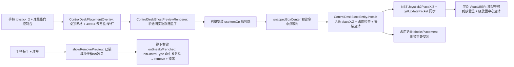

# controlDesk 棋盘网格自由放置系统（棋盘插槽）

> 记录 controlDesk 桌顶「棋盘网格」自由放置系统的**设计与实现**，作为后续添加新模块（throttle / monitor_2 / 新控件）的参考。
> **背景**：monitor_2 / throttle / joystick_2 原本共用桌体后缘上方插槽（`BACK_SLOT`，整宽一条、互斥安装）——该插槽已**整体移除**，改为在桌顶显示 6×14 的 1px 棋盘网格，模块自由放置（先做显示，放置逻辑逐步落地）。
> 本文描述的状态：**joystick_2 已完整接入**（预览 → 放置 → 存储 → 渲染 → 拆除 → 占用阻挡）；throttle / monitor_2 未接入自由放置（仍与 joystick_2 互斥）。

## 一句话

手持模块物品对准控制台 → 桌顶出现 1px 棋盘网格 → 准星吸附到 1px 格作为**放置中心** → 右键安装，模块渲染在预览盒位置（模型平移到放置位）→ 每个模块记录**占地矩形**，重叠安装被阻挡 → 扳手蹲下右键命中放置盒拆除。

## 坐标约定（北向基准，全系统统一）

- 所有模型/预览/放置坐标均为**北向基准模型空间 px（0..16）**，随桌体 FACING 旋转（绕方块中心 Y，`rotateCenteredDegrees(-facing.getOpposite().toYRot(), UP)` 同约定）。
- 桌体：`x0..16, y0..8, z8..16`（桌顶面 y=8）。桌顶放置区域 = 8 深 × 16 宽（`z8..16`）。
- **棋盘网格**：6×14 格、1px/格、四周内缩 1px → `x1..15, z9..15`（15 条竖线 + 7 条横线，`ControlDeskPlacementOverlay.showTopGrid`）。
- **放置中心** `(placeX, placeZ)`：命中点经 `ControlDeskBlock.snappedBoxCenter` 吸附到 1px 网格整数 px（客户端预览与服务端放置共用同一方法，防偏差）。
- **占地矩形**：中心 ± 半宽（joystick_2 = 4×4 → `FOOTPRINT_HALF=2`）。
- **放置位竖直（预览下沉 1px 规则）**：底 `PLACE_Y_BOTTOM=7`（嵌入桌面 1px）～ 顶 `PLACE_Y_TOP=16`（高 9）。
- **模型平移**：模型在 Blockbench 中的实际位置（中心 `MODEL_CENTER=8`、底座底 `MODEL_BOTTOM_Y=0`）→ 渲染时平移到放置位：`shift = (placeX-8, 7-0, placeZ-8) / 16`（块单位）。

## 核心常量（集中在 `ControlDeskBlockEntity`）

| 常量 | 值 | 含义 |
|---|---|---|
| `JOYSTICK_2_FOOTPRINT_HALF` | 2 | 占地半宽（px）；预览盒与占用阻挡共用 |
| `JOYSTICK_2_PLACE_Y_BOTTOM` | 7f | 放置位底 y（嵌入桌面 1px） |
| `JOYSTICK_2_PLACE_Y_TOP` | 16f | 放置位顶 y（高 9） |
| `JOYSTICK_2_MODEL_CENTER` | 8f | 模型默认中心 x/z（Blockbench 中模型 x6..10 / z6..10 → 8） |
| `JOYSTICK_2_MODEL_BOTTOM_Y` | 0f | 模型底座底 y |
| `rotationFor(Direction)` | 静态方法 | 玩家朝向 → 安装旋转：北0/南180/西90/东270 |

> 改模型位置（Blockbench）后必须同步 `MODEL_CENTER` / `MODEL_BOTTOM_Y`；改模块尺寸（占地/高度）后必须同步 `FOOTPRINT_HALF` / `PLACE_Y_BOTTOM` / `PLACE_Y_TOP`。

## 数据流



## 各文件职责与关键方法

### `block/ControlDeskBlockEntity.java`（服务端状态权威）
- 字段：`joystick2PlaceX/Z`（int，默认 8）、`backSlotRotation`（int，默认 0）
- `install(type, installFacing, placeX, placeZ)`：JOYSTICK_2 分支记录位置 + `blocksPlacement` 检查；throttle / joystick_2 记录安装朝向旋转；PEDAL / JOYSTICK 忽略位置
- `blocksPlacement(cx, cz, half)`：候选矩形 vs 已装模块占地矩形重叠判定（目前只有 joystick_2 的 4×4）
- `remove(type)`：JOYSTICK_2 重置位置为 (8,8)
- `getJoystick2PlaceX/Z()` / `getBackSlotRotation()`
- NBT：`Joystick2PlaceX` / `Joystick2PlaceZ`（四路径全覆盖，蓝图兼容；旧存档缺字段默认 8,8）
- `install`/`remove` 互斥检查目前仍保留（MONITOR_2/THROTTLE/JOYSTICK_2 三选一）——待三者全部接入自由放置后改为纯占用判定

### `block/ControlDeskBlock.java`（交互 + 纯数学工具，服务端/客户端共用）
- `useItemOn`（服务端安装）：JOYSTICK_2 → `snappedBoxCenter(pos, FACING, hitResult.getLocation())` → `install`；失败提示「已安装」/「位置被占用」（`gui.ccpe.control_desk.position_occupied`）
- `onSneakWrenched`（扳手蹲下右键）：`hitControlType` 命中 → `remove` + `Block.popResource` 掉落 + 拆除音效
- `hitControlType`：PEDAL/JOYSTICK 走 `installBounds` 安装位框；JOYSTICK_2 走 `joystick2PlaceBox` 放置盒
- `joystick2PlaceBox(desk, facing, pos)` → 世界 AABB（放置盒，拆除命中 + 客户端扳手预览共用）
- `modelToWorld(pos, x, y, z, facing)`：北向基准 px → 世界（私有；`gridWorld` 的纯数学版，无 +0.06 抬高）
- `snappedBoxCenter(pos, facing, click)` → `{cx, cz}`：命中点 → 北向模型坐标 → 吸附整数 px（**预览与放置共用的唯一吸附实现**）
- `hitBounds(bounds, click)`：闭区间 + 0.001 容差（不能直接用 `AABB.contains`，半开区间问题）
- `installBounds(type, facing, pos)`：仅 PEDAL（左右两框）/ JOYSTICK 有安装位框；MONITOR_2/THROTTLE/JOYSTICK_2 返回**空列表**

### `client/ControlDeskPlacementOverlay.java`（客户端预览，ClientTickEvent.Pre，每 tick 重绘）
- `showTopGrid`：手持 throttle / joystick_2 时桌顶 6×14 白色网格线（1/128 线宽；y=7.1 + `gridWorld` 的 +0.06 → 恰好桌顶面，防 z-fight）
- `showJoystick2Box`：手持 joystick_2 时 4×9×4 绿色盒子（1/64 线宽），被阻挡变红；盒子中心 = `ControlDeskBlock.snappedBoxCenter`
- `isJoystick2PlacementBlocked`：同类型已装 / 互斥模块已装 / `blocksPlacement` 占用重叠
- `showRemovePreview`：手持扳手时已装模块线框（PEDAL/JOYSTICK 安装位框；JOYSTICK_2 放置盒），命中变红
- `gridWorld`：北向基准 px → 世界（含 +0.06 y 抬高，仅预览绘制用）

### `client/ControlDeskGhostPreviewRenderer.java`（半透明实物预览，AFTER_BLOCK_ENTITIES）
- 仅 PEDAL / JOYSTICK / JOYSTICK_2 显示（MONITOR_2 / THROTTLE 未接入）
- JOYSTICK_2：模型平移到预览盒位（`shift`），安装朝向旋转绕盒子中心，被阻挡时不显示
- 变换链：`R_facing · [T(盒心)·R_install·T(-盒心)] · T(shift)`

### `block/ControlDeskVisual.java`（Flywheel）/ `block/ControlDeskRenderer.java`（BER 回退）
- 安装渲染与 ghost 同变换：`applyJoystick2Placement` / `renderJoystick2Part` = 平移到放置位 + 绕放置中心旋转
- **三处变换必须保持一致**：Visual、BER、Ghost（防预览与实装不一致）

### 变换链（关键，三处统一）
```
M = R_facing · [ T(placeX/16, 0.5, placeZ/16) · R_install · T(-placeX/16, -0.5, -placeZ/16) ] · T(shift)
shift = ( (placeX-8)/16, (7-0)/16, (placeZ-8)/16 )
```
- `R_facing`：`rotateCenteredDegrees(-facing.getOpposite().toYRot(), UP)`（与桌体底座模型同约定）
- `R_install`：安装朝向旋转（北0/南180/西90/东270），绕**放置中心**转（模型已平移到放置位，绕放置中心转才不甩开；Y 旋转枢轴 y 值无关）
- `T(shift)` 必须是最内层（最后调用）：先于 facing/安装旋转作用于模型空间
- 位置计算：BE 存整数 `placeX/placeZ`；渲染换算 `/16` 成块单位

## 添加新模块参考步骤（checklist）

以「把 joystick_2 的做法复制给新模块 X」为例：

1. **物品**：`MyModItems` 注册 `CONTROL_X`；`MyModCreativeModeTabs` 加入创造模式物品栏；`models/item/x.json` → 用户绘制的物品模型；lang 名称
2. **枚举与状态**：`ControlType` 加 `X`；BE 加 `xInstalled` + 放置字段（若自由放置）+ NBT 四路径（`saveAdditional`/`loadAdditional` 含 contains 守卫/`writeSafe`/`getUpdateTag`）
3. **常量**：BE 加 `X_FOOTPRINT_HALF`（占地半宽）、`X_PLACE_Y_BOTTOM/TOP`（放置位竖直）、`X_MODEL_CENTER/MODEL_BOTTOM_Y`（Blockbench 中模型实际位置）；改模型后同步
4. **块交互**：`ControlDeskBlock.controlTypeOf` / `controlItem` / `getDrops`；`useItemOn` 里计算放置中心（若中心吸附可直接复用 `snappedBoxCenter`，尺寸不同则扩展）；`installBounds` 返回空（自由放置模块）
5. **安装/拆除**：BE `install` 分支（记录位置 + `blocksPlacement` 检查 + 记录安装朝向旋转）、`remove` 分支（重置位置）；`hitControlType` 加放置盒命中；lang「位置被占用」
6. **预览**：`ControlDeskPlacementOverlay` 加手持时显示（网格加类型；盒子参考 `showJoystick2Box`，尺寸用常量）；`showRemovePreview` 加放置盒显示；`ControlDeskGhostPreviewRenderer` 加实物预览（若需要）并解除 early-return
7. **渲染**：`MyModPartialModels` 加部件；`ControlDeskVisual`（`syncInstance` + 放置变换）+ `ControlDeskRenderer`（放置变换）——三处变换保持一致
8. **占用**：`blocksPlacement` 加 X 的占地矩形判定（半宽/非方形需扩展参数）；**移除 `install` 里的旧互斥检查**（三模块全部接入后）
9. **验证**：预览位置 == 实装位置；四个朝向安装旋转正确；占用阻挡生效；扳手拆除命中放置盒；破坏掉落

## 当前状态与已知边界

- ✅ joystick_2 完整接入：桌顶网格 + 4×9×4 预览盒 + 半透明实物 + 位置存储/渲染 + 占用阻挡 + 扳手拆除
- ⏳ throttle / monitor_2：未接入自由放置——`install` 仍与 joystick_2 互斥、无放置位、无法按位置拆除（只能拆桌掉落）；接入时按上面 checklist 走，并把互斥改为纯占用判定
- 网格线是纯显示层（Outliner），逻辑全部基于放置中心 + 占地矩形
- 安装位置 = 服务端对**右键命中点**吸附（与客户端准星同射线）；多玩家极端场景如需精确可控，可改客户端发 payload（对齐 Monitor 的 PlaceModulePayload 模式）
- 预览统一「下沉 1px」规则：模块预览盒/实物/实装放置位底都在 y7（嵌入桌面 1px）；网格线在桌顶面（y8，+0.06 防 z-fight），不下沉
- 吸附中心 = 盒子中心（居中吸附）；如需 monitor 式「角落吸附」（准星=模块左上角），改 `snappedBoxCenter` 的取整方式即可
