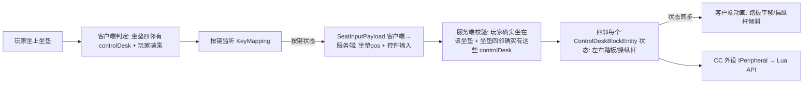

# controlDesk × Create 坐垫联动 + 可安装控件 方案

> 记录 controlDesk 的坐垫联动、可安装控件、配置存储与 Create 蓝图兼容的**设计方案与已确认决策**。
> **阶段一（控件安装系统）已实现并验证 ✅**；坐垫联动 / 按键 / 动画 / CC 外设待实施。
> 参考来源：aeroworks（`references/aeroworks-decompiled/.../content/controls/` 模块/socket 系统）、本项目 Monitor 模块系统、Create 坐垫（`SeatBlock`/`SeatEntity`）、本项目 RedstoneTransceiver 蓝图兼容案例（`create-schematic-nbt.md`）。

## 需求一句话

controlDesk **默认没有控件**（脚踏板/操纵杆），玩家需要**手动安装控件**（已实现）；玩家坐在**任意坐垫**上（该坐垫东南西北紧邻 1 格内存在至少一个 controlDesk）→ 自动进入操作模式（无需手动交互）→ 按键**广播驱动四邻所有联动的 controlDesk** 的已安装控件（Q/E 踩踏板、WASD 推操纵杆，按键可配置、踏板两种触发模式）→ 控件状态通过 **CC 外设/Lua API** 暴露。

## Create 坐垫机制（查证结果）

来源：`references/Create-mc1.21.1-dev/.../contraptions/actors/seat/SeatBlock.java`

- 坐垫是普通方块 `SeatBlock`（16 色，Create 内部类，非 API）；右键 → 服务端 `sitDown()` 创建 `SeatEntity`，位置固定在坐垫方块中心 `(x+0.5, y, z+0.5)`，`player.startRiding(seat, true)`
- 判定「坐在某坐垫上」：`player.getVehicle() instanceof SeatEntity seat && seat.blockPosition().equals(seatPos)`
- 判定「某格是坐垫」：`create:seats` 方块 tag（`AllBlockTags.SEATS`），不写死类/颜色
- **实测**：坐垫上按 WASD/空格无影响；按潜行会离开坐垫（该键行为必须保留）

## 核心判定（已定案：现查，零持久化）

**以坐垫为中心**（不依赖 controlDesk 的朝向）：

- 判定①联动存在：坐垫四邻（N/E/S/W 紧邻 1 格）内存在至少一个 controlDesk——这些 controlDesk **全部进入联动**，最多 4 个
- 判定②玩家在操作：`player.getVehicle() instanceof SeatEntity seat && seat.blockPosition().equals(seatPos)`
- 「操作模式」= ①+②同时成立；客户端、服务端各自独立现查，天然无陈旧状态

**联动目标 = 坐垫四邻的所有 controlDesk（广播）**：玩家按键时，四邻每个 controlDesk 的对应控件一起响应；没安装对应控件的 controlDesk 自动忽略。不需要选定目标。

## 总体数据流

## 控件安装系统（✅ 已实现）

### 实现细节

- **控件物品**：`item/MyModItems.java` 注册 `CONTROL_PEDAL`（"pedal"）/ `CONTROL_JOYSTICK`（"joystick"），已入创造模式物品栏；物品栏模型 parent 到 `models/block/pedal/pedal_item`、`models/block/joystick/joystick_item`（用户绘制）
- **BE 存储**（`ControlDeskBlockEntity`）：`ControlType` 枚举（PEDAL 一对 / JOYSTICK）+ `install`/`remove`/`isInstalled`；NBT 字段 `PedalInstalled`/`JoystickInstalled`；实现 `saveAdditional`/`loadAdditional`/`getUpdateTag`/`getUpdatePacket`/`writeSafe`（`PartialSafeNBT`）→ Create 蓝图兼容三件套（见下）
- **交互**（`ControlDeskBlock`）：
  - 手持控件物品右键 → 服务端安装（非创造消耗 1 个；已装提示 `gui.ccpe.control_desk.already_installed`）
  - 扳手蹲下右键 → 卸载全部已装控件并掉落物品；无控件时走 `IWrenchable` 默认拆方块
  - `getDrops` 覆写 → 方块被破坏（任何方式）时已装控件随掉落
- **安装预览**（`client/ControlDeskPlacementOverlay`，已注册）：手持控件物品 + 准星指向 controlDesk（原版 `mc.hitResult`）→ Catnip Outliner 在安装位显示预览框，绿=可装 / 红=已装；每 tick 重新 show，离开/换物品自动消失
  - 安装位 AABB = `ControlDeskBlock.installBounds(type, facing, pos)`（北向基准 shape + `VoxelShaper` 随 FACING 旋转；PEDAL 显示左右两个框）；调整位置改 `ControlDeskBlock` 顶部的 `*_SHAPE` 常量
- **渲染**：`ControlDeskVisual`（Flywheel）+ `ControlDeskRenderer`（BER 回退）按 BE 安装状态叠加，渲染顺序 **底座 → 本体**：
  - PEDAL → `pedal_base`（一个模型含左右双底座）+ `pedal`（左）+ `pedal_right`（右）
  - JOYSTICK → `joystick_base` + `joystick`
  - PartialModel 定义在 `MyModPartialModels`（`CONTROL_DESK_PEDAL*`/`CONTROL_DESK_JOYSTICK*`）
- **选择框/碰撞箱**：`ControlDeskBlock.SHAPE` 单块 `[0,0,8]~[16,8,16]`（对应底座模型），`getShape` 同时承担选择框与碰撞箱，安装控件不改变

### 踩坑经验（重要）

1. **Flywheel `TransformedInstance` 每帧必须 `setIdentityTransform()`**：`translate` 是**累加语义**，不重置会导致模型每帧漂移出视野，表现为「安装后不渲染」。Create 惯例（`BlazeBurnerVisual` 等）每帧 `setIdentityTransform().translate(...)...setChanged()` 链式设置。
2. **beginFrame 里动态 `createInstance()`/`delete()` TransformedInstance 是官方支持**（`BlazeBurnerVisual` 火焰/护目镜/帽子/杆子的先例），可以按状态动态增删实例。
3. **Flywheel `PartialModel` 自动注册**（`PartialModelEventHandler` 在 `ModelEvent.RegisterAdditional` 遍历 `PartialModel.ALL` 注册、`BakingCompleted` 填充），**无需手动注册**；移动模型文件路径不影响加载，模型缺失会烘焙成 missing（渲染为空）。
4. **控件模型拆分**：本体与底座分开建模（`pedal`/`pedal_right`/`pedal_base`、`joystick`/`joystick_base`），渲染需**分别挂 PartialModel**，别漏底座。

## 按键与交互（待实施）

- **配置界面**：对准相应元件（已安装的控件）蹲下+右键打开（对齐 Monitor 惯例）
- **按键可配置**：KeyMapping 注册（左踏板/右踏板/操纵杆 W/A/S/D），玩家设定的按键**覆盖已有按键**——自定义 KeyConflictContext（坐垫操作模式激活我们的键、原版 Q 丢物品/E 物品栏/WASD 移动失效；离开坐垫恢复）。实现前先验证 NeoForge `KeyMapping.setKeyConflictContext` 行为
- **潜行键不覆盖**（Create 坐垫按潜行=下车，必须保留）
- **默认按键**：Q=左踏板、E=右踏板、WASD=操纵杆（W 前推 / S 后拉 / A 左摆 / D 右摆）
- **按键目标**：**广播**给坐垫四邻所有联动的 controlDesk（没装对应控件的自动忽略）
- **触发模式**：踏板两种（按住式=按住踩/松开抬、切换式=按一下踩住/再按抬起），可配置；操纵杆固定按住式（不适用切换式）
- 按键状态按边沿/持续发送 payload

## 服务端状态（待实施）

- 每个联动的 controlDesk BE 各自维护：`leftPedalDown` / `rightPedalDown` / 操纵杆轴状态（浮点 x,y）；**配置需要持久化**（见下），操作运行状态按需持久化
- payload 处理器：**校验玩家确实坐在该坐垫上 + 该坐垫四邻确实存在这些 controlDesk** 才更新对应 BE 状态（防作弊/异常）
- 状态变更 → 同步客户端（`getUpdatePacket` 模式，已就绪）

## 动画（待实施，项目第一个动态渲染）

- **踏板：踩下 = 前后平移（不是旋转！）**，Visual（Flywheel）与 BER 两条路径都要支持
- **操纵杆：WASD 方向倾斜、松开回中，最大摆动 30°**
- 客户端缓存目标状态 + 上一状态插值（参考 Monitor `animProgress` 模式）

## CC 外设（待实施）

- 按项目现有模式接入（参考 `TransmissionPeripheralBlockEntity` 的外设实例 / `MonitorPeripheral` 的 IPeripheral 实现）
- Lua API 初稿：`isLeftPedalDown()` / `isRightPedalDown()` / `getJoystickX()` / `getJoystickY()`（**轴浮点 -1..1**）

## 配置存储与 Create 蓝图兼容

- 需求：配置可保存、可分享、可批量制作 → **必须兼容 Create 蓝图**；配置（已安装控件 + 控件配置，含触发模式/按键绑定）**存 BE NBT**（服务端权威），客户端从 BE 读配置生成运行时按键映射
- 参考项目实际案例 `RedstoneTransceiver`（详见 `create-schematic-nbt.md`，都是踩过的坑）：
  1. 蓝图保存路径走 `saveAdditional`（**不走** `writeSafe`）——运行时字段要在 `saveAdditional` 层排除，光实现 `writeSafe` 没用
  2. BE **必须实现 `getUpdatePacket()`**（quill 保存读的是客户端 BE，否则存出旧配置）
  3. 配置变更后 `sendBlockUpdated` + 先落盘再保存蓝图（自动存档 ~30s 间隔，会回滚未落盘配置）
- **阶段一已按此实现**：BE 的控件安装状态 NBT 持久化 + `getUpdatePacket` + `writeSafe` 全部就位

## 实施顺序

1. ✅ 控件安装系统：控件物品 + 安装/卸载交互 + BE 存储 + 蓝图兼容 + 安装预览 + 叠加渲染（**已完成，含踩坑经验**）
2. ⏳ 判定工具 + 服务端校验骨架（坐垫四邻联动 + 玩家骑乘判定，无 UI 效果，可断点验证）
3. ⏳ 客户端按键监听 + payload 链路（重点验证按键冲突 KeyConflictContext 方案）
4. ⏳ BE 状态 + 服务端权威更新 + 广播同步
5. ⏳ 动画（踏板平移、操纵杆 30° 倾斜）
6. ⏳ 配置 GUI（自绘背景/控件，蹲下右键对准控件打开；按键重绑定 + 触发模式）
7. ⏳ CC 外设 + Lua API（Lua 侧验证信号）

## 待确认 / 风险清单

| # | 问题 | 影响 |
|---|---|---|
| 1 | 按键冲突方案需进游戏验证（NeoForge KeyConflictContext 对原版键的实际效果） | 按键 |
| 2 | 按键绑定存 BE 后，多个玩家对同一 controlDesk 的按键习惯冲突如何处理（配置跟随机器 vs 跟随玩家） | 配置 |
| 3 | 配置 GUI 的贴图/控件由用户绘制（进行中） | GUI |
| 4 | 踏板平移行程/操纵杆 30° 的具体动画参数 | 动画 |
| 5 | 广播语义：坐垫四邻多个 controlDesk 同时响应时，各自控件安装情况不同（未安装的忽略）——需确认无额外要求 | 联动 |
| 6 | 控件物品安装位固定为北面（模型空间 -Z 侧）预览，位置可在 `ControlDeskBlock` 的 `*_SHAPE` 常量调整——确认当前位置满意 | 安装位 |
