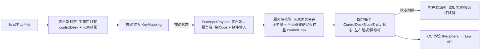

# controlDesk × Create 坐垫联动 + 可安装控件 方案

> 记录 controlDesk 的坐垫联动、可安装控件、配置存储与 Create 蓝图兼容的**设计方案与已确认决策**。
> **阶段一（控件安装系统）✅ 已实现；阶段二（模块设置菜单 + 按键绑定 UI）✅ 已实现**；坐垫联动 / 按键驱动 ✅、动画（操纵杆 + 踏板）✅、CC 外设注册 + Lua API ✅ 已实施；踏板触发模式（切换式）待接入。
> 参考来源：aeroworks（`references/aeroworks-decompiled/.../content/controls/` 模块/socket 系统 + ModuleScreen 按键捕获）、本项目 Monitor 模块系统、Create 坐垫（`SeatBlock`/`SeatEntity`）、本项目 RedstoneTransceiver 蓝图兼容案例（`create-schematic-nbt.md`）。

## 需求一句话

controlDesk **默认没有控件**（脚踏板/操纵杆），玩家需要**手动安装控件**（已实现）；玩家坐在**任意坐垫**上（该坐垫东南西北紧邻 1 格内存在至少一个 controlDesk）→ 自动进入操作模式（无需手动交互）→ 按键**广播驱动四邻所有联动的 controlDesk** 的已安装控件（Q/E 踩踏板、WASD 推操纵杆，按键可配置、踏板两种触发模式）→ 控件状态通过 **CC 外设/Lua API** 暴露。

## Create 坐垫机制（查证结果）

来源：`references/Create-mc1.21.1-dev/.../contraptions/actors/seat/SeatBlock.java`

- 坐垫是普通方块 `SeatBlock`（16 色，Create 内部类，非 API）；右键 → 服务端 `sitDown()` 创建 `SeatEntity`，位置固定在坐垫方块中心 `(x+0.5, y, z+0.5)`，`player.startRiding(seat, true)`
- 判定「坐在某坐垫上」：`player.getVehicle() instanceof SeatEntity seat && seat.blockPosition().equals(seatPos)`
- 判定「某格是坐垫」：`create:seats` 方块 tag（`AllBlockTags.SEATS`），不写死类/颜色
- **实测**：坐垫上按 WASD/空格无影响；按潜行会离开坐垫（该键行为必须保留）

## 核心判定（已定案：现查，零持久化）

**以坐垫为中心**（不依赖 controlDesk 的朝向）：

- 判定①联动存在：坐垫四邻（N/E/S/W 紧邻 1 格）内存在至少一个 controlDesk——这些 controlDesk **全部进入联动**，最多 4 个
- 判定②玩家在操作：`player.getVehicle() instanceof SeatEntity seat && seat.blockPosition().equals(seatPos)`
- 「操作模式」= ①+②同时成立；客户端、服务端各自独立现查，天然无陈旧状态
- 实现：`ControlDeskSeatLink.seatPosOf`（判定②）/ `findLinkedDesks`（判定①）/ `isOperating`（操作模式），客户端 `SeatControlListener` 与后续服务端 payload 校验均调用

**联动目标 = 坐垫四邻的所有 controlDesk（广播）**：玩家按键时，四邻每个 controlDesk 的对应控件一起响应；没安装对应控件的 controlDesk 自动忽略。不需要选定目标。

## 总体数据流

## 控件安装系统（✅ 已实现）

### 实现细节

- **控件物品**：`item/MyModItems.java` 注册 `CONTROL_PEDAL`（"pedal"）/ `CONTROL_JOYSTICK`（"joystick"）/ `CONTROL_MONITOR_2`（"monitor_2"）/ `CONTROL_THROTTLE`（"throttle"），已入创造模式物品栏；物品栏模型 parent 到 `models/block/pedal/pedal_item`、`models/block/joystick/joystick_item`、`models/block/control_desk_1/monitor_2/monitor_2`、`models/block/control_desk_1/throttle/throttle_item`（用户绘制）
- **BE 存储**（`ControlDeskBlockEntity`）：`ControlType` 枚举（PEDAL 一对 / JOYSTICK / MONITOR_2 / THROTTLE）+ `install`/`remove`/`isInstalled`；NBT 字段 `PedalInstalled`/`JoystickInstalled`/`Monitor2Installed`/`ThrottleInstalled`；实现 `saveAdditional`/`loadAdditional`/`getUpdateTag`/`getUpdatePacket`/`writeSafe`（`PartialSafeNBT`）→ Create 蓝图兼容三件套（见下）；**MONITOR_2 与 THROTTLE 共用桌体后缘上方插槽，互斥安装**（`install` 内判断）
- **交互**（`ControlDeskBlock`）：
  - 手持控件物品右键 → 服务端安装（非创造消耗 1 个；已装提示 `gui.ccpe.control_desk.already_installed`）
  - 扳手蹲下右键 → 按点击位置拆除对应的**单个**模块并掉落物品（`onSneakWrenched`）；点击不在安装位时不拆；光桌（无模块）走 `IWrenchable` 默认拆方块
  - `getDrops` 覆写 → 方块被破坏（任何方式）时已装控件随掉落
- **安装预览**（`client/ControlDeskPlacementOverlay`，已注册）：手持控件物品 + 准星指向 controlDesk（原版 `mc.hitResult`）→ Catnip Outliner 在安装位显示预览框，绿=可装 / 红=已装；每 tick 重新 show，离开/换物品自动消失
  - **半透明模型预览**（`client/ControlDeskGhostPreviewRenderer`，已注册，参考 aeroworks `SocketPlacementClient#onRenderLevelStage`）：手持控件物品 + 准星指向 controlDesk 且该位置**可安装**（未装该控件）→ 在安装位渲染控件**半透明模型**（`RenderLevelStageEvent.AFTER_BLOCK_ENTITIES` + `CachedBuffers.partial` + `RenderType.translucentMovingBlock()` + `color(255,255,255,110)` 约 43% + 固定光照 `0xF000F0`；facing 旋转与 BER 同一约定 `rotateCenteredDegrees(-facing.getOpposite().toYRot())`）；与线框预览**共存**（对齐 aeroworks socket 线框 + ghost 模型方案），已装位置仍只显示红色线框；部件列表 = `ControlDeskRenderer` 安装渲染的底座→本体（PEDAL base+左右 / JOYSTICK base+杆 / MONITOR_2 单体 / THROTTLE base+手柄+指示灯 / JOYSTICK_2 base+手柄）
  - 安装位 AABB = `ControlDeskBlock.installBounds(type, facing, pos)`（北向基准 shape + `VoxelShaper` 随 FACING 旋转；PEDAL 显示左右两个框；MONITOR_2/THROTTLE 共用桌体后缘上方整宽一条 `(0,8,8)~(16,14,16)`，互斥安装）；调整位置改 `ControlDeskBlock` 顶部的 `*_SHAPE` 常量
- **渲染**：`ControlDeskVisual`（Flywheel）+ `ControlDeskRenderer`（BER 回退）按 BE 安装状态叠加，渲染顺序 **底座 → 本体**：
  - PEDAL → `pedal_base`（一个模型含左右双底座）+ `pedal`（左）+ `pedal_right`（右）
  - JOYSTICK → `joystick_base` + `joystick`
  - MONITOR_2 → `control_desk_1/monitor_2/monitor_2`（单体，静态）
  - THROTTLE → `control_desk_1/throttle/throttle_base` + `throttle_handle`（平移动画）+ `throttle_indicator`（**指示灯：随油门档位大小从暗红(0xFF560101)→亮红(0xFFCD0000) 线性着色**，参考 Create analog lever 指示灯 / Simulated throttle_lever diode——BER `SuperByteBuffer.color()`、Flywheel `colorArgb()`，`ThrottleMotion.indicatorColor(gear)`）
  - PartialModel 定义在 `MyModPartialModels`（`CONTROL_DESK_PEDAL*`/`CONTROL_DESK_JOYSTICK*`/`CONTROL_DESK_MONITOR_2`/`CONTROL_DESK_THROTTLE*`）
- **选择框/碰撞箱**：`ControlDeskBlock.SHAPE` 单块 `[0,0,8]~[16,8,16]`（对应底座模型），`getShape` 同时承担选择框与碰撞箱，安装控件不改变

### 踩坑经验（重要）

1. **Flywheel `TransformedInstance` 每帧必须 `setIdentityTransform()`**：`translate` 是**累加语义**，不重置会导致模型每帧漂移出视野，表现为「安装后不渲染」。Create 惯例（`BlazeBurnerVisual` 等）每帧 `setIdentityTransform().translate(...)...setChanged()` 链式设置。
2. **beginFrame 里动态 `createInstance()`/`delete()` TransformedInstance 是官方支持**（`BlazeBurnerVisual` 火焰/护目镜/帽子/杆子的先例），可以按状态动态增删实例。
3. **Flywheel `PartialModel` 自动注册**（`PartialModelEventHandler` 在 `ModelEvent.RegisterAdditional` 遍历 `PartialModel.ALL` 注册、`BakingCompleted` 填充），**无需手动注册**；移动模型文件路径不影响加载，模型缺失会烘焙成 missing（渲染为空）。
4. **控件模型拆分**：本体与底座分开建模（`pedal`/`pedal_right`/`pedal_base`、`joystick`/`joystick_base`），渲染需**分别挂 PartialModel**，别漏底座。
5. **partial model 透明贴图必须在模型 JSON 里加 `"render_type": "minecraft:cutout"`**：Flywheel `Models.partial` 经 `BakedModelBufferer` 按 `model.getRenderTypes` 分渲染层，缺省 = solid（**忽略 alpha，透明区域渲染成不透明**）；BER 路径固定 `cutoutMipped` 不受 JSON 影响。参考：monitor case（`my_monitor_case.json` 带 cutout）、Simulated throttle_lever 的 button.json 同款声明。

## 控制台配置菜单（🔶 骨架）与模块设置菜单（✅ 已实现）

### 打开方式（配置菜单）

- **扳手普通右键（不蹲下）** 或 **空手蹲下右键**，准星指向 controlDesk（**任意位置**）→ 打开控制台配置菜单 `ControlDeskConfigScreen`（背景复用 JoystickModuleScreen：`MyUIElements.BACKGROUND` 192×169）
- **当前配置**：① 频道滚轮条（第一条，对齐 MonitorMenuScreen：跳过已占用频道；复用 PE/Monitor 的全局频道注册表 `GlobalChannelRegistry`（经 `ControlDeskRegistry` 登记），频道全局唯一；关闭时经 `ControlDeskChannelPayload` → 服务端 `setChannel` 注册 + 落盘 + 蓝图兼容）；② 已安装控件列表（`InstalledModulesList`：物品栏图标 + 控件名称，数据来自客户端 BE 安装状态；**悬停整行高亮，点击行打开对应模块配置菜单**（操纵杆 `JoystickModuleScreen` / 脚踏板 `PedalModuleScreen`，`withReturnTo` 使模块菜单关闭后返回本配置菜单））；其余配置控件（按键绑定、触发模式等）后续接入
- **扳手蹲下右键** → 拆除命中的模块（服务端 `onSneakWrenched`，掉落物品）；客户端 overlay 不拦截此组合（不打开菜单，让右键事件传到服务端）
- 实现分层（对齐 Monitor 模式，Block 双端加载不引用 Screen）：
  - `ControlDeskBlock.onWrenched`：一律消费右键（**不再旋转方块**，`getRotatedBlockState` 已移除）
  - `ControlDeskBlock.useItemOn`：空手蹲下 → 一律消费右键
  - `client/ControlDeskPlacementOverlay`：右键**边沿**检测（`useDown && !lastUseDown` 防连发）+（扳手 或 空手蹲下）→ 准星指向控制台 → 打开 `ControlDeskConfigScreen`
- **模块设置菜单入口**：控制台配置菜单中点击已安装控件行（`InstalledModulesList` 点击回调按控件类型分发）→ 打开对应模块设置菜单（`JoystickModuleScreen` / `PedalModuleScreen`）

### 控件设置菜单（JoystickModuleScreen / PedalModuleScreen）

- 两屏幕均继承 `AbstractMonitorScreen`；背景复用 MonitorModuleScreen（`MyUIElements.BACKGROUND` 192×169 + 标题控件名）；`ControlDeskPlacementOverlay` 按命中控件类型分发
- `JoystickModuleScreen`（操纵杆）布局（自上而下）：① 前后键位绑定条（W/S，默认 w/s）② 前后轴设置条 `DoubleScrollValueBar`（左=回正时间 icon RECOVER 默认 2 tick 范围 0..100；右=档位/自由模式 ToggleButton：未选中 icon FREE_MODE = 自由模式满偏 tick 数（默认 2 范围 1..100），选中 icon INDEX = 档位数（默认 4 范围 1..31）；两值独立记忆，右槽数值/范围/tooltip 随开关状态切换）③ 左右键位绑定条（A/D，默认 a/d）④ 左右轴设置条（同上结构）；`PedalModuleScreen`（脚踏板）：① 左踏板按键绑定条（PEDAL_LEFT_UP / PEDAL_LEFT_DOWN）② 右踏板按键绑定条（PEDAL_RIGHT_UP / PEDAL_RIGHT_DOWN）③ 回正时间条 `ScrollValueBar`（icon RECOVER，默认 2 tick 范围 0..100，左右两踏板共用）④ 满偏时间条 `ScrollValueBar`（icon FREE_MODE，默认 2 tick 范围 1..100，踩下/抬起按住到满偏所需 tick 数，左右共用）
- **操纵杆配置已全部持久化**：BE NBT（两轴回正时间 `JoystickReturnTime`/`JoystickReturnTimeYaw` + 两轴档位模式 `GearModePitch`/`GearCountPitch`/`GearModeYaw`/`GearCountYaw` + 两轴自由模式满偏 tick 数 `JoystickFreeSpeedPitch`/`JoystickFreeSpeedYaw` + 四向按键 `JoystickKeyUp/Down/Left/Right`，旧存档缺失字段时保持默认）+ `saveAdditional`/`loadAdditional`/`writeSafe`/`getUpdateTag` 四路径 + `getUpdatePacket` 同步；屏幕打开时读客户端 BE 初始化、`onClose` 经 `ControlDeskConfigPayload`（pos + 两轴回正时间 + 两轴档位开关/档位数/自由速度 + 4 键，共 13 字段）→ 服务端 setter（`setJoystickReturnTime`/`setJoystickReturnTimeYaw`/`setGearConfig`/`setJoystickFreeSpeed`/`setJoystickKeys`）

### DoubleInputBar（双按键绑定条，`foundation/gui/widget/`）

- 左右两个按键槽位（命中区 `HIT_X_1=45`/`HIT_X_2=123`/`HIT_W=47`），各带图标 + 按键名显示（槽位内居中）
- **按键捕获（参考 aeroworks ModuleScreen）**：左键点击槽位进入捕获 → 键盘键 `InputConstants.getKey(keyCode, scanCode).getName()` / 鼠标键 `Type.MOUSE.getOrCreate(button).getName()` 均可绑定 → ESC(256) 取消；右键点击槽位清除绑定
- 显示：未绑定 →「未绑定」（`bind_unbound`）；捕获中 → `> 内容(仅内容下划线) <` 居中，颜色不变
- 音效：进入捕获/清除 `UI_BUTTON_CLICK`（aeroworks playUiClick 风格）、改键成功 `NOTE_BLOCK_HAT`（ScrollValueBar 风格）
- tooltip「左键绑定 右键清除」（`bind_tip`）；完成回调 `onBindCaptured(side, keyName)`（side 0=左 1=右，空串=清除）

## 按键与交互（✅ 坐垫驱动已接入；✅ 踏板按住式已实施，切换式待接入）

- **配置界面**：🔶 控制台配置菜单已就位（扳手右键 / 空手蹲下右键打开 `ControlDeskConfigScreen`），首条配置 = 频道（复用全局频道注册表，经 `ControlDeskChannelPayload` 保存）+ 已安装控件列表（点击行打开对应模块设置菜单）；按键配置已存 BE（操纵杆四键 + 脚踏板四键 + 油门杆两键，见「配置存储与 Create 蓝图兼容」）；模块设置菜单（`DoubleInputBar` 按键捕获等）已实现，入口 = 配置菜单点击已安装控件行
- **联动判定 + 按键监听**：✅ `ControlDeskSeatLink`（判定① 坐垫四邻 N/E/S/W 紧邻 1 格的 controlDesk 全部联动，最多 4 个；判定② 玩家骑乘 Create `SeatEntity`；操作模式 = ①+②，客户端/服务端各自现查零持久化）+ `SeatControlListener`（客户端每 tick 现查：进入操作模式输出联动信息，按下任一联动控制台**已安装控件**所配置的按键 → 边沿检测 debug 日志，含按键含义与归属控制台）；✅ payload 链路已接入（`SeatInputPayload` 每 tick 上报四方向 + 踏板四键按住态 → 服务端校验 → BE 权威模拟）；按键冲突方案已决定不实施
- **虚拟摇杆 HUD overlay（测试用，默认关闭）**：✅ `SeatControlState`（客户端共享状态：操作模式 / 有无操纵杆 / 模拟轴 axisX,axisY(-1..1 带动力学) / 原始值 rawX,rawY(0/1) / 轴值 analogX,analogY(0..1 = |axis|)）+ `JoystickOverlay`（`LayeredDraw.Layer` 经 `RegisterGuiLayersEvent` 挂在 HOTBAR 之上，右下角**贴图方案**：底座 `textures/gui/joy_stick_ui.png` + 摇杆头 `textures/gui/crosshair.png`；摇杆头位置 = 圆心 + **模拟轴** × 行程，与 3D 动画同源、无额外平滑层；曾用 `fillCircle` 逐行扫描画圆、后又加 SMOOTHED 平滑层，均已弃）；**显示由客户端配置 `joystickOverlayEnabled` 控制（默认关闭）**；轴目标 = 操纵杆方向槽位**并集**（任一联动控制台该方向绑定的键按下即生效）；设计参考 aeroworks ConsoleHudOverlay
- **按键可配置**：控件按键绑定存 BE，操作模式下读原始 GLFW 状态驱动控件——**操作模式下已实施 drain 原版 KeyMapping 点击**（`ClientTickEvent.Pre` 先于 `handleKeybinds` 消费：把联动控制台绑定的键对应的所有 KeyMapping 的 click 提前清空，拦截 E 开物品栏/聊天/丢弃等点击驱动动作，无需 mixin；按住态动作如移动/跳跃坐垫骑乘时天然抑制，无需处理；潜行下车保留）
- **潜行键不覆盖**（Create 坐垫按潜行=下车，必须保留）
- **默认按键**：左踏板 踩下=Q / 抬起=E、右踏板 踩下=E / 抬起=Q、WASD=操纵杆（W 前推 / S 后拉 / A 左摆 / D 右摆）
- **按键目标**：**广播**给坐垫四邻所有联动的 controlDesk（没装对应控件的自动忽略）
- **触发模式**：踏板两种（按住式=按住踩 → 踏板 +z、按住抬 → 踏板 -z、都松开 → 按回正时间归零，**已实施**；切换式=按一下踩住/再按抬起，待接入），可配置；操纵杆固定按住式（不适用切换式）
- **油门杆（前进/后退按键与档位切换节奏均可配置）**：默认 空格 = 前进（模型空间 +x）/ 左Ctrl = 后退（-x），可经 `ThrottleModuleScreen` 的 `DoubleInputBar` 改绑（存 BE `ThrottleKeyForward`/`ThrottleKeyBack`，见「配置存储与 Create 蓝图兼容」）；`SeatControlListener` 操作模式下读联动油门台 BE 配置的按键（原始 GLFW 状态），经 `SeatInputPayload`（11 字段）上报（联动有装油门杆的控制台才上报）；**档位模式**：1px = 1 档（档位 0..11，默认最低档 0），按住满**配置的档位切换节奏**（`ThrottleTicksPerGear`，默认 4，范围 1..100）tick 进/退一档（连续按住每满 N tick 一档），**锁存不回正**；每个档位切换播放一次 LEVER_CLICK（音调随档位上升：前进从低到高、后退从高到低，0.75→1.5）；渲染端（Visual/BER）张力充电进度同步跟随 BE 配置的节奏
- 按键状态 ✅ 每 tick 经 `SeatInputPayload`（坐垫 pos + 四方向按住态）发送；离开坐垫/打开 GUI 时发一次全 false 释放

## 服务端状态（✅ 已实施：操纵杆轴状态 + 踏板压下值）

- **操纵杆轴状态（浮点 x,y）**：✅ `ControlDeskBlockEntity.joystickAxisX/Y`（-1..1），**服务端权威**；BE 挂服务端 ticker（`ControlDeskBlock.getTicker` → `tickServer`），每 tick 按**本 BE 自己的配置**模拟（自由模式线性累加/回正、档位模式按下边沿步进，共用 `JoystickTilt` 动力学）；轴值变化 `notifyChange` → `getUpdatePacket` 广播
- **输入租约**：payload 校验通过后写入（玩家 UUID + 坐垫 pos + 四方向按住态）；tickServer 每 tick 校验「玩家仍骑乘在该坐垫上」，否则清除输入（断线/离开兜底）——档位模式轴值保持、自由模式自然回正
- **油门档位状态**：✅ `ControlDeskBlockEntity.throttleGear`（**0..MAX_TRAVEL_PX**，1px = 1 档，默认最低档 0，服务端权威）+ 输入租约（前进/后退按住态）+ 充电计数 `throttleChargeTicks`；tickServer 模拟（前进按住充电满 {@code TICKS_PER_GEAR}（4）tick 进一档 / 后退同样退一档 / 无输入锁存并清零充电 / 到顶底充电清零不动作）；每个档位切换 `notifyChange` + 播放一次 `LEVER_CLICK`（`ThrottleMotion.pitchForGear` 音调随档位上升 0.75→1.5，最低档不响）；`getThrottleAxis()` = 档位/MAX 经 `getUpdatePacket` 广播；同步/落盘规则同踏板轴（只写 `getUpdateTag`、客户端 `loadAdditional` 的 `contains` 守卫读，不进 `saveAdditional`/`writeSafe`）
- **payload 处理器**：✅ `SeatInputPayload` 处理器**校验玩家确实坐在该坐垫上**（`ControlDeskSeatLink.seatPosOf`）才把输入写入坐垫四邻装了操纵杆的 BE（防作弊/异常）
- **状态变更 → 同步客户端**：✅ `getUpdatePacket` 模式；轴状态只**写** `getUpdateTag`、客户端经 `loadAdditional` 的 `contains` 守卫**读**（不落盘、不进 `writeSafe`，蓝图/存档不含运行时状态，服务端读盘恒为 0）
- **渲染读 BE 轴值**：✅ `JoystickTilt.targetDeg(be)` 直接读客户端 BE 的轴值——所有客户端一致，非联动控制台不受本地玩家输入影响

## 动画（操纵杆 ✅ 倾斜 / 踏板 ✅ 平移）

- **操纵杆**：✅ WASD 方向倾斜、松开回中，**最大 15°**（用户定稿，原 30° 作废），绕枢轴 **(8,6,3)**（Blockbench 找的旋转中心，模型像素）；**分层约定：数值层线性累加 + 动画层指数逼近** —— 数值 = **BE 运行时轴状态 `joystickAxisX/Y`（服务端权威，经 getUpdatePacket 同步）**（本地 `SeatControlState` 仅 HUD overlay 用，配置取第一个装操纵杆的控制台）：**自由模式**（档位开关关）按下按 `JoystickTilt.pressStep`（= 1/满偏tick，满偏 tick 数可配置，默认 2）累加、松开每 tick 向 0 累加 1/回正时间 `JoystickTilt.returnStep`（0 = 关闭回正保持不动）；**档位模式**（开关开）**关闭自动回正**，检测按键**按下边沿**（服务端按上一 tick 输入判定），进/退一档：轴值 = 离散档位 `pos(k) = -1 + 2k/(档位数-1)`（相邻档间隔 `JoystickTilt.gearStep` = **2/(档位数-1)**：2 档 = {-1,1}、3 档 = {-1,0,1}、4 档 = {-1,-1/3,1/3,1}；按住不重复步进），钳位两端；**离开坐垫档位保持**（服务端输入租约失效清除输入后：档位模式轴值保持、自由模式自然回正；渲染读 BE 轴值，所有客户端一致，非联动控制台不受本地玩家输入影响）；各 BE 用**自己的**两轴配置模拟（X 轴用 Yaw 系列、Y 轴用 Pitch 系列），CC 接口直接读数值层（BE 轴值）；**动画层**各渲染端（Visual 实例字段 / BER `Map<BlockPos,float[]>` / overlay SMOOTHED map）用 `JoystickTilt.approach` **指数逼近**追逐数值（aeroworks SMOOTHED 模式，`SMOOTH_DECAY=0.3`/tick，帧时间修正 `getGameTimeDeltaTicks`）；曾用 partialTick 线性插值方案（已弃）；Flywheel 路径 `TransformedInstance` 变换链 `rotateCentered → translate(pivot) → rotateX/rotateZ → translate(-pivot)`，BER 路径 SuperByteBuffer 同链（参考 Create HarvesterRenderer pivot 模式）；**方向符号待进游戏验证**（W=前推 / D=右摆 对应 rotateX/rotateZ 正负，反了翻转 `JoystickTilt.targetDeg` 符号）；**档位步进手感待进游戏验证**（每按一次进/退一档、按住不连跳；档位数 = 1 时步长为 0 不动作；**偶数档位（如 4 档）中心 0 不是档位**，从中心首次按下会吸附到最近档位——四舍五入向上取整偏前进方向，如 4 档从中心按前进直接到满偏 1，按后退到 -1/3，若手感不对可改为向下取整）
- **踏板：踩下/抬起 = 前后平移（不是旋转！）**：✅ 已实施（Visual（Flywheel）+ BER 双路径）。数值 = BE 运行时轴值 `pedalLeftAxis/pedalRightAxis`（-1..1，服务端权威，经 getUpdatePacket 同步，不落盘）——**踩下键按住按满偏时间线性累加（`JoystickTilt.pressStep`，满偏 tick 数可配置 `PedalFreeSpeed`，默认 2）、抬起键按住向 -1 累加、都不按按回正时间线性归零**（`JoystickTilt.stepAxis` + `returnStep`，左右共用 `PedalReturnTime`，默认 2）；**动画层**各渲染端用 `JoystickTilt.approach` 指数逼近追逐 `PedalMotion.targetPx`（= 轴值 × `MAX_TRAVEL` 1px），平移方向 = **模型空间 z 轴**（踩下 = **+z**、抬起 = **-z**，随 FACING 旋转仍沿桌面法线；Flywheel 在 facing 旋转后链式 `translate(0,0,px)`、BER SuperByteBuffer 同链，均为模型空间变换）；**方向符号已进游戏验证**（踩下 +z / 抬起 -z 正确）
- **油门：手柄沿模型空间 x 轴平移（不是旋转）**：✅ 已实施（Visual（Flywheel）+ BER 双路径）。数值 = BE **离散档位**（0..11，服务端权威）；**动画 = 档位位置 + 操作者本地"张力蠕动"**（`ThrottleMotion.tensionPx`）：按住前进/后退时把手向下一档方向**稍微移动**（≤ 1/3px，`SeatControlState.throttleDir` 驱动，仅联动控制台）；**张力充电进度由渲染层用帧时间平滑推进**（每帧 `frameTicks / TICKS_PER_GEAR` 累加，档位步进/按键边沿清零——避免游戏时间整 tick 跳变导致渲染卡顿），满 {@code TICKS_PER_GEAR}（4）tick 档位步进（客户端观察到档位变化清零）→ **张力清零 + `approachStep` 快速逼近（`STEP_DECAY=0.1`）突然到位**（参考 knob 卡位：吸附档位 + 前半程微扭动）；目标平移量 = 档位 × 1px（`MAX_TRAVEL_PX`=11px；**模型默认 handle 在底端（-x 端），0 偏移起步**），平移方向 = **模型空间 x 轴**（BlockBench 中取的方向，随 FACING 旋转仍沿桌面方向）；**档位模式 / 4 tick 一档 / 张力蠕动 / 帧平滑已按用户定稿**

## CC 外设（✅ 外设注册 + Lua API 已接入，待 Lua 侧验证信号）

- ✅ 控制台已注册为 CC:T 外设：`ControlDeskPeripheral`（`getType()` = `"ccpe:control_desk"`，equals 按方块位置），`ControlDeskBlockEntity.getPeripheral()` 懒加载（对齐 `MonitorBlockEntity` 模式）
- ✅ 查找链路（参考 Monitor，已进游戏验证）：`pe.getPeripheral(ch)`（`PeripheralExtenderAPI.getPeripheral`：先查传感器 → 再查 `MonitorRegistry` → **`ControlDeskRegistry.get(ch)` 分支**）返回控制台外设；`peripheral.wrap(...)` 经 `CCPeripheralCapabilities` 能力注册直接可用；频道与传感器/显示器共享 `GlobalChannelRegistry` 命名空间（全局唯一）
- ✅ Lua API（按定稿实现，直接读数值层 = BE 服务端权威状态，**对齐 Monitor 的「外设 → 模块实例」模式**）：
  - 外设 `getModule(name)`（`mainThread=true`，仅构造实例不读状态）→ 返回模块实例：`"pedal"` → `PedalModuleHandle`、`"joystick"` → `JoystickModuleHandle`、`"throttle"` → `ThrottleModuleHandle`；未安装对应控件返回 nil
  - **模块实例上的状态读取方法全部 `mainThread=false`**（Lua 侧高频轮询直接跑 CC worker 线程，不占主线程）：
    - `PedalModuleHandle`：模拟量 `getLeftPedal()/getRightPedal()`（-1..1：+1 踩下 / -1 抬起）+ 差值 `getPedalDifference()`（右 − 左，-2..2）+ 方向判断 `isLeftPedalDown()/isRightPedalDown()`（轴值 > 0）与 `isLeftPedalUp()/isRightPedalUp()`（轴值 < 0，均含回正余量）
    - `JoystickModuleHandle`：原始值 `isJoystickXActive()/isJoystickYActive()`（boolean：该轴有无按键动作，读服务端输入租约）+ 轴值 `getJoystickX()/getJoystickY()`（0..1 幅度 = |轴值|）+ 带符号 `getJoystickXSigned()/getJoystickYSigned()`（-1..1）
    - `ThrottleModuleHandle`：原始值 `isThrottleForwardActive()/isThrottleBackActive()`（boolean：前进/后退键按住态，读服务端输入租约）+ 档位 `getThrottleGear()`（0..11 整数，锁存不回正）+ 轴值 `getThrottleAxis()`（0..1 = 档位/MAX，满前进 = 1）
  - 定稿写的 0/1 按项目惯例实现为 boolean（Lua 中 0 为真值，boolean 语义更正确）
- **踩坑（重要）**：CC:Tweaked 把 `@LuaFunction` 方法收集成 Lua 表返回；**没有任何 Lua 方法的 IPeripheral 对象会被判为 unknown type 返回 nil**（`CobaltLuaMachine#toValue` 日志 `Received unknown type '...', returning nil`）——`peripheral.wrap/find` 走能力路径不受影响（所以能 wrap 到、但 `pe.getPeripheral` 返回 nil）。Lua API 实现后此问题自然消失，占位 `ping()` 已删

## 配置存储与 Create 蓝图兼容

- 需求：配置可保存、可分享、可批量制作 → **必须兼容 Create 蓝图**；配置（已安装控件 + 控件配置，含触发模式/按键绑定）**存 BE NBT**（服务端权威），客户端从 BE 读配置生成运行时按键映射
- 参考项目实际案例 `RedstoneTransceiver`（详见 `create-schematic-nbt.md`，都是踩过的坑）：
  1. 蓝图保存路径走 `saveAdditional`（**不走** `writeSafe`）——运行时字段要在 `saveAdditional` 层排除，光实现 `writeSafe` 没用
  2. BE **必须实现 `getUpdatePacket()`**（quill 保存读的是客户端 BE，否则存出旧配置）
  3. 配置变更后 `sendBlockUpdated` + 先落盘再保存蓝图（自动存档 ~30s 间隔，会回滚未落盘配置）
- **阶段一已按此实现**：BE 的控件安装状态 NBT 持久化 + `getUpdatePacket` + `writeSafe` 全部就位
- **操纵杆配置已全部持久化**：两轴回正时间 + 两轴档位模式（开关 + 档位数，默认关 / 4 档）+ 两轴自由模式满偏 tick 数（默认 2，范围 1..100）+ 四向按键（默认 w/s/a/d）存 BE NBT 四路径全覆盖；`JoystickModuleScreen` 打开时读客户端 BE 初始化、`onClose` 经 `ControlDeskConfigPayload`（13 字段）→ 服务端 setter（`notifyChange` 同步）
- **脚踏板配置已全部持久化**：回正时间（`PedalReturnTime`，左右共用）+ 满偏时间（`PedalFreeSpeed`，左右共用）+ 四个按键绑定（`PedalKeyLeftUp`/`PedalKeyLeftDown`/`PedalKeyRightUp`/`PedalKeyRightDown`）存 BE NBT 四路径全覆盖；`PedalModuleScreen` 打开时读客户端 BE 初始化、`onClose` 经 `PedalConfigPayload`（6 字段，与操纵杆包分离防互覆盖）→ 服务端 setter（`setPedalReturnTime`/`setPedalFreeSpeed`/`setPedalKeys`）
- **油门杆配置已全部持久化**：前进/后退按键（`ThrottleKeyForward`/`ThrottleKeyBack`，默认 空格/左Ctrl，空串 = 未绑定）+ 档位切换节奏（`ThrottleTicksPerGear`，默认 4，范围 1..100）存 BE NBT 四路径全覆盖；`ThrottleModuleScreen` 打开时读客户端 BE 初始化、`onClose` 经 `ThrottleConfigPayload`（4 字段，与操纵杆/踏板包分离防互覆盖）→ 服务端 setter（`setThrottleKeys`/`setThrottleTicksPerGear`）
- **待接入**：踏板触发模式（切换式；按住式已随踏板控制实施）

## 实施顺序

1. ✅ 控件安装系统：控件物品 + 安装/卸载交互 + BE 存储 + 蓝图兼容 + 安装预览 + 叠加渲染（含踩坑经验）
2. ✅ 判定工具（`ControlDeskSeatLink`：坐垫四邻联动 + 玩家骑乘判定，客户端/服务端共用）✅ 客户端按键监听（`SeatControlListener` 边沿检测 + 日志）✅ 服务端校验 + payload 链路（`SeatInputPayload`）
3. ✅ payload 链路（坐垫校验 → BE 轴状态 → 广播）已接入；✅ 操作模式下 drain 原版 KeyMapping 点击（拦截 E 开物品栏等点击驱动动作，无需 mixin；见风险 1）
4. ✅ BE 运行时轴状态（`joystickAxisX/Y`）+ 服务端权威更新（BE ticker 用 `JoystickTilt` 动力学模拟）+ 广播同步（`getUpdatePacket`）
5. ✅ 操纵杆倾斜动画（15°、枢轴 8,3,3、**模拟轴动力学驱动**：按下逼近 ±1 / 松开按回正时间归零，Flywheel Visual + BER 双路径）；✅ 踏板平移动画（踩下 = 模型空间 +z 1px / 抬起 = -z 1px、指数逼近平滑，Flywheel Visual + BER 双路径，`PedalMotion` 单一实现）
6. 🔶 配置 GUI：✅ 控制台配置菜单（`ControlDeskConfigScreen`：扳手右键 / 空手蹲下右键打开；首条配置 = 频道滚轮条，复用全局频道注册表）+ 模块菜单背景 + 双按键绑定条 + 双滚轮条（回正/档位）+ 操纵杆全部配置持久化 + 脚踏板回正时间条与按键绑定持久化 已完成；⏳ 配置菜单其余控件（模块设置区块重新接入、脚踏板触发模式配置等）
7. ✅ CC 外设注册（`ControlDeskPeripheral` + `pe.getPeripheral` / `peripheral.wrap` 可查，参考 Monitor 链路）✅ Lua API（操纵杆原始值/轴值/带符号 + 踏板踩下判断 + 油门档位/轴值/按住态，直接读 BE 数值层）；⏳ Lua 侧验证信号
8. ✅ 油门杆（throttle）档位逻辑 + 动画：写死按键（空格=前进 +x / 左Ctrl=后退 -x）→ `SeatInputPayload`（11 字段）→ 服务端校验 → BE 油门**档位**（0..11 离散，服务端权威，`getUpdatePacket` 广播）→ 手柄沿模型空间 x 轴平移（档位 × 1px，`approachStep` 快速逼近段落感）；每档切换 LEVER_CLICK 音效（音调随档位上升 0.75→1.5）；✅ 接配置 UI（`ThrottleModuleScreen`：`DoubleInputBar` 前进/后退 + `ScrollValueBar` 档位切换节奏 → `ThrottleConfigPayload` → BE NBT 持久化 + `SeatControlListener` 读 BE 配置驱动，渲染端张力充电同步跟随 BE 配置）

## 待确认 / 风险清单

| # | 问题 | 影响 |
|---|---|---|
| 1 | ✅ 按键冲突：操作模式下 drain 原版 KeyMapping 点击（`ClientTickEvent.Pre` 先于 `handleKeybinds` 消费，见 `SeatControlListener.drainConflictingClicks`；按住态动作坐垫骑乘天然抑制，潜行下车保留） | 按键 |
| 2 | 按键绑定存 BE 后，多个玩家对同一 controlDesk 的按键习惯冲突如何处理（配置跟随机器 vs 跟随玩家） | 配置 |
| 3 | 按键/回正时间配置保存链路已实施（操纵杆 + 脚踏板，`ControlDeskBlockEntity` NBT + `getUpdatePacket`/`writeSafe` 蓝图兼容）；触发模式（按住式/切换式）UI 待做 | 配置 |
| 4 | 踏板平移行程已定 1px（踩下 +z / 抬起 -z，已进游戏验证）；操纵杆方向符号待进游戏验证（反了翻转 `JoystickTilt.targetDeg` 符号） | 动画 |
| 5 | 广播语义：坐垫四邻多个 controlDesk 同时响应时，各自控件安装情况不同（未安装的忽略）——需确认无额外要求 | 联动 |
| 6 | 安装位固定为北侧 z0..8 三块（左踏板 x11..16 / 操纵杆 x5..11 / 右踏板 x0..5）+ 桌体后缘上方整宽插槽（monitor_2 / throttle 共用互斥，y8..14 z8..16），`ControlDeskBlock` 的 `*_SHAPE` 常量可调——确认当前位置满意 | 安装位 |
| 7 | 触发模式（按住式/切换式）配置 UI 待做 | 配置 GUI |
