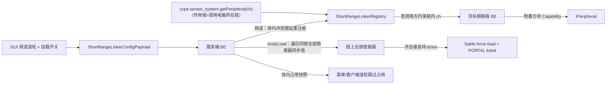

# 短程信号链接器（ccpe:short_range_linker）实现方案

> 状态：**功能全部落地，待进游戏验证**（`./gradlew.bat classes` 通过）。已落地：`ShortRangeLinkerRegistry`（物理体作用域频道注册表）、`ShortRangeLinkerBlock` / `ShortRangeLinkerBlockEntity`（频道 + bodyLoad 共享开关 + ticket + 红石 + **附着方块 NBT 缓存**（默认关，Lua `enableNbtCache` 开启并配置刷新间隔，默认 20 tick；`getNbt`/`getAllNbt` 直读缓存）+ NBT/蓝图）、注册（方块/BE/菜单/创造标签/主入口 clear）、资源（blockstate 6 形态：地面 1 + 天花板 1 + 墙壁 4；**躺/竖共用一个模型** `models/block/short_range_link/short_range_link.json`（用户自建扁平小方块）+ 贴图 `textures/block/short_range_link/tex.png`；语言键 `block.ccpe.short_range_linker` + `gui.ccpe.short_range_linker.*`）、**选择框抄 static_port**（`VoxelShaper.forDirectional(Block.box(5,0,5,11,3,11), UP)`，FLOOR→UP / CEILING→DOWN / WALL→水平四向）、**音效对齐 static_port（SoundType.COPPER）**、GUI（Menu extraData 传频道/占用快照/bodyLoad；Screen 频道滚轮跳过同体占用 + 「加载物理体」ToggleButton + 非物理体提示 + tooltip 前景层）、payload（`ShortRangeLinkerConfigPayload` + `ShortRangeLinkerPacketHandlers`，经 `ModPackets` 注册）、Lua API（**并入 `ccpe.sensor_system`，原计划 `ccpe.link` 已删除**）、wiki 页面（`wiki/docs/sensor-system/short-range-linker.md` + `.zh.md`，已入 mkdocs 导航）。待做：第八节进游戏验证。
> 已确认决策：API = `getPeripheral` + 红石输入/输出，**模块并入 `ccpe.sensor_system`（原计划 `ccpe.link` 已废弃）**；非物理体严格不链接；物理体 = Sable 约束链；物理体加载 = 链上共享开关；方块 ID = `ccpe:short_range_linker`。
> 目标代码：`src/main/java/com/zzy205/myfirstmod` 下新增 block / compat/cc / screen / network 若干类（见文件清单）。

## 一、需求背景

实际游玩中 `peripheral_extender`（pe）的频道是全局的（`GlobalChannelRegistry`，与 Monitor / 控制台共享同一频道命名空间），但绝大多数场景只需在**单个物理体**（一架飞机 / 车辆）内做短程外设获取。新增「短程信号链接器」：**频道作用域限定在单个物理体（Sable 约束链）内**，类似 monitor 模块 ID 只在当前 monitor 上唯一。

## 二、核心语义

1. **频道只在一个物理体内寻址**：同一物理体（含约束链）上的链接器共享频道空间；不同物理体上的相同频道号互不干扰（互相查不到）。
2. **非物理体严格不链接**：链接器不在任何 Sable 物理体上时**不注册频道**，Lua 查询一律返回 nil，GUI 显示「需放置在物理体上」。
3. **同体频道唯一 + 冲突顺延**（详见第九节「频道唯一性语义」）。
4. **Lua API（全局 API，模块 = `ccpe.sensor_system`，作用域 = 调用电脑所在物理体；已落地，原计划 `ccpe.link` 废弃）**：
   - `getPeripheral(channel)` → 本体内频道 `channel` 的目标设备外设：链接器 → 附着方块外设；**控制台（controlDesk）也占用同一频道空间**（`ControlDeskRegistry` 委托本注册表）→ 返回控制台自身外设（Capability 查询，mainThread=true）
   - `getRedstoneOutput(channel)` / `getRedstoneInput(channel)` → 目标链接器红石输出 / 输入（mainThread=false）
   - `setRedstoneOutput(channel, signal)` → 写目标链接器红石输出并更新方块 POWERED（mainThread=true）
   - **NBT 缓存三方法（与 pe 不同：默认关闭，需显式开启）**：`enableNbtCache(channel, ticks?)`（mainThread=true；`ticks` 缺省 20，`<=0` 关闭；开启后服务端按间隔刷新附着方块 NBT 快照）→ `getNbt(channel, path)` / `getAllNbt(channel)`（mainThread=false 直读 volatile 缓存；路径语法与 `ccpe.pe.get` 相同，复用 `PeripheralExtenderAPI.resolvePath`/`convertCompoundToMap`）；开关 + 间隔随 NBT/蓝图持久化（BE 字段 `nbtCacheEnabled`/`nbtCacheInterval`，快照本身不落盘，onLoad 置脏首 tick 重建）
   - **作用域解析照抄 `SensorSystemAPI.resolveSubLevel()`**：`computer.getLevel()` + `computer.getPosition()` → `SableCompat.getContainingSubLevel` → `getConnectedChain` 得链 UUID 集合 → 在该链内查频道。**实现 = 链 UUID 集合在 `SensorSystemAPI.update()`（服务端主线程）缓存进 volatile `chainUuids`，Lua 线程只读**（照 SensorSystemAPI 高频缓存模式；顺带避免红石读方法在电脑线程直接碰 Sable，最多滞后 1 tick）。
5. **物理体加载 = 链上共享开关**（新增需求，见第四节）。
6. **全局频道体系不动**：pe / Monitor / 控制台的 `GlobalChannelRegistry` 保持原样，向后兼容；新注册表完全独立。

## 三、物理体作用域机制（照抄 BodySensorRegistry 模式）

按子次元 UUID 登记、查询时按约束链聚合——天然抗「链动态变化」（轴承连接/断开）：

```text
ShortRangeLinkerRegistry
├── 数据：Map<UUID, Map<Integer, ShortRangeLinkerBlockEntity>>   // subLevelId → (频道 → 链接器)
├── 登记：register(desired, linker) → 取 linker 所在子次元 UUID；desired 已被「同一链内」
│         其它链接器占用 → 顺延；返回实际频道（体内冲突顺延，复用 ChannelRegistry 顺延思路）
├── 查询：get(chainUuids, channel) → 在 chainUuids 这些子次元的条目里找 channel
│         （自动覆盖「两个体经轴承连接后合并」的情况）
├── 注销：unregister(channel, linker)（setRemoved 时）
├── 僵尸清理：isRemoved 判定（照 GlobalChannelRegistry）
└── 占用快照：occupiedChannels(chainUuids) → 供 GUI 跳过同体占用（不是全局）
```

**链动态变化**：BE 每 20 tick 复核所在子次元 UUID（照 FMC/INS 既有复核模式）——两个体被轴承连接后频道空间自动合并，同体冲突由复核 + 顺延兜底；断开后自动恢复各自独立。

## 四、共享物理体加载设置（链上所有链接器共用）

镜像 pe 的 loadMode=2（Sable force-load ticket + PORTAL ticket，见 `PeripheralExtenderBlockEntity.tryRegisterSableTicket` / `serverTick`），但**开关是链上共享的**：

1. 每个链接器持久化 `bodyLoad` 布尔（NBT，`saveAdditional` + `writeSafe` 蓝图都存）。
2. **共享语义（last-toggle-wins）**：任一链接器切换 `bodyLoad` → 服务端遍历同链全部链接器，把**同一个值**写入它们的 `bodyLoad` 并 `setChanged` + `sendBlockUpdated`——链上所有链接器的 GUI 开关显示一致（"开和关反映在所有链接器里"）。
3. **生效条件**：`bodyLoad=true` 的链接器各自按 pe 模式注册 force-load + PORTAL ticket（每个开启的链接器独立持有，冗余但无害——与 pe 多传感器同体行为一致，Sable 按 (ticketType, key=pos) 去重），并每 20 tick 复核 ticket。
4. **onLoad 采用 OR 自愈**：新放置 / 重新加载的链接器若同链已有任一 `bodyLoad=true`，把自己的标志同步为 true——保证共享开关一致（部署蓝图 / 新放链接器不会出现"别人开着、自己关着"）。
5. **非物理体上**：开关禁用（GUI 提示，不能开启，因为本来就不注册）。
6. **与 pe 的加载模式相互独立**：各自 ticket，互不影响。
7. **链断开**：两半各自保持原共享值（原先 on 则两边继续加载）。

## 五、文件清单

### 新增（Java）

| 文件 | 职责 |
|---|---|
| `compat/cc/ShortRangeLinkerRegistry.java` | 物理体作用域频道注册表（第三节设计，纯逻辑） |
| ~~`compat/cc/ShortRangeLinkerAPI.java`~~（**已删除**） | 原 `ccpe.link` Lua API；四个方法已并入 `compat/cc/SensorSystemAPI.java`（见「修改（Java）」表） |
| `block/ShortRangeLinkerBlock.java` | 贴附式方块：**复制 `PeripheralExtenderBlock`**（FACE/FACING/POWERED、canSurvive、红石 getSignal/isSignalSource、右键开 GUI、扳手拆除、`getAttachedPos` 复用；开菜单前 `refreshOccupiedChannels()` 保证占用快照最新） |
| `block/ShortRangeLinkerBlockEntity.java` | BE：频道持久化、`bodyLoad` 共享开关 + ticket 管理、onLoad/setRemoved 注册注销、20 tick 链复核、红石输出/输入（照 pe BE）、体内占用快照、`PartialSafeNBT.writeSafe` |
| `screen/ShortRangeLinkerMenu.java` | 服务端菜单：传 pos、当前频道、**体内**占用频道数组、当前 `bodyLoad` |
| `screen/ShortRangeLinkerScreen.java` | 客户端 GUI：频道滚轮（跳过同体占用）+ 「加载物理体」ToggleButton + 非物理体提示 + **tooltip 前景层**（照 `AbstractMonitorScreen.renderWidgetTooltips`，否则 tooltip 被后渲染的「完成」按钮盖住） |
| `network/ShortRangeLinkerConfigPayload.java` | 客户端→服务端：保存频道 + bodyLoad（照 `SensorFilterPayload` codec 模式） |
| `network/ShortRangeLinkerPacketHandlers.java` | payload 服务端处理器：非物理体忽略 → 频道冲突顺延回写 → `setBodyLoad` 同步全链 → 刷新占用快照广播 |

### 新增（资源）

`assets/ccpe/blockstates/short_range_linker.json`、`models/block/…`、`models/item/…`、贴图（可先复用 pe 贴图）、`lang/en_us.json` + `zh_cn.json`（"Short-Range Signal Linker" / "短程信号链接器"）、创造模式物品栏条目。

### 修改（Java）

| 文件 | 改动 |
|---|---|
| `block/MyModBlocks.java` | 注册 `short_range_linker` 方块 |
| `block/MyModBlockEntities.java` | 注册 BE 类型并绑定 |
| `compat/cc/SensorSystemAPI.java` | **并入链接器四方法**（getPeripheral / 红石三件套）+ `chainUuids` 缓存（`update()` 主线程刷新）；`CCPeripheralExtenderSetup` 无需改动（SensorSystemAPI 本就已注册） |
| `network/ModPackets.java` | 注册 `ShortRangeLinkerPacketHandlers`（payload 实际注册入口；原计划的 `CCPeripheraExtender.java` 未改动） |
| `screen/MyModMenus.java` | 注册菜单类型 |
| `item/MyModCreativeModeTabs.java` | 加入创造标签 |

**不触碰**：`GlobalChannelRegistry` / `PeripheralExtenderRegistry` / `MonitorRegistry` / `ControlDeskRegistry` / pe 全部现有逻辑。

## 六、数据流



## 七、实现步骤（按序执行，状态已更新）

1. **`ShortRangeLinkerRegistry`**：纯逻辑注册表（登记 / 体内顺延 / 链查询 / 注销 / 僵尸清理 / 体内占用快照 / 按链遍历链接器）——先行完成，后续全部依赖它。✅ 已落地
2. **Block + BE**：复制 pe 方块结构；BE 实现注册注销、20 tick 链复核、`bodyLoad` 共享同步 + ticket 管理、红石、NBT、`writeSafe`。✅ 已落地
3. **Lua API**：原计划 `ShortRangeLinkerAPI`（作用域解析照 `SensorSystemAPI.resolveSubLevel`）+ 注册到 `CCPeripheralExtenderSetup`。✅ 已落地，**但按用户要求改为并入 `SensorSystemAPI`（模块 `ccpe.sensor_system`），`ShortRangeLinkerAPI` / `ccpe.link` 已删除**，链 UUID 走 `update()` 缓存。
4. **GUI**：Menu + Screen（频道滚轮 + 加载开关）+ payload + 菜单与 payload 注册。✅ 已落地（另加 tooltip 前景层修复按钮遮挡）
5. **注册与资源**：方块/BE 注册、blockstate/模型/贴图/语言/创造标签。✅ 已落地
6. **编译**：`./gradlew.bat classes` 通过。✅ 编译通过；⏳ 进游戏验证（第八节清单）

## 八、进游戏验证清单

1. 同一架飞机（同一物理体）上：目标链接器设频道 1 → 电脑上 `require("ccpe.sensor_system").getPeripheral(1)` 能取到目标附着方块外设（如传感器 / NavTable）。
2. 两架飞机各用频道 1 → 互不干扰：A 机电脑查不到 B 机外设（返回 nil）。
3. 轴承连接的螺旋桨与机身算同一体 → 可互查（验证约束链聚合）。
4. 地面静态放置（非物理体）→ 不注册、查询返回 nil、GUI 显示「需放置在物理体上」。
5. `setRedstoneOutput(1, 15)` → 目标链接器方块 POWERED 变化、相邻红石线亮；`getRedstoneInput` 读数正确。
6. 同体两个链接器抢同一频道 → 后者顺延（GUI 占用跳过 + 注册日志）。
7. **共享加载开关**：链上链接器 A 开启「加载物理体」→ 链上全部链接器 GUI 开关都变开（A 关闭 → 全部变关）；远离后物理体仍被加载（force-load 生效）；pe 的加载模式不受影响。
8. **蓝图**：Create 蓝图保存 / 部署后频道与 `bodyLoad` 不丢（`writeSafe`），部署后同链开关经 OR 自愈一致。
9. 已有存档的 pe / Monitor / 控制台频道全部不受影响（回归验证）。
10. **NBT 缓存**：默认不缓存（`getNbt`/`getAllNbt` 返回 nil/空表）→ `enableNbtCache(1)` 后 `getAllNbt(1)` 返回附着方块 NBT（首个 tick 即有快照）；改间隔 `enableNbtCache(1, 5)` 后刷新频率变化；`enableNbtCache(1, 0)` 关闭后读取返回 nil；重进存档 / 蓝图部署后开关与间隔保持、首个 tick 快照重建；附着方块 NBT 变化（如油箱油量）在间隔内反映。

## 九、频道唯一性语义（详细）

**背景**：pe 全局频道是 1:1（频道号 → 传感器，冲突顺延，`ChannelRegistry.register`）；monitor 模块 ID 也是 1:1（0..9999 共享命名空间，`GridState.trySetId` 冲突处理）。「频道唯一性」问的是：**在同一个物理体内，一个频道号到底指什么、谁可以占用它**。

**推荐语义（寻址模型，类比 monitor 模块 ID）**：

- 频道号是链接器在物理体内的**地址**：每个链接器占一个频道号，同体内 1:1（频道 → 链接器），注册时冲突自动顺延到下一个空闲号。
- **查询方（电脑）不需要自己的频道号**：`ccpe.sensor_system` 是全局 Lua API，作用域 = 调用电脑所在物理体；`getPeripheral(N)` 的 `N` 是**目标链接器的地址**，不是自己的频道。链接器只放在目标块上（像 pe 传感器），电脑侧零配置。
- 不同物理体频道号独立：A 机频道 1 和 B 机频道 1 各指各的，互不可见。
- GUI 滚轮**跳过同体已占用**频道（不是全局占用），放置时若同体冲突自动顺延。

**为什么必须唯一**：若允许同体内多个链接器用同一频道，`getPeripheral(N)` 就产生歧义——该返回哪个？（first-match / 距离最近都不可预测，且 Lua 侧无法感知）唯一性保证「频道 N 要么空闲、要么唯一指向一个链接器」，寻址确定、无歧义。这与 monitor 模块 ID 的语义完全一致（每个模块有唯一 ID，用 ID 引用模块）。

**备选语义（配对模型，不推荐）**：两个链接器（查询侧 + 目标侧）设**同一个**频道号表示"配对"，`getPeripheral(ch)` 返回同链上同频道的"另一个"。问题：3 个及以上同频道时配对歧义；且若强制唯一，配对就退化成"查询侧自己也占一个号"，与寻址模型等价但更绕。若你确实想要"查询侧也要放一个链接器、两边同号配对"的玩法，再单独讨论（会影响注册表与 GUI 设计）。

## 十、已知边界与坑

- **物理体身份用「链」而非单一子次元**：链动态变化（轴承连接/断开）由 20 tick 复核 + 冲突顺延兜底；这是与 pe 全局注册表最大的行为差异点。
- **GUI 占用快照是体内范围**：菜单打开时由服务端按链计算好传客户端，不复用 `GlobalChannelRegistry.occupiedChannelsArray()`。
- **蓝图兼容**：`writeSafe` 只存频道 + `bodyLoad`（照 pe），AttachedNBT / 占用快照 / ticket 状态属运行时数据不落盘。
- **bodyLoad 是共享值（last-toggle-wins）**：后切换者覆盖全链；若想要「任一开启即加载」的 OR 开关语义需再讨论（当前 OR 只用于 onLoad 自愈）。
- **冗余 ticket**：链上所有开启的链接器各自持有 ticket（与 pe 多传感器同体行为一致，Sable 按 (ticketType, key=pos) 去重，无害）。
- **Sable 坐标投影**：本轮 API 不含 NBT 读取，无坐标投影需求；将来若加 `getAll` 再复用 `PeripheralExtenderBlock.tryAddRealWorldPos`。
- **作用域 = 调用电脑所在物理体**：电脑不在任何物理体上时 `ccpe.sensor_system` 查询一律 nil（严格语义，与「非物理体不链接」一致）。作用域解析由 `update()` 主线程缓存 `chainUuids`，Lua 侧最多滞后 1 tick。
