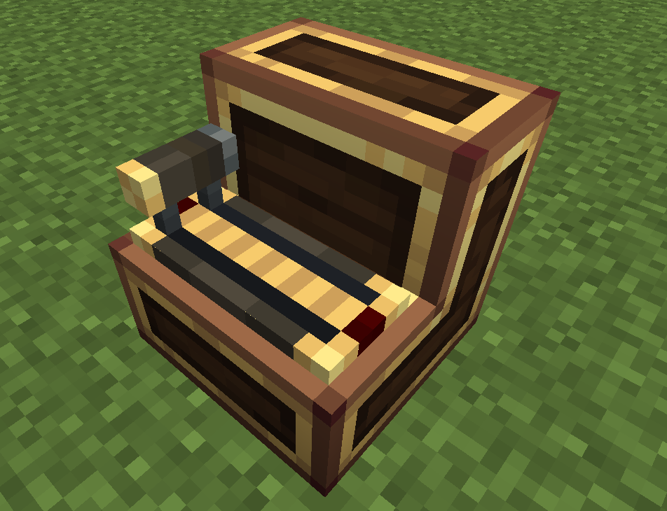

# Baffle

The Baffle is a desk **form conversion**, not a separate control. It turns a [Control Desk](overview.md) into a **3/4 stair shape**.

**Install**: hold a **Create Brass Casing** (`create:brass_casing`) and right-click an already-placed desk. The desk's model switches to the stair form and the selection box follows the new shape.

## Effects

- A full-height wall covers the front area (`z0..8`), the rear half stays a low tabletop — the desk becomes a 3/4-block stair.
- **Top grid modules are unaffected**: [Joystick 2](joystick_2.md), [Throttle](throttle.md), [Throttle 2](throttle_2.md) and [Monitor 2](monitor_2.md) can still be placed on the rear tabletop and coexist with the baffle.

## Conflicts

- The baffle conflicts with **Foot Pedals** and the **Joystick** (they mount on the front area the wall covers) and with the [Dock](dock.md) (both are form conversions). Install the baffle only after removing pedals / joystick / dock.
- A desk with a dock installed cannot receive a baffle, and vice versa.

## Removal

Hold a Create wrench and **sneak + right-click** the desk's front full-height wall. The desk returns to its base form and a Brass Casing is dropped.

!!! tip "Baffle vs Dock"
    The Dock extends the tabletop (and the placement grid), the Baffle builds a wall instead. If your build needs extra top-grid space, use the [Dock](dock.md); if it needs a back panel / railing, use the Baffle.
