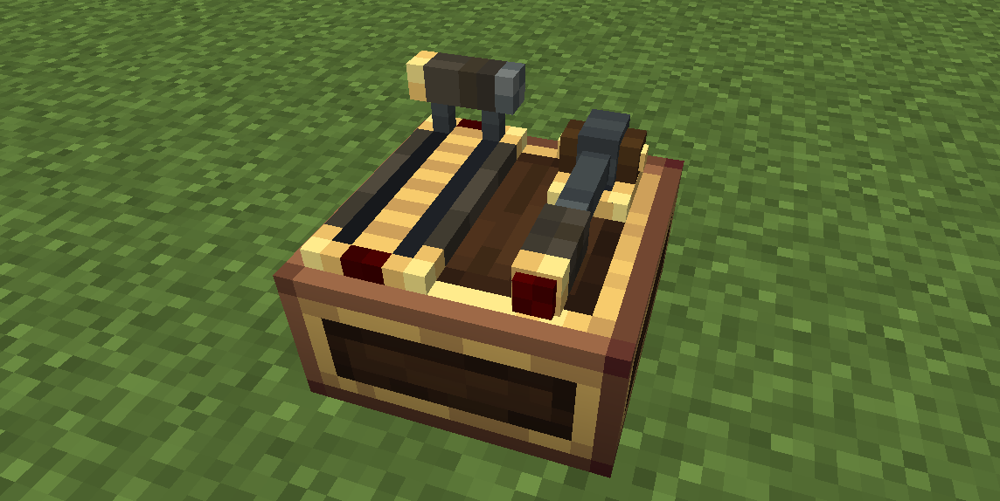

# Dock

The Dock is a desk **form conversion**, not a separate control. It turns a [Control Desk](overview.md) into a full-width slab desk.

**Install**: hold the [**Control Desk**](overview.md) (the desk you place in the world) and right-click an already-placed desk. The top grid expands from 6×14 to **14×14**.

## Effects

- Tabletop extends over the front area (`z0..8`), the desk becomes a full 16×8×16 slab.
- **Top grid expands to 14×14** (`x1..15 / z1..15`): [Throttle](throttle.md), [Throttle 2](throttle_2.md) and [Monitor 2](monitor_2.md) can now be placed at any z between the new bounds, and [Joystick 2](joystick_2.md) gets a much larger placement area.
- The desk keeps everything else (channel, seat operation mode, CC peripheral) — only the shape changes.

## Conflicts

- The dock conflicts with **Foot Pedals** and the **Joystick** (they mount on the front area the dock covers). Install the dock **before** mounting pedals/joystick; to install one later you must remove the dock first.
- The dock is mutually exclusive with the [Baffle](baffle.md) (both are form conversions) — only one form can be active.

## Removal

Hold a Create wrench and **sneak + right-click** the desk's front area.

!!! warning "Remove modules on the extension first"
    Any top modules placed in the **area added by the dock** (the front rows the dock created, north of the normal 6×14 grid) must be removed **before** the dock can be removed — otherwise those modules would be left hanging over the edge. Move or remove them first, then the dock can be taken off. The desk's base form is restored and a desk item is dropped.
