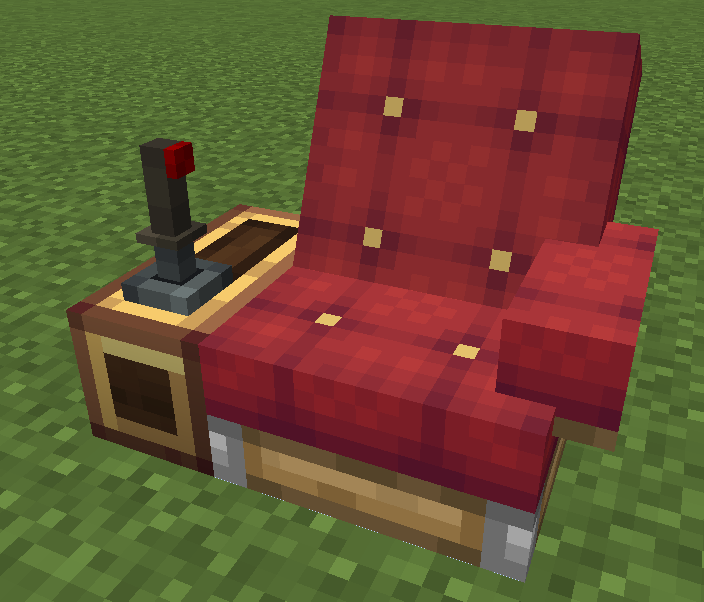

# Joystick 2



The Joystick 2 installs onto a [Control Desk](overview.md) and tilts up to **15°** in any direction: push **forward** (default `W`), pull **back** (`S`), tilt **left** (`A`) or **right** (`D`). Release the keys and it returns to the center.

!!! tip "Right-handed design"
    This joystick is designed for **right-handed** use.The recommended installation position is as shown in the picture, if you install it in a different position, you will need to modify the key bindings yourself.

## Deflection Modes

Each axis (forward/back, left/right) is configured **independently**:

- **Free mode** (default): the stick deflects smoothly. **Full-deflection time** (ticks) controls how long holding a key takes to reach full tilt (default 2, range 1..100); **return time** (ticks) controls how long it takes to return to the center after release (default 2, range 0..100; `0` = no return — the stick stays where it is). 20 ticks = 1 second.
- **Gear mode**: the stick snaps to discrete gear positions instead of deflecting smoothly. **Gear count**: 1..31 (default 4). Gear positions are evenly spaced from -1 to +1 (e.g. 4 gears → `{-1, -1/3, +1/3, +1}`; 3 gears → `{-1, 0, +1}`; 2 gears → `{-1, +1}`). Each press of a key steps **one** gear up/down (holding does not repeat), and there is **no auto-return** — the stick stays on its gear even after you leave the seat, like a physical gear lever.

## Key Bindings

| Direction | Default key |
|---|---|
| Forward / Back | `W` / `S` |
| Left / Right | `A` / `D` |

All four bindings are configurable **per-desk** in the module settings menu (open the [desk config menu](overview.md#configuration-menu) and click the "Joystick 2" row). The bindings are **independent** from the regular [Joystick](joystick.md) — both controls can be installed and configured separately.

## Lua API

```lua
local pe = require("ccpe.pe")
local desk = pe.getPeripheral(4)
local joy2 = desk.getModule("joystick_2")   -- nil if no joystick 2 installed
```

### joy2.isAxisXActive() / joy2.isAxisYActive()

Returns `true` while any key of that axis is pressed (X = left/right, Y = forward/back).

### joy2.getAxisX() / joy2.getAxisY()

Returns the axis **magnitude** (number, **0..1**) — how far the stick is deflected on that axis, regardless of direction.

```lua
print(joy2.getAxisX(), joy2.getAxisY())   -- 0..1
```

### joy2.getAxisXSigned() / joy2.getAxisYSigned()

Returns the **signed** axis value (number, **-1..1**): `+1` = right (`D`) / forward (`W`), `-1` = left (`A`) / backward (`S`).

```lua
print(joy2.getAxisXSigned(), joy2.getAxisYSigned())
```

All methods are `mainThread = false` — safe to poll at high frequency.

## Example

```lua
local pe = require("ccpe.pe")
local desk = pe.getPeripheral(4)
local joy2 = desk.getModule("joystick_2")

while true do
    local forward = joy2.getAxisYSigned()  -- -1..1, thrust amount
    local steer   = joy2.getAxisXSigned()  -- -1..1, turning amount
    print(("forward %.2f  steer %.2f"):format(forward, steer))
    os.sleep(0.05)
end
```
