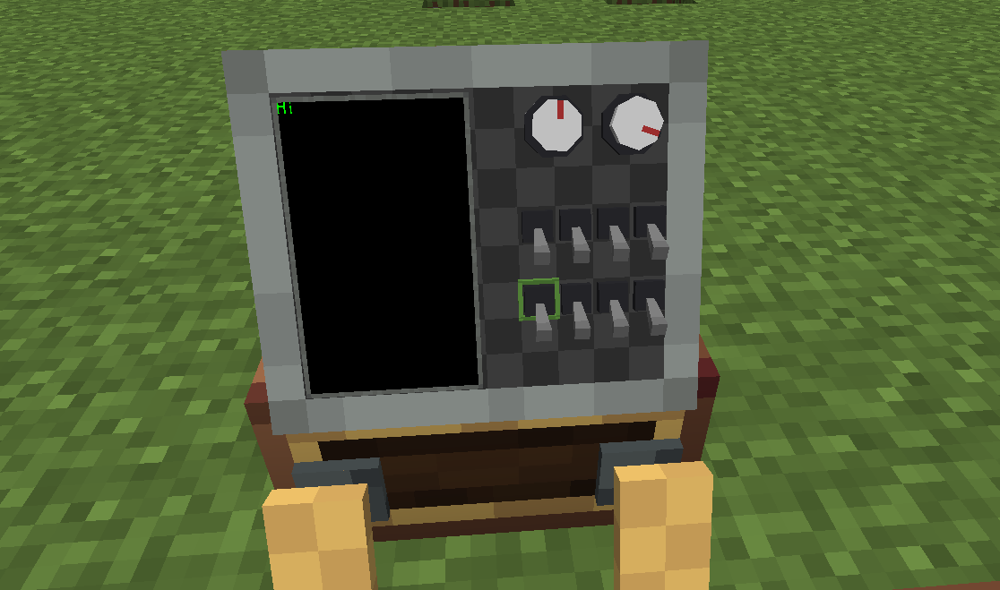

# Monitor 2



Monitor 2 installs onto the top of a [Control Desk](overview.md) as a **built-in mini Monitor**: its screen face is a **10×8** grid of module slots holding the same modules as the full [Monitor](../monitor/overview.md) — buttons, toggle switches, knobs and screens — all freely controlled via Lua.

> It occupies the full 14×6 desk-top grid — the only legal placement is center `(8,12)` — so it is **mutually exclusive** with the [Throttle](throttle.md) and [Throttle 2](throttle_2.md) (only one of them can be installed at a time). Unlike those controls, Monitor 2 **does not face the player**: it only rotates with the desk's facing.

## Installing / Removing

- **Install**: hold the Monitor 2 item and right-click the desk. It mounts at the only legal position (center `(8,12)`) of the desk-top grid; a 14×6×12 preview box shows where it will go (green = free, red = occupied).
- **Remove**: sneak + right-click with a Create wrench to remove it; breaking the desk drops it as an item.

## The 10×8 Grid

The screen face is a **10×8** grid (the full Monitor is 12×10): `x` 0..9, `y` 0..7. Module placement, interaction, rendering and configuration are identical to the Monitor — see [Monitor Overview](../monitor/overview.md).

| Type | Description | Docs |
|---|---|---|
| `button_1` | Button (momentary; player click / interaction lock / light strip) | [Button Module](../monitor/button.md) |
| `toggle_switch` | Toggle switch (latching) | [Switch Module](../monitor/switch.md) |
| `knob` | Knob (angle 0..360) | [Knob Module](../monitor/knob.md) |
| `screen` | Screen (cell-model text + free-position graphics) | [Screen Module](../monitor/screen.md) |

## Lua API

Monitor 2's Lua API is **identical to the Monitor's** — there is nothing new to learn. Only the grid size differs (10×8 vs 12×10).

### Getting the Monitor 2 Peripheral

Get it from the control desk peripheral via `getModule("monitor")` (peripheral type `"ccpe:monitor_2"`); returns `nil` when Monitor 2 is not installed:

```lua
local pe = require("ccpe.pe")
local desk = pe.getPeripheral(4)
local m = desk.getModule("monitor")   -- nil if no Monitor 2 installed
```

`m` has the **same methods as a Monitor peripheral** — `getCellModule(x, y)` / `getModule(id)` / `playNiceSound()` / `playSound(name)` — fully described in [Monitor](../monitor/monitor.md). Here all queries operate on the 10×8 grid.

### Shortcuts (no intermediate peripheral needed)

The desk peripheral also exposes the same queries directly on the 10×8 grid:

| Method | Description |
|---|---|
| `desk.getMonitor2CellModule(x, y)` | Module/screen on the cell (`x` 0..9, `y` 0..7); `nil` if empty / Monitor 2 not installed |
| `desk.getMonitor2Module(id)` | Module/screen by ID; `nil` if not found / Monitor 2 not installed |

### Module Instances

The returned module/screen instances are the **same handles as the Monitor's** — common methods (`getId()`, `getType()`, `getX()`, `getY()`, `getWidth()`, `getHeight()`, `setTooltip()`) and each type's own methods are described in the Monitor docs:

- Common instance methods — [Monitor Overview → Common Module Instance Methods](../monitor/overview.md#common-module-instance-methods)
- Per type — [Button](../monitor/button.md) / [Switch](../monitor/switch.md) / [Knob](../monitor/knob.md) / [Screen](../monitor/screen.md)

### Differences from the Monitor

Only the grid size differs (10×8 vs 12×10). Everything else behaves identically, including the `mainThread` rules and `nil` semantics.

## Example

```lua
local pe = require("ccpe.pe")
local desk = pe.getPeripheral(4)

-- Read a module directly from the 10×8 grid
local mod = desk.getMonitor2CellModule(3, 4)
if mod then
    print("type:", mod.getType(), "id:", mod.getId())
    mod.setTooltip("Pressure gauge")
end

-- Or go through the Monitor 2 peripheral
local m = desk.getModule("monitor")
if m then
    local scr = m.getCellModule(1, 1)
    if scr and scr.getType() == "screen" then
        scr.write("Hello from Monitor 2")
    end
end
```
