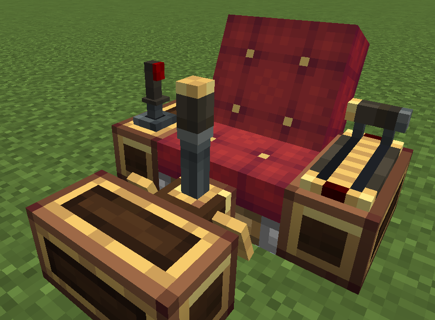

# Control Desk



**Designed to optimize space usage and maintain a clear field of view.**

The Control Desk is a seat-driven control console. By default it has **no controls installed** — you install [Foot Pedals](pedal.md), a [Joystick](joystick.md) and/or a [Throttle](throttle.md) onto it yourself. Sit on a Create seat next to the desk and you automatically enter **operation mode**: your keyboard drives the installed controls of every linked desk, and the control states are exposed to CC:T via a Lua API.

## Installing / Removing Controls

- **Install**: hold a control item (Foot Pedal / Joystick / Throttle) and right-click the desk. The control mounts at a fixed position on the desk's front edge. While aiming at a desk with a control item in hand, a preview box shows the mount position — **green** = can install, **red** = already installed. Installing consumes one item (not in Creative).
- **Remove**: hold a Create wrench and **sneak + right-click** the mounted control — only the control you clicked is removed and dropped as an item.
- **Form conversions**: the desk can be reshaped into a full-width slab ([Dock](dock.md)) or a 3/4 stair with a front wall ([Baffle](baffle.md)) — both mutually exclusive with the front-mounted controls.
- **Breaking the desk** drops any installed controls together with the desk.
- A desk with no controls installed can be removed normally with a wrench (sneak + right-click).

## Seat Operation Mode

Sitting is all you need — no manual interaction:

1. Sit on **any Create seat** that has at least one Control Desk within 1 block directly to its north / east / south / west.
2. All such desks around the seat (up to 4) become **linked** and respond to your keys **simultaneously** (broadcast). A linked desk without the corresponding control installed simply ignores the input.
3. Press **sneak** to dismount (vanilla Create behavior is preserved).

Linking is based on the seat's four neighbors, not on the desk's facing. While you are in operation mode, keys bound to the desk's controls are **drained** from the vanilla key handling before the game processes them — so e.g. pressing `E` drives the pedal instead of opening the inventory. Held-state behavior that is not click-driven (movement, sneak-to-dismount) is untouched.

!!! tip "Seat detection"
    The seat is detected by the **ridden entity**, not the block: operation mode triggers whenever your vehicle is Create's `SeatEntity` (or a subclass of it). Seats from other mods that ride Create's seat entity — such as **Create: Interiors** chairs — work out of the box.

### Default Key Bindings

| Control | Action | Default key |
|---|---|---|
| Joystick | Push forward / pull back / tilt left / tilt right | `W` / `S` / `A` / `D` |
| Left pedal | Press down / lift up | `Q` / `E` |
| Right pedal | Press down / lift up | `E` / `Q` |
| Throttle | Shift up / shift down | `Space` / `Left Ctrl` |

All key bindings are **per-desk** and configurable in the module settings menu (see below).

## Configuration Menu

Open the desk's configuration menu with:

- **Wrench + right-click** the desk, or
- **Empty hand + sneak + right-click** the desk

The menu contains:

- **Channel** scroll bar — the desk's global channel number, shared with sensors / Monitors / Peripheral Extenders in one globally-unique namespace (occupied channels are skipped).
- **Installed controls** list — click a row to open that control's module settings menu (key bindings, return time, gear mode, etc.).

All settings are stored in the block's NBT and survive **Create schematics / contraption pick-up**, so you can mass-produce configured desks.

## CC:T Peripheral

The desk's peripheral type is `"ccpe:control_desk"`.

### Getting the Peripheral

```lua
-- Method A: via a channel (works at any distance)
local pe = require("ccpe.pe")
local desk = pe.getPeripheral(4)   -- 4 = the desk's channel number

-- Method B: direct CC:T peripheral (computer placed adjacent)
local desk = peripheral.wrap("right")
-- or
local desk = peripheral.find("ccpe:control_desk")
```

### Getting Control Handles

```lua
local pedal = desk.getModule("pedal")     -- nil if no pedal installed
local joy   = desk.getModule("joystick")  -- nil if no joystick installed
local th    = desk.getModule("throttle")  -- nil if no throttle installed
```

`desk.getModule(name)` accepts `"pedal"` / `"joystick"` / `"joystick_2"` / `"throttle"` / `"throttle_2"` (case-insensitive) and returns `nil` when the control is not installed. The returned handles read the **server-authoritative control state** directly:

| Handle | Methods |
|---|---|
| `pedal` | `getLeftPedal()`, `getRightPedal()`, `getPedalDifference()`, `isLeftPedalDown()`, `isRightPedalDown()`, `isLeftPedalUp()`, `isRightPedalUp()` |
| `joystick` | `isAxisXActive()`, `isAxisYActive()`, `getAxisX()`, `getAxisY()`, `getAxisXSigned()`, `getAxisYSigned()` |
| `joystick_2` | `isAxisXActive()`, `isAxisYActive()`, `getAxisX()`, `getAxisY()`, `getAxisXSigned()`, `getAxisYSigned()` |
| `throttle` | `isForwardActive()`, `isBackActive()`, `getThrottleGear()`, `getAxis()` |
| `throttle_2` | `getAxis()`, `getCenterAxis()`, `setAngle(degrees)` |
| `monitor_2` | via `getModule("monitor")` — same methods as the [Monitor](../monitor/overview.md) |

See [Foot Pedal](pedal.md), [Joystick](joystick.md), [Joystick 2](joystick_2.md), [Throttle](throttle.md), [Throttle 2](throttle_2.md) and [Monitor 2](monitor_2.md) for the full API of each handle. All state-reading methods run on the CC worker thread (`mainThread = false`) and are safe to poll at high frequency.

## Virtual Joystick HUD (optional)

A debug/test HUD overlay showing a virtual joystick in the corner of the screen can be enabled via the client config `joystickOverlayEnabled` (default **off**).
