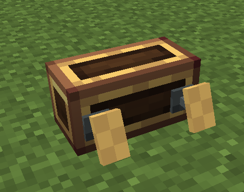

# 脚踏板



脚踏板在[控制台](overview.zh.md)上安装**一对踏板**（左 / 右）。坐在联动坐垫上进入操作模式后，按住踏板「踩下」键踏板向前平移（模型空间 **+z**），按住「抬起」键向后平移（**-z**），都不按时按回正时间回到中间位置。

踏板行程是**模拟量** —— 踩下是平滑累加到满偏，不是阶跃。

## 默认按键

| 踏板 | 踩下 | 抬起 |
|---|---|---|
| 左踏板 | `Q` | `E` |
| 右踏板 | `E` | `Q` |

四个按键绑定都**跟随控制台**，可在模块设置菜单中配置（打开[控制台配置菜单](overview.zh.md)，点击「脚踏板」行）。

## 模块设置

- **回正时间**（tick，默认 2，范围 0..100，左右共用）—— 松开后回到中间位置所需时间；设为 `0` 关闭回正（踏板停在原地）。
- **满偏时间**（tick，默认 2，范围 1..100，左右共用）—— 按住踩下/抬起键到满行程所需 tick 数（越小越快）。20 tick = 1 秒。

## Lua API

```lua
local pe = require("ccpe.pe")
local desk = pe.getPeripheral(4)
local pedal = desk.getModule("pedal")   -- 未安装脚踏板返回 nil
```

### pedal.getLeftPedal() / pedal.getRightPedal()

返回踏板的模拟量位置（数值，**-1..1**）：`+1` = 完全踩下，`-1` = 完全抬起，`0` = 中间。

```lua
print(pedal.getLeftPedal())   -- -1 .. 1
```

### pedal.getPedalDifference()

返回左右踏板的差值（数值，**-2..2**）：**右 − 左**。正 = 右踏板踩得更深；负 = 左踏板踩得更深。

```lua
print(pedal.getPedalDifference())
```

### pedal.isLeftPedalDown() / pedal.isRightPedalDown()

踏板处于踩下方向（轴值 > 0，含回正过程中的余量）时返回 `true`。

### pedal.isLeftPedalUp() / pedal.isRightPedalUp()

踏板处于抬起方向（轴值 < 0）时返回 `true`。

所有方法都是 `mainThread = false`（跑在 CC worker 线程），可以在循环里高频轮询。

## 示例：差速踏板

踏板对最经典的用法是差速油门：两踏板**平均值** = 整体油门，`getPedalDifference()` = 转向量。

```lua
local pe = require("ccpe.pe")
local desk = pe.getPeripheral(4)
local pedal = desk.getModule("pedal")

while true do
    local left, right = pedal.getLeftPedal(), pedal.getRightPedal()
    local throttle = (left + right) / 2          -- -1..1，整体前进/后退
    local turn     = pedal.getPedalDifference()  -- -2..2，右减左
    print(("throttle %.2f  turn %.2f"):format(throttle, turn))
    os.sleep(0.05)
end
```
