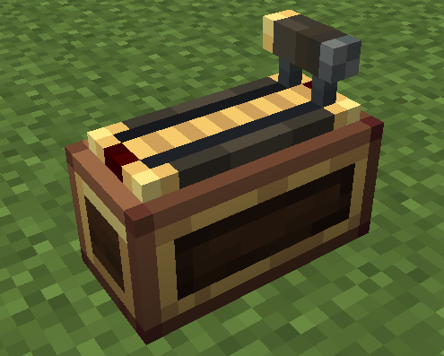

# Throttle



The Throttle installs onto a [Control Desk](overview.md) and shifts through **12 discrete gears (0..11)**. The handle slides along the **model-space X axis**: gear 0 is at the bottom (−X end), gear 11 is full forward (+X end), 1 px per gear. Hold the **forward** key (default `Space`) to shift up, hold the **back** key (default `Left Ctrl`) to shift down.

> The Throttle shares the rear-top slot of the desk with **Monitor 2** — the two are mutually exclusive.

## Gear Shifting

- **Gear shift rate** (ticks): how long you must hold a key to shift one gear — default **4**, range 1..100 (20 ticks = 1 second). Holding continuously shifts one gear every N ticks.
- The throttle **locks in place** — there is no auto-return. Releasing the keys (or pressing both) holds the current gear; the gear also persists after you leave the seat, like a physical throttle.
- Each gear shift plays a lever click whose pitch rises with the gear position (forward shifts go low → high, back shifts go high → low, 0.75 → 1.5); the lowest gear (0) does not click.
- The indicator light colors from **dark red** (gear 0) to **bright red** (full forward) as the gear rises.

## Key Bindings

| Action | Default key |
|---|---|
| Forward (shift up) | `Space` |
| Back (shift down) | `Left Ctrl` |

Both bindings and the gear shift rate are configurable **per-desk** in the module settings menu (open the [desk config menu](overview.md#configuration-menu) and click the "Throttle" row).

## Lua API

```lua
local ss = require("ccpe.sensor_system")
local desk = ss.getPeripheral(4)
local th = desk.getModule("throttle")   -- nil if no throttle installed
```

### th.isForwardActive() / th.isBackActive()

Returns `true` while the forward / back key is held (raw input, reads the server input lease).

### th.getThrottleGear()

Returns the current gear as an integer (**0..11**): `0` = lowest (bottom, −X end), `11` = full forward (+X end). The gear latches — it does not return to 0 on its own.

```lua
print(th.getThrottleGear())   -- 0..11
```

### th.getAxis()

Returns the normalized throttle position (number, **0..1**) = gear / max travel: `0` = lowest gear, `1` = full forward.

```lua
print(th.getAxis())   -- 0..1
```

All methods are `mainThread = false` — safe to poll at high frequency.

## Example

```lua
local ss = require("ccpe.sensor_system")
local desk = ss.getPeripheral(4)
local th = desk.getModule("throttle")

while true do
    local gear = th.getThrottleGear()        -- 0..11
    local throttle = th.getAxis()    -- 0..1
    print(("gear %d  throttle %.2f"):format(gear, throttle))
    os.sleep(0.05)
end
```
