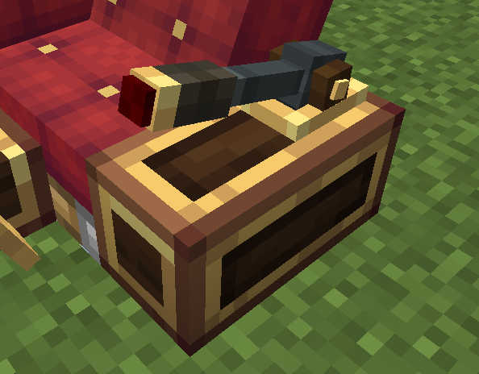

# 油门杆 2



油门杆 2 安装在[控制台](overview.zh.md)上，是**总距杆**类型：手柄绕枢轴（模型空间 `(4,2,8)`）**旋转**而不是平移。角度**连续可调**，范围 **0°（最底端，放置默认）～ +30°（满偏上抬）**。

> 它全占桌顶 6×14 棋盘网格（唯一合法放置中心 `(8,12)`，只能 0°/180° 旋转）——与[油门杆](throttle.zh.md)、监视器 2 **互斥**（同一时刻只能安装其中一个）。

## 角度控制

- 按住**上抬**键（默认 `空格`）手柄上升（角度 +）；按住**下拉**键（默认 `左Ctrl`）手柄下降（角度 −）。
- **满偏时间**（tick）：按住按键到满偏 +30° 所需时间 —— 默认 **20**，范围 1..100（20 tick = 1 秒）。按住期间每 tick 推进 `30° / 满偏时间`。
- 松开按键后的行为由**回正开关**决定：
  - **回正关闭**（默认）：手柄**锁存不回正** —— 类似物理总距杆，停在当前位置。
  - **回正开启**：手柄按**回正时间**速率（默认 **2** tick，范围 0..100，`0` = 关闭回正）线性回到**中位 15°**（30° 的一半）。

## 按键绑定

| 动作 | 默认按键 |
|---|---|
| 上抬（角度 +） | `空格` |
| 下拉（角度 −） | `左Ctrl` |

两个按键绑定、满偏时间与回正开关/回正时间都**跟随控制台**，可在模块设置菜单中配置（打开[控制台配置菜单](overview.zh.md)，点击「油门杆 2」行）。它们与普通[油门杆](throttle.zh.md)的绑定**相互独立** —— 两个控件可以分别安装在不同的控制台上、各自配置。

## Lua API

```lua
local pe = require("ccpe.pe")
local desk = pe.getPeripheral(4)
local th2 = desk.getModule("throttle_2")   -- 未安装油门杆 2 返回 nil
```

### th2.getAxis()

返回归一化的拉杆位置（数值，**0..1**）= 角度 / 30°：`0` = 最底端（放置默认），`1` = 满偏上抬。

```lua
print(th2.getAxis())   -- 0..1
```

### th2.getCenterAxis()

返回相对**中位 15°** 的拉杆位置（数值，**-1..1**）= (角度 − 15°) / 15°：`-1` = 最底端（0°），`0` = 中位（15°，回正模式松开后的落点），`+1` = 满偏上抬（30°）。回正开关开启时最有用。

```lua
print(th2.getCenterAxis())   -- -1..1
```

### th2.setAngle(degrees)

直接设置拉杆角度（度，**0..30**，越界自动钳位）。在游戏主线程运行（`mainThread = true`），写入**服务端权威**角度并广播。

> 注意：玩家坐在联动坐垫上操作（输入租约有效）时，服务端每 tick 模拟会按按键继续推进角度，**覆盖**本设置；无玩家输入（回正关闭 = 锁存）时本设置保持到下次按键/回正。

```lua
th2.setAngle(20)   -- 把手转到 20°
```

所有读取方法都是 `mainThread = false`（跑在 CC worker 线程），可以高频轮询。

## 示例

```lua
local pe = require("ccpe.pe")
local desk = pe.getPeripheral(4)
local th2 = desk.getModule("throttle_2")

while true do
    local axis   = th2.getAxis()          -- 0..1
    local center = th2.getCenterAxis()    -- -1..1
    print(("axis %.2f  center %.2f"):format(axis, center))
    os.sleep(0.05)
end
```
