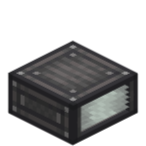

# Cooling Air Duct



The **Cooling Air Duct** (`ccpe:cooling_air_duct`) is a pure cooling module for the [Engine System](overview.md). It attaches to an engine core and adds dissipation (the `K_DUCT` component of the cooling model) — plus it hosts the adjustable **cooling shutter** (`setCooling`).

## Placement

- Attach against any face of an engine core (6 faces × 2 rotations = 12 block states).
- There is no block entity — it is a pure static block; all cooling logic lives in the engine's controller.

## What it does

- **Cooling fins**: each duct adds a fixed dissipation component to the engine's Newton cooling (`K_DUCT = 0.05` per duct), so more ducts = faster cooling.
- **Cooling shutter**: `setCooling(0..1)` (default 1.0 = fully open) only scales the duct dissipation component — closing the shutter reduces the duct's cooling (real cowl-flap behaviour, "keep the heat in"). It **cannot increase** cooling beyond the ducts you have: to cool more, add more ducts.
- It is **purely a cooling module**: it does not gate the economy factor, mixture or fuel cost.

!!! note "`setCooling` / `setMixture` are pure storage"
    `setCooling` and `setMixture` are always accepted (no gating). The shutter value is only *consumed* while a cooling duct is installed (the `K_DUCT` component); the mixture value is only consumed by fluid engines. On a steam engine both are stored but have no effect.

## Goggle display

Hover the duct with goggles:

```
Engine Status
Temperature: XX.X°C
Cooling: 80%
```

The **Cooling** line shows the shutter percentage (`coolingStrength`, the `setCooling` value) — below 100% means the shutter has been closed to keep heat in.
