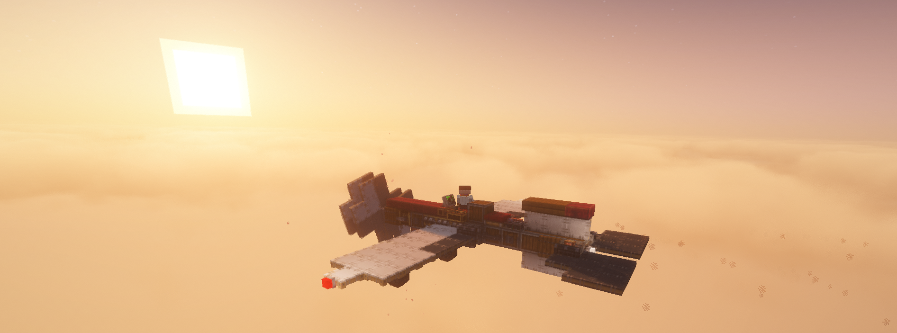
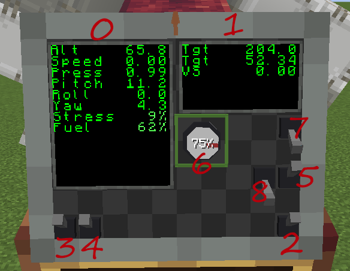

# Example - Trainer Aircraft

> A complete CCPE avionics example: a flyable fixed-wing trainer aircraft that integrates the [Sensor System](../sensor-system/overview.md) (static port / pitot tube / INS / FMC), the [Modular Monitor](../monitor/overview.md) (switch / knob / screen), the [Control Desk](../control-desk/overview.md) (joystick / pedal / throttle) and [Aero Bearing](../aero-bearing/overview.md) control surfaces — with pitch damping, auto-roll, auto-throttle and altitude hold.

## [> Download Save <](https://github.com/ZombieEggStew/ccnavigationtable-template-1.21.1/blob/main/.design_guide/trainer%20aircraft.zip)
[OneDrive](https://1drv.ms/u/c/4fabe5939824c0f1/IQDyp7GaueyWSJS6sStblBfdAdL7uPhhr4vora3CftGzKo0)

## Required Mods

- CC:Tweaked
- Create
- Sable
- Create: Aeronautics
- Create: Diesel Generators
- CCPE (this mod)

Comes with its own control program: `trainer aircraft\computercraft\computer\0\startup.lua` (included in the save, runs automatically on boot).

## Design Overview

Everything about this trainer is built around **simplification**:

- **Simplified drive** — the fuselage is one **long stick**, transferring stress in a **straight line**.
- **Simplified aero** — trimmed so the **thrust line passes through the center of mass and the lift center coincides with it** — throttle changes produce no pitch moment and level-flight net moment ≈ 0, keeping the control logic simple and predictable (see the [Flight Management Computer](../sensor-system/fmc.md) for the game's aero model).
- **Simplified controls** — only **elevator (pitch) and ailerons (roll)** as control surfaces, **no rudder** — yaw comes from differential thrust / sideslip, so Lua only needs to control two axes.

## Control Panel

Monitor **module IDs** for each control (used with `monitor.getModule(id)` in Lua):

| Control | Module ID | Description |
|---|---|---|
| Screen (left) | 0 | Main flight data display |
| Screen (right) | 1 | Altitude-hold data display |
| Engine switch | 2 | Engine on / off |
| Screen switch | 3 | Show / hide screens |
| Navigation light switch | 4 | Three-color navigation lights |
| Auto-roll switch | 5 | Wings-level hold when hands off (PD) |
| Altitude knob | 6 | Target altitude (see below) |
| Auto-throttle switch | 7 | Airspeed hold + altitude hold |
| Pitch-damping switch | 8 | Artificial pitch damping (suppresses phugoid) |

## Screen Display

Left screen (module ID 0), top to bottom:

- Alt: current altitude (m)
- Speed: current speed (m/s)
- Press: current pressure
- Pitch: pitch angle (°) — screen shows **nose-up as positive** (opposite sign of the raw API reading)
- Roll: roll angle (°)
- Yaw: yaw angle (°)
- Stress: stress used, percent
- Fuel: fuel remaining, percent

Right screen (module ID 1), top to bottom:

- Tgt: target altitude (set by the altitude knob)
- Tgt: airspeed needed to hold that altitude (solved from "lift = gravity")
- VS: vertical speed (m/s, positive = climbing)

## Flight Operations

1. Hold a Diesel Generators fuel can, right-click the fluid port between the landing gear to fill the aircraft with fuel
2. Sit on the seat
3. Flip the engine switch on
4. Hold Space to push the throttle to gear 1 for slow taxiing (hold Ctrl to reduce throttle)
5. Press Q or E to work the pedals, steering the nose wheel to taxi onto a suitable taxiway
6. Hold Space to push the throttle to full and take off
7. Around 300 m, tap W to keep from climbing too high
8. Turn the altitude knob (aim at the knob, hold right mouse button and move the mouse around it) to set the target altitude (0% ≈ 70 m, 100% ≈ the aircraft's maximum steady-state altitude at max RPM, about 250 m)
9. Flip the auto-throttle switch on — the aircraft automatically controls the throttle and holds the target altitude

!!! tip "Wings-level helper"
    Turn on the **auto-roll** switch to level the wings whenever you let go of the stick. It never fights manual control — any joystick X-axis input automatically switches auto-roll off.

## Autopilot Functions (startup.lua)

### Artificial Pitch Damping

Feeds the pitch rate back into the elevator command (`PITCH_DAMP_GAIN = 0.5`) to suppress the long-period pitch oscillation (phugoid).

### Auto-Roll

With hands off the stick and roll outside the deadband, drives the ailerons from "roll angle proportional + roll-rate damping" (`ROLL_KP = -0.5`, `ROLL_KD = -0.5`) to level the aircraft.

### Auto-Throttle + Altitude Hold

A three-step closed loop:

1. **RPM feedforward** — target altitude → required pressure → required airspeed from "lift = gravity" → propeller RPM from lift-surface drag + universal drag (`getPropellerRPM`, θ = 90°).
2. **Airspeed PI correction** — corrects the throttle from the pitot airspeed error (`AIRSPEED_KP = 0.002`, `AIRSPEED_KI = 0.001`), eliminating model / wind / mass drift.
3. **Altitude hold** — outer loop altitude error → target vertical speed (`ALT_HOLD_KP_VS = 0.3`, clamped ±5 m/s), inner loop vertical-speed error → elevator (`ALT_HOLD_KP_PITCH = 1.0`, clamped ±15°).

## Flight Tips

- **Hands-off full throttle at low altitude pitches up by itself**: lift ∝ pressure × airspeed — at low altitude pressure is high, so the same airspeed produces excess lift → climb; at high altitude pressure is low, so more airspeed is needed for lift. For stable cruise use the **altitude knob + auto-throttle**; when flying manually, pull the throttle back a bit low and go full throttle high.
- **Long-period oscillation (phugoid)**: after letting go, the aircraft slowly bobs up and down at ~16 s per cycle — normal aero behaviour (static-stability recovery + inertia overshoot); **pitch damping** settles it.
- **Control-surface chatter**: if the elevator / ailerons chatter at high frequency, lower `PITCH_DAMP_GAIN` below 0.5, or reduce `ALT_HOLD_KP_PITCH` / `ALT_HOLD_KP_VS`.

## Related Pages

- [Sensor System](../sensor-system/overview.md) — static port / pitot tube / INS / FMC / AIC
- [Aero Bearing](../aero-bearing/overview.md) — Lua-control control surfaces
- [Modular Monitor](../monitor/overview.md) — switch / knob / screen modules
- [Control Desk](../control-desk/overview.md) — joystick / pedal / throttle
