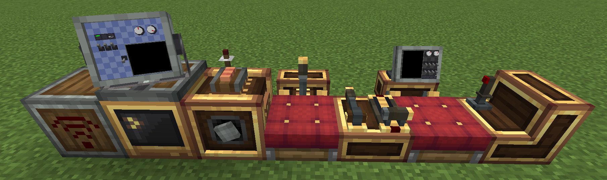

# CCPE — CC 外设扩展器

!!! info "欢迎"
    CCPE (CC Peripheral Extender) 是一个为 Minecraft NeoForge 平台设计的模组，专为 Create: Aeronautics 和 ComputerCraft: Tweaked 用户提供强大的无线外设控制能力。

## ✨ 核心功能

### [📡外设扩展器](peripheral-extender/overview.md)

多功能远程终端，支持：

- **NBT 数据读取** — 通过频道无线访问方块数据
- **外设代理** — 远程调用 CC:T 外设方法
- **无线红石** — 发送和接收红石信号
- **导航桌集成** — 获取飞行器位置、方位、距离
- **物理数据** — 读取 Sable 物理引擎的速度、质量、姿态
- **区块加载** — 保持目标方块所在区域或者物理结构不被卸载
    
### [🍑模块化监视器](monitor/overview.md)
12x10棋盘插槽，lua自由控制，满足不同场景下的互动和信息展示需求。

### [📻 红石收发器](redstone-transceiver/overview.md)
直接读取和发送 Create Redstone Link 信号，无需在计算机旁堆叠红石链接方块。

### [🎛️ 电子变速箱](electronic-transmission/overview.md)
专为 CC:T 控制优化的转速控制器，避免了 Create 原版控制器的网络级联问题。

---
## 🚀 快速开始

[示例与教程](examples/monitoring-system.md) — 查看实际应用案例

## 🔗 相关链接

- [GitHub 仓库](https://github.com/ZombieEggStew/ccnavigationtable-template-1.21.1)
- [问题反馈](https://github.com/ZombieEggStew/ccnavigationtable-template-1.21.1/issues)
- [更新日志](https://github.com/ZombieEggStew/ccnavigationtable-template-1.21.1/blob/main/changeLog.md)
