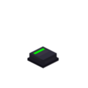

# 按钮模块



按钮本身为**瞬时型**：按下/弹起是分开的，`isPressed` 读取当前按下状态。
此外还提供「玩家点击检测」「玩家互动锁」「灯带控制」「表面标签」四组能力，可组合出锁存按钮等自定义行为。
`press()` / `release()` 会播放对应的按键音效——**音效由按钮的实际动作（运动）触发**，而不是玩家的原始鼠标输入。

## 操作说明
- **配置模块**：手持扳手对准模块右键 或者 蹲下+右键 可以打开模块配置界面，配置模块 ID、tooltip等属性
- **拆卸模块**：手持扳手蹲下右键 可以拆卸模块

---

## 基础：按下 / 弹起 / 状态

### btn.press()

按下按钮，并播放按下音效（灯带在「自动模式」下会随按下点亮）。

```lua
btn.press()
```

### btn.release()

弹起按钮，并播放弹起音效（灯带在「自动模式」下会随弹起熄灭）。

```lua
btn.release()
```

### btn.isPressed()

返回当前是否处于按下状态（布尔）。

```lua
btn.press()
print(btn.isPressed())  -- true
btn.release()
print(btn.isPressed())  -- false
```

---

## 玩家点击检测

!!! note
    用于区分「玩家点击」与「Lua 调用 press/release」。只有玩家实际点击（客户端→服务端的交互包）才会更新下列状态，`btn.press()` 不计数。

### btn.wasClicked()

返回自上次读取以来按钮是否被玩家**按下**过（只在按下边沿 0→1 触发，松开鼠标不触发；读取后自动清除标志，适合边沿检测）。

```lua
while true do
    if btn.wasClicked() then
        print("玩家点击了按钮")
    end
    os.sleep(0.05)
end
```

### btn.getClickCount()

返回玩家累计点击次数（每次玩家按下 +1；Lua 的 `press()` 不计入）。

```lua
local last = btn.getClickCount()
while true do
    local now = btn.getClickCount()
    if now ~= last then
        print("新增点击", now - last, "次")
        last = now
    end
    os.sleep(0.05)
end
```

### btn.clearClicked()

清除「未读点击」标志（不读取）。

```lua
btn.clearClicked()
```

---

## 表面标签

按钮表面可以显示文字标签（渲染方式参考旋钮角度文字：默认居中、白色、字号一致）。传入空串 `""` 可清除显示，但**会保留**之前设置的位置/字号/颜色，下次写入文字时继续沿用。

### btn.setLabel(text)

在按钮表面写入文字。传入空串 `""` 可清除显示（之前设置的位置/字号/颜色会被保留）。

```lua
btn.setLabel("START")
```

### btn.getLabel()

读取按钮表面文字（未设置时返回空串）。

```lua
print(btn.getLabel())  -- START
```

### btn.setLabelPosition(x, y)

设置标签相对标签原点的位置偏移。单位为 MC 像素（1px = 1/16 块）；`x` 向右为正、`y` 向上为正。`(0, 0)` 为标签原点——按钮表面视觉中心（默认）。

```lua
btn.setLabelPosition(0.2, 0.1)  -- 相对原点：右移 0.2px、上移 0.1px
```

### btn.getLabelPosition()

读取标签位置偏移，返回 `x, y`（MC 像素）。

```lua
local x, y = btn.getLabelPosition()
print(x, y)
```

### btn.setLabelScale(scale)

设置标签字号（块/字体像素）。默认 `1/512`（与旋钮角度显示完全一致）；值越大字越大，例如 `1/256` 为两倍大。

```lua
btn.setLabelScale(1 / 256)  -- 放大为旋钮角度字号的 2 倍
```

### btn.getLabelScale()

读取标签字号（默认 `1/512`）。

```lua
print(btn.getLabelScale())  -- 0.001953125
```

### btn.setLabelColour(colour)

设置标签颜色（`0xRRGGBB`，默认白色 `0xFFFFFF`）。

```lua
btn.setLabelColour(0xFF0000)  -- 红色
```

### btn.getLabelColour()

读取标签颜色（`0xRRGGBB`，默认 `0xFFFFFF`）。

```lua
print(btn.getLabelColour())  -- 16711680
```

### btn.setDropShadow(dropShadow)

设置标签是否绘制投影（默认 `true`，与旋钮角度文字一致）。设为 `false` 可去掉文字下方的阴影。

```lua
btn.setDropShadow(false)
```

### btn.getDropShadow()

读取标签当前是否绘制投影（默认 `true`）。

```lua
print(btn.getDropShadow())  -- true
```

组合使用：

```lua
btn.setLabel("START")
btn.setLabelPosition(0.2, 0.1)  -- 相对原点：右移 0.2px、上移 0.1px
btn.setLabelScale(1 / 256)      -- 放大为旋钮角度字号的 2 倍
btn.setLabelColour(0xFF0000)    -- 红色
btn.setDropShadow(false)
```

---


## 玩家互动锁（Lua 完全控制按钮）

### btn.setPlayerControl(enabled)

设置玩家互动开关。

- `true`（默认）：玩家可按下/弹起按钮，行为照常
- `false`：按钮由 Lua 完全控制——玩家点击**不会**改变按下状态、也**不会**直接播放音效，但仍会更新 `wasClicked()` / `getClickCount()`（音效由 `press()` / `release()` 触发，跟随按钮实际动作）

```lua
btn.setPlayerControl(false)
```

### btn.getPlayerControl()

返回当前是否允许玩家互动（布尔，默认 `true`）。

```lua
print(btn.getPlayerControl())  -- true
```

---

## 灯带控制

### btn.setLight(level)

设置灯带亮度（0..1），并自动切换到「代码控制」模式（此后玩家互动不再改变灯带）。

- `0` = 熄灭，`1` = 最亮

```lua
btn.setLight(1)   -- 点亮
btn.setLight(0)   -- 熄灭
```

### btn.getLight()

返回 Lua 设定的灯带亮度（0..1，默认 0）。

```lua
print(btn.getLight())  -- 1.0
```

### btn.setLightControl(codeControlled)

设置灯带是否由代码控制。

- `true`：灯带亮度只随 `setLight` 改变（玩家互动不影响灯带）
- `false`（默认）：自动模式，灯带随按下状态点亮/熄灭

```lua
btn.setLightControl(true)
btn.setLightControl(false)
```

### btn.isLightControlled()

返回灯带当前是否由代码控制（布尔）。

```lua
print(btn.isLightControlled())  -- false
```

---

## 示例

### 示例 1：Lua 控制的锁存按钮（灯带自动跟随）

不控制灯带（保持默认「自动模式」），只用玩家互动锁接管按钮行为，把瞬时按钮变成「点击翻转」的锁存按钮：灯带自动跟随按下状态点亮。

```lua
local pe = require("ccpe.pe")
local monitor = pe.getPeripheral(3)
local btn = monitor.getModule(0)

-- 锁住玩家互动：玩家点击不再直接改变按钮状态，脚本全权决定按下/弹起
btn.setPlayerControl(false)

local latched = false

while true do
    if btn.wasClicked() then
        latched = not latched
        if latched then
            btn.press()    -- 按下：播放按下音效，灯带自动点亮
        else
            btn.release()  -- 弹起：播放弹起音效，灯带自动熄灭
        end
    end
    sleep(0.05)
end
```

### 示例 2：灯带表示状态的锁存按钮（按钮保持瞬时）

不控制按钮按下/弹起行为（保持玩家可互动的瞬时按钮），只用灯带表示锁存状态：每次点击翻转灯带，灯带不再跟随瞬时按压。

```lua
local pe = require("ccpe.pe")
local monitor = pe.getPeripheral(3)
local btn = monitor.getModule(0)

-- 灯带交给 Lua（setLight 会自动切到代码控制模式，不再跟随按下）
btn.setLight(0)

local latched = false

while true do
    if btn.wasClicked() then
        latched = not latched
        if latched then
            btn.setLight(1)   -- 灯带点亮 = 开
        else
            btn.setLight(0)   -- 灯带熄灭 = 关
        end
    end
    sleep(0.05)
end
```
