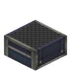

# Monitor Slab



The Monitor Slab is a **step-shaped** monitor block: its surface is a **14×14** board grid where you can install button, switch, knob and screen modules and control them with Lua from a CC:T computer.

Compared to the [Monitor](monitor.md), it has a flat (half-slab) shape, making it suitable as an information panel on the floor, on a wall, or on a ceiling. It reuses the Monitor's channel and peripheral system, but its config is simpler (channel only).

## Attachment Forms and Orientation

The Monitor Slab can attach to three kinds of faces:

| Form | Attaches to | Panel faces |
|---|---|---|
| Floor | Top of a block | Panel faces up |
| Wall | Side of a block | Panel faces outward |
| Ceiling | Bottom of a block | Panel faces down |

!!! warning "Watch the orientation when placing (floor and ceiling each have 4 orientations)"
    Both the floor and ceiling variants have **4 orientations** (FACING), following the player's horizontal facing when placing: **floor = opposite of the player's facing, ceiling = the player's facing**; wall = the clicked face.
    The **display direction** of the surface modules / screen content changes with this orientation — pay attention when placing so the content faces the direction you want.

## Getting the Monitor Slab Peripheral

The CC:T peripheral type is `"ccpe:monitor_slab"`; obtain it the same way as the Monitor (sharing the same global channel system):

```lua
-- Method A: by channel (recommended, works at any distance)
local pe = require("ccpe.pe")
local slab = pe.getPeripheral(3)   -- 3 is the Monitor Slab's global channel number

-- Method B: wrap when a computer is placed directly against it
local slab = peripheral.wrap("right")
-- or
local slab = peripheral.find("ccpe:monitor_slab")
```

## Operation

- **Place modules**: hold a module item (button / switch / knob / screen) and right-click the panel to place it; screens are placed by clicking **two empty cells** to form a rectangular region.
- **Configure channel**: hold a wrench and **right-click** (or **sneak + right-click** empty-handed) to open the config interface and set the **global channel number** (shared channel system with the Monitor / Peripheral Extender).
- **Configure modules**: wrench right-click a module / screen → opens the module config interface.
- **Remove modules**: wrench **sneak + right-click** a module / screen → removes it.
- **Remove the whole block**: wrench sneak + right-click an empty spot on the panel → removes the block, returning a **plain Monitor Slab item (no data kept)**; this is blocked if the surface has content (it prompts you to remove the modules first).
- **Break directly**: drops a plain Monitor Slab plus the surface module / screen items (modules separate from the block).

## Lua API

It shares the same interface as the [Monitor](monitor.md) (`MonitorGridHost`): `getCellModule(x, y)` / `getModule(id)` to query module and screen instances, and `playNiceSound()` / `playSound(name)` to play sounds.

See [Monitor Overview](overview.md) ("Common module methods") and [Button Module](button.md) / [Switch Module](switch.md) / [Knob Module](knob.md) / [Screen Module](screen.md) for the generic module methods and per-module APIs.

The screen's text / graphics API is identical to the regular Monitor's screen module (see [Screen Module](screen.md)); content direction follows the placement orientation and is readable from the front of the panel.
