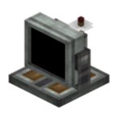
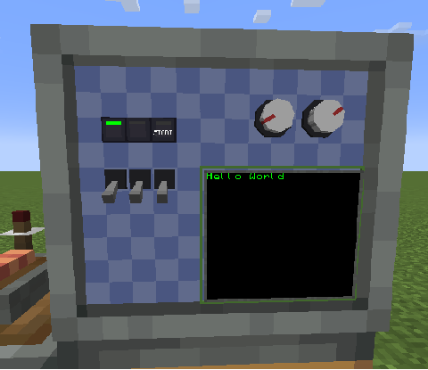

# 监视器概述



模块化监视器（Monitor）是 CCPE 的互动信息终端：一块 **12×10** 的棋盘式插槽面板，可以在格子上安装按钮、开关、旋钮、屏幕等模块，并通过 CC:T 计算机用 Lua 自由控制它们。




## 操作说明
- **配置模块**：手持扳手对准模块右键 或者 蹲下+右键 可以打开模块配置界面，配置模块 ID、tooltip等属性
- **拆卸模块**：手持扳手蹲下右键 可以拆卸模块


## 获取 Monitor 外设

Monitor 的 CC:T 外设类型名是 `"ccpe:monitor"`，获取方式有两种：

### 方式 A：通过频道获取（推荐，跨距离）

借助外设扩展器的频道系统，在任意距离拿到 Monitor 外设：

```lua
local pe = require("ccpe.pe")
local monitor = pe.getPeripheral(3)   -- 3 是 Monitor 的全局频道号
```

### 方式 B：计算机紧贴 Monitor

计算机紧贴 Monitor 放置时直接 wrap：

```lua
local monitor = peripheral.wrap("right")
-- 或
local monitor = peripheral.find("ccpe:monitor")
```

`monitor` 本身提供模块/屏幕的查询方法与音效方法（见 [监视器](monitor.md)）。查到的「模块实例」再提供各自的 get/set 方法。

## 模块类型

| 类型名 | 说明 | 文档 |
|---|---|---|
| `button_1` | 按钮（瞬时型；支持玩家点击检测 / 互动锁 / 灯带控制） | [按钮模块](button.md) |
| `toggle_switch` | 钮子开关（锁存型） | [开关模块](switch.md) |
| `knob` | 旋钮（角度 0..360） | [旋钮模块](knob.md) |
| `screen` | 屏幕（文本渲染 + 图形绘制） | [屏幕模块](screen.md) |


## 模块实例通用方法

以下方法对所有模块类型（`button_1` / `toggle_switch` / `knob`）以及屏幕（`screen`）都可用（`handle` 表示任意模块实例）。

| 方法 | 说明 |
|---|---|
| `handle.getId()` | 返回该模块/屏幕在本 Monitor 内的唯一 ID（数字） |
| `handle.getType()` | 返回类型名字符串：`"button_1"`、`"toggle_switch"`、`"knob"` 或 `"screen"` |
| `handle.getX()` / `handle.getY()` | 返回模块/屏幕左上角所在格子的坐标（数字） |
| `handle.getWidth()` / `handle.getHeight()` | 返回占用尺寸（格数，数字）。例如旋钮（knob）为 2×2 |
| `handle.setTooltip(text)` | 设置该模块在配置界面/悬停时显示的 tooltip 文本（屏幕写入悬停说明文字 `tooltipText`） |

```lua
print(mod.getId(), mod.getType())   -- 7  toggle_switch
mod.setTooltip("喂料阀门")
screen.setTooltip("压力表")
```

## 约定与说明

- **mainThread 规则**：所有纯 **get** 方法 `mainThread = false`（计算机线程直接读，低延迟）；所有 **set / 动作** 方法 `mainThread = true`（服务器主线程写，安全）。注意 `wasClicked()` / `clearClicked()` 属于「读取并清除」，也算动作，走 `mainThread = true`。
- **格子坐标**：`x` 0..11，`y` 0..9（12×10 网格）。
- **模块 ID**：同一 Monitor 内唯一，模块与屏幕共用命名空间。
- **返回 nil**：查询不到（空格 / 无效 ID）时返回 `nil`。

## 完整示例

```lua
local pe = require("ccpe.pe")
local monitor = pe.getPeripheral(3)

-- 遍历一个格子上的模块
local mod = monitor.getCellModule(3, 4)
if mod then
    print("type:", mod.getType(), "id:", mod.getId())
    mod.setTooltip("由 Lua 设置的说明")

    if mod.getType() == "toggle_switch" then
        mod.setToggleState(true)
    elseif mod.getType() == "knob" then
        mod.setAngle(135)
    elseif mod.getType() == "button_1" then
        mod.press()
    end
end
```
