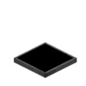

# Screen Module



Screens share the ID namespace with normal modules, and `getType()` returns `"screen"`. Screens support **text rendering** (cell/grid model) and **graphics drawing**.

The screen uses a **cell model** (LCD framebuffer semantics):

- **The text layer is a fixed-size cell array**: first call `setGrid(cols, rows)` to set the grid size; cells fill the screen's inner area. Each cell = character + foreground colour + background colour, **writing overwrites the cell** (one value per position forever, no overlapping quads), and the content size is fixed — it never grows over time.
- **Cursor-based positioning**: `setCursorPos(col, row)` (1-based, CC:T style); `write` fills cells from the cursor.
- **Background colour**: `fill` sets cell background colours in bulk; combined with `write` you get "colour block + text".
- **Full-screen batch transfer**: `draw(batch)` sends the whole screen in one call with **atomic replacement** (no clear+write intermediate-state flicker); when only one layer changes, `drawCells(batch)` / `drawShapes(batch)` replace just the text layer / graphics layer.
- **The graphics layer** (`drawRect`/`drawLine`/`drawCircle`/`drawPoint`) keeps **free positioning** (1/128 block coordinates) and **z layering**, not constrained by the grid, but only drawn inside the screen's drawable area.

## Operation
- **Place a screen**: right-click an empty cell as the anchor, then right-click another empty cell — the screen occupies the two cells to form a rectangular area (minimum 2×2).
- **Configure module**: hold a wrench and right-click the module, or sneak + right-click, to open the module config interface and configure properties such as module ID and tooltip
- **Remove module**: hold a wrench and sneak + right-click to remove the module


## Grid Layout

### screen.setGrid(cols, rows) / screen.getGrid()

Sets the screen's grid size (cols × rows, max 128×128); cells fill the screen's inner area and glyph size is derived from the grid (`cellW = inner width / cols`).
**Resetting clears the text layer** (CC:T resize semantics) and the cursor returns to `(1, 1)`.

Before any `setGrid` call, the default grid size (12 × 10) is used.

```lua
screen.setGrid(10, 6)
local cols, rows = screen.getGrid()   -- 10, 6
```

### screen.setTextScale(scale, lineSpacing?) / screen.getTextScale()

An **alias for `setGrid`** (old Lua programs calling it won't error): derives the grid size from the font size, equivalent to resetting the grid —
`cols = inner width / scale`, `rows = inner height / (scale × lineSpacing)`. Resetting also clears the text layer.

- `scale`: font size (MC pixels, 1px = 1/16 block)
- `lineSpacing`: optional, **cell height/width ratio** (line-spacing factor, default 1.2; pass 1.0 for square cells)

```lua
screen.setTextScale(0.35)            -- default ratio 1.2 (tall cells)
screen.setTextScale(0.35, 1.0)       -- square cells
screen.setTextScale(0.35, 1.5)       -- wider/flatter cells
local cols, rows = screen.getTextScale()   -- returns the grid size (same as getGrid)
```

### screen.getSize()

Returns the current grid size, identical to `getGrid()`, returning two values `cols, rows`.

```lua
local cols, rows = screen.getSize()
print(cols, rows)
```


## Text Rendering (Cell Model)

### screen.write(text)

Writes text cell by cell from the cursor position (supports `\n` line breaks, ignores `\r`). Each written character **overwrites its cell** (character + current foreground colour) and the cursor advances one cell;
**the background colour stays unchanged** (`fill` colours are not overwritten by `write`, enabling "colour block + text").
At the end of a line, `setOverflowMode` applies (default `"wrap"`); writes after the last row are discarded.

```lua
screen.write("Hello\nCCPE")
```

### screen.writeField(col, row, width, text, align?, colour?)

**Writes text inside a fixed region** (for refreshing a fixed-width field every tick, e.g. clocks / counters). Writes `text` into a **single-row region** of `width` cells starting at `(col, row)`:

- cells in the region **not covered by the text are automatically cleared to spaces** (foreground colour = `colour`, or the one set by `setTextColour`) — e.g. write `"15"` one frame and `"6"` the next, and the tens cell clears itself;
- cell **background colours inside the region are kept** (`fill` colours are not cleared);
- everything outside the region stays untouched; the cursor position is unchanged.

`align` (optional, default `"left"`):

- `"left"`: flush left, empty on the right
- `"right"`: flush right, empty on the left (typical for numbers / clocks)
- `"center"`: centred in the region

`colour` (optional, `0xRRGGBB`): if given, the region's characters (including cleared cells) render in this colour; otherwise the colour set by `setTextColour` is used (white by default).

Text wider than the region is truncated: left/centre keep the start, right-align keeps the end (printf `%2s` style).

```lua
screen.writeField(1, 1, 2, "15", "right")          -- |15|
screen.writeField(1, 1, 2, "6",  "right")          -- | 6|  ← tens cell auto-cleared
screen.writeField(1, 2, 10, "LOADING", "center")   -- current foreground colour
screen.writeField(1, 3, 10, "ALERT", "center", 0xFF0000)  -- red
```

> **Tip**: `writeField` clears only the region's characters and keeps backgrounds — ideal for "number/text refreshing in place". Use `draw(batch)` to replace the whole screen (including shapes), or `drawCells` / `drawShapes` to replace one layer.

### screen.clear()

Clears the whole screen (cells + shapes + cursor), **keeping the grid size**.

### screen.setCursorPos(col, row) / screen.getCursorPos()

Sets/reads the cursor position (**cell coordinates, 1-based**, CC:T style; automatically clamped into the grid).
`getCursorPos` returns two values, `col, row`.

```lua
screen.setCursorPos(1, 1)          -- top-left cell
local col, row = screen.getCursorPos()
```

### screen.setTextColour(colour) / screen.getTextColour()

Sets/reads the foreground colour (0xRRGGBB, default `0xFFFFFF`), affecting characters written by subsequent `write` calls.

```lua
screen.setTextColour(0x00FF00)
```

### screen.setOverflowMode(mode) / screen.getOverflowMode()

Sets/reads how text overflowing one line width is handled:

| mode | Meaning |
|---|---|
| `"truncate"` | Truncate directly, discard the overflow |
| `"ellipsis"` | Truncate a bit more, append `"..."` |
| `"wrap"` | Wrap to the next line (default) |

```lua
screen.setOverflowMode("ellipsis")
```

### screen.setVisible(visible) / screen.getVisible()

Sets/reads the **render toggle** of the whole screen (default `true`):

- `false`: the **entire screen** (9-grid frame + cell content + shape layer) is **not drawn**, showing a blank panel;
- `true`: rendering is restored.

Cell content and all settings (what was written with `write`/`fill`/`draw`, `setTextColour`, etc.) are kept — the toggle only affects display. Handy for effects like "hide the screen while a button is pressed".

```lua
screen.setVisible(false)   -- hide the whole screen
screen.setVisible(true)    -- show it again
print(screen.getVisible()) -- true
```


## Filling (Background Colour)

### screen.fill(col, row, w, h, colour)

Sets cell **background colours** in bulk (solid fill, for segmented progress bars). Only changes background colours; characters and foreground colours stay unchanged.

- `col, row`: starting cell (1-based)
- `w, h`: width and height (cells, overflowing is clipped automatically)
- `colour`: colour (0xRRGGBB)

```lua
screen.fill(1, 1, 10, 1, 0xFF0000)   -- first 10 cells of row 1 get a red background
screen.write("Loading")              -- text drawn on top of the red
```

### screen.fillField(col, row, width, count, colour, align?)

**Fixed-width region fill** (for refreshing a segmented progress bar every tick): inside a **single-row region** of `width` cells starting at `(col, row)`, sets the first `count` cells' background to `colour` and **automatically clears the remaining cells in the region to transparent** (extra segments disappear when progress shrinks); everything outside the region and all characters stay unchanged.

- `col, row`: starting cell of the region (1-based)
- `width`: region width (cells, ≤ 0 does nothing)
- `count`: number of cells to fill (clamped to `[0, width]`; `0` clears the whole region)
- `colour`: fill colour (0xRRGGBB)
- `align`: alignment (optional, default `"left"`) — `"left"` flush to the start / `"right"` flush to the end / `"center"` centred

```lua
screen.fillField(1, 2, 10, 7, 0x00FF00, "left")   -- first 7 cells green, rest transparent
screen.fillField(1, 2, 10, 3, 0x00FF00, "left")   -- progress shrank: cells 4..10 auto-cleared
```

> **Tip**: `fillField` is an atomic background replacement of the region — fills `count` cells and clears the rest, ideal for per-tick progress bars that grow *and* shrink; `fill` only paints (never erases), best for one-time base colours.


## Full-Screen Batch Transfer

### screen.draw(batch)

**Sends the whole screen's cells and optional shapes in one call, with atomic full-screen replacement** (the server clears and rebuilds; the client receives a complete new frame, **no intermediate-state flicker**).
On a parse failure a Lua error is raised and the screen stays unchanged (no partial application).

`batch` is a Lua table with two sections:

- **`cells`**: one array per cell, `{col, row, char, fg?, bg?}` (col/row **1-based**; omitted `fg` uses the current foreground colour, omitted `bg` is transparent)
- **`shapes`** (optional): an array of shapes, each a table with a `type` field:
  - `{type = "rect", x, y, w, h, colour, solid?, lineWidth?, z?}`
  - `{type = "line", x1, y1, x2, y2, colour, lineWidth?, z?}`
  - `{type = "circle", cx, cy, radius, colour, solid?, lineWidth?, segments?, z?}`
  - `{type = "point", x, y, colour, z?}`
  - omitted `z` uses the current default layer (`setZIndex`)

```lua
screen.draw({
  cells = {
    {1, 1, "A", 0xFFFFFF, 0x000000},   -- cell (1,1): white text on black
    {2, 1, "B", 0xFF0000},             -- cell (2,1): red text, transparent bg
  },
  shapes = {
    {type = "rect", x = 0, y = 0, w = 8, h = 8, colour = 0x00FF00, solid = true},
  },
})
```

Calling `draw` once per tick gives a "one frame per tick" full-screen refresh with no intermediate states anywhere in the pipeline.

### screen.drawCells(batch)

**Replaces only the text layer** (cells + cursor), with atomic replacement semantics: the server clears the text layer and writes the given cells; **the graphics layer (rect/line/circle) stays unchanged**. On a parse failure a Lua error is raised and the text layer stays unchanged (no partial application).

The argument has the same shape as `draw`'s `cells` section (outer table is still `{cells = {...}}`): one array per cell, `{col, row, char, fg?, bg?}` (col/row **1-based**; omitted `fg` uses the current foreground colour, omitted `bg` is transparent).

Replacing clears all cells and resets the cursor to (1,1); cells you omit are blank.

```lua
screen.drawCells({
  cells = {
    {1, 1, "A", 0xFFFFFF, 0x000000},
    {2, 1, "B", 0xFF0000},
  },
})
```

### screen.drawShapes(batch)

**Replaces only the graphics layer** (rect/line/circle), with atomic replacement semantics: the server clears the graphics layer and writes the given shapes; **the text layer (cells + cursor) stays unchanged**. On a parse failure a Lua error is raised and the graphics layer stays unchanged (no partial application).

The argument has the same shape as `draw`'s `shapes` section (outer table is still `{shapes = {...}}`): an array of shapes, each a table with a `type` field (`rect` / `line` / `circle` / `point`), exactly as documented under `draw`.

```lua
screen.drawShapes({
  shapes = {
    {type = "rect", x = 0, y = 0, w = 8, h = 8, colour = 0x00FF00, solid = true},
  },
})
```

> **Tip**: update one layer per tick with `drawCells` / `drawShapes` when the other layer is static — each call is a single packet and never touches the other layer. Use `draw` when both layers change together (one call replaces both).


## Graphics Drawing (Free Positioning + z Layer)

Graphics use "screen-local coordinates": origin at the **top-left** of the drawable area, `x` right, `y` down, 1 unit = 1/128 block (`1px = 8 units`).
The graphics layer is not constrained by the grid, but is **only drawn inside the screen's drawable area**.

### screen.setZIndex(z) / screen.getZIndex()

Sets/reads the default layer used by subsequent `drawRect`/`drawLine`/`drawCircle`/`drawPoint` calls when no z is explicitly given (default 0, higher = more in front).
Only the graphics layer has z; the text layer (cells) has no z.

```lua
screen.setZIndex(2)
screen.drawRect(0, 0, 4, 4, 0xFF0000, true, 1)   -- uses default layer 2
```

### screen.drawRect(x, y, width, height, colour, solid, lineWidth, z?)

Draws a rectangle on the screen.

- `x, y`: top-left corner (1/128 block, 0 = left/top edge of the inner area, increasing right/down)
- `width, height`: width and height (1/128 block)
- `colour`: colour (0xRRGGBB)
- `solid`: `true` = filled, `false` = outline only
- `lineWidth`: line width (1/128 block, only applies to outlines)
- `z`: layer (higher = more in front, when omitted uses the default layer set by `setZIndex`)

```lua
screen.drawRect(0, 0, 2, 2, 0xFF0000, true, 1)        -- filled red square, default layer
screen.drawRect(1, 1, 1, 1, 0x00FF00, false, 0.2)     -- green outline, default layer
screen.drawRect(0, 0, 8, 8, 0x0000FF, true, 1, 5)     -- layer 5, on top of the others
```

### screen.drawLine(x1, y1, x2, y2, colour, lineWidth, z?)

Draws a line segment.

- `x1, y1` / `x2, y2`: start/end points (1/128 block)
- `colour`: colour (0xRRGGBB)
- `lineWidth`: line width (1/128 block)
- `z`: layer (higher = more in front, when omitted uses the `setZIndex` default layer)

```lua
screen.drawLine(0, 0, 8, 8, 0xFFFFFF, 0.5)
```

### screen.drawCircle(cx, cy, radius, colour, solid, lineWidth, segments?, z?)

Draws a circle (approximated with a regular polygon).

- `cx, cy`: center (1/128 block)
- `radius`: radius (1/128 block)
- `colour`: colour (0xRRGGBB)
- `solid`: `true` = filled circle, `false` = ring
- `lineWidth`: line width (1/128 block, only applies when `solid=false`)
- `segments`: approximation segments (default 32, minimum 3, more = rounder)
- `z`: layer (higher = more in front, when omitted uses the `setZIndex` default layer)

```lua
screen.drawCircle(8, 8, 4, 0xFFFF00, true, 1)          -- filled circle
screen.drawCircle(8, 8, 4, 0x00FF00, false, 0.2, 48)   -- 48-segment ring
```

### screen.drawPoint(x, y, colour, z?)

Draws a point (equivalent to a 1×1 unit filled rectangle).

- `x, y`: top-left coordinates (1/128 block)
- `colour`: colour (0xRRGGBB)
- `z`: layer (higher = more in front, when omitted uses the `setZIndex` default layer)

```lua
screen.drawPoint(4, 4, 0xFF0000)
```

### screen.clearRects()

Clears all drawn rectangles (does not affect text or other shapes).

### screen.clearShapes()

Clears all shapes (rectangles + lines + circles + points), does not affect the text layer.

!!! tip "Layer reminder"
    The larger the `z`, the more in front, but each +1 moves forward roughly 1/2048 block; **z around `[-1, 10]` is recommended**. Setting it too large will visibly separate layers and look wrong from the side.
