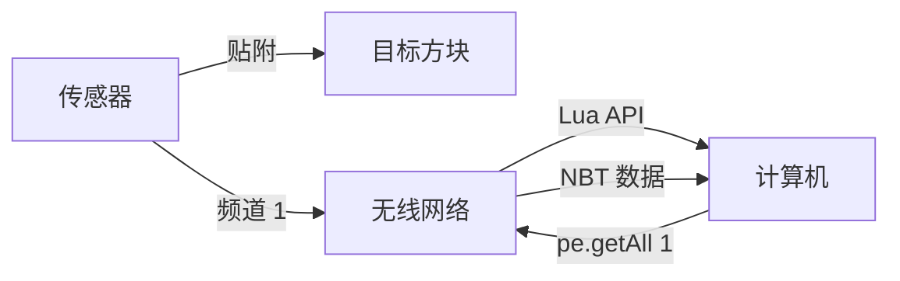

# 外设扩展器概述

外设扩展器（Peripheral Extender）是 CCPE 的核心组件，它打破了 CC:T 必须紧贴方块才能访问数据的限制。

## 核心特性

### 📡 无线数据读取
- 无需线缆连接
- 不限距离（默认配置）
- 实时数据刷新（50ms/tick）

### 🔌 多功能合一
一个传感器提供多种数据访问方式：

- **NBT 数据读取** — 读取方块的完整或部分 NBT 数据
- **外设代理** — 调用方块的 CC:T 外设方法
- **无线红石** — 发送和接收红石信号
- **导航桌集成** — 获取飞行器的位置和方位（需要 Simulated）
- **物理数据** — 读取速度、质量、姿态等物理信息（需要 Sable）

## 工作原理



1. 将传感器贴在目标方块上
2. 设置唯一的频道号
3. 在任意位置的计算机中通过频道号访问数据

## 使用场景

### 飞船自动驾驶
将传感器贴在导航桌上，实时获取位置和方位，实现自动导航。

### 仓储监控
在多个箱子上安装传感器，集中监控物品库存。

### 机械控制
读取 Create 机械装置的状态，动态调整红石信号或转速。

### 物理模拟
监控飞行器的速度、姿态，实现稳定控制系统。

## 性能特点

| 指标 | 数值 | 说明 |
|---|---|---|
| 数据刷新频率 | 50ms | 服务端每 tick 更新 |
| Lua 读取延迟 | ~0.02ms | 单次调用耗时 |
| 最大传感器数 | 65535 | 受频道号范围限制 |
| 传输距离 | 无限制 | 默认配置 |

!!! success "高频监控友好"
    即使需要每 tick 读取多个传感器的数据，性能开销也非常小。

## 快速开始

1. [安装与配置](../getting-started/installation.md)
2. [第一个脚本](../getting-started/first-script.md) — 5 分钟上手
3. [NBT 读取详细文档](nbt-reading.md)

## API 模块

外设扩展器的 Lua API 通过 `ccpe.pe` 模块提供：

```lua
local pe = require("ccpe.pe")

-- NBT 数据读取
local data = pe.getAll(channel)
local value = pe.get(channel, "path.to.field")

-- 外设代理
local peripheral = pe.getPeripheral(channel)

-- 无线红石
pe.setRedstoneOutput(channel, 15)
local signal = pe.getRedstoneInput(channel)

-- 导航桌（需要 Simulated）
local pos = pe.getNavTargetPos(channel)
local angle = pe.getNavRelativeAngle(channel)

-- 物理数据（需要 Sable）
local velocity = pe.getPhysicsVelocity(channel)
local mass = pe.getPhysicsMass(channel)
```

完整 API 参考：[Lua API 参考](api-reference.md)
