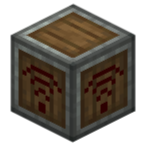

# Redstone Transceiver



Lets your computer directly read and send signals on the **Create Wireless Redstone Link network**, without needing to pile up wireless redstone terminals next to the computer.

Channel configuration is saved with Create's schematic system, but be careful about duplicate channels when deploying.

Each transceiver can be configured with multiple channels, and each channel is bound to one redstone frequency. The Lua side operates through the channel number:

!!! tip "Channels"
    These channels are unrelated to the [Peripheral Extender](../peripheral-extender/overview.md) channel numbers and do not interfere with each other.

---

## Redstone Signals

| Method | Description |
|---|---|
| `getRedstoneSignal(channel)` | Read the Create Redstone Link signal bound to the channel (0-15) |
| `setRedstoneSignal(channel, 0-15)` | Send a redstone signal to the Create network bound to the channel |

```lua
local r = peripheral.find("ccpe:redstone_transceiver")

-- Read the Create redstone network signal on channel 3
local signal = r.getRedstoneSignal(3)

-- Send a full-strength signal to the Create network on channel 7
r.setRedstoneSignal(7, 15)
```

---

## Channel Management

Besides configuring frequencies manually in-game, you can also manage channels directly from Lua:

| Method | Description |
|---|---|
| `setFrequency(channel, item1, item2)` | Create/modify the frequency items of a channel. When `item2` is empty it equals `item1`; when both are empty a new empty channel is created |
| `getFrequency(channel)` | Read the frequency item IDs of a channel, returns `{freq1=..., freq2=...}`; returns `nil` if the channel doesn't exist |
| `removeChannel(channel)` | Delete the specified channel |
| `getChannels()` | List all currently configured channel numbers |

```lua
local r = peripheral.find("ccpe:redstone_transceiver")

-- Create channel 7 with frequency items (redstone, redstone)
r.setFrequency(7, "minecraft:redstone")

-- Change channel 7's frequency to (redstone, stone) (prefix omitted, treated as minecraft:)
r.setFrequency(7, "minecraft:redstone", "stone")

-- Read the frequency items of channel 7
local freq = r.getFrequency(7)
print(freq.freq1, freq.freq2)

-- List all channels
for _, ch in ipairs(r.getChannels()) do
    print("channel: " .. ch)
end

-- Delete channel 7
r.removeChannel(7)
```
