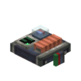

# 航空集成计算机（AIC）

**航空集成计算机**（`ccpe:aic`）是装在物理体（Sable sub-level）上的航电方块。透明陀螺仪内部有一个罗盘，重力让它保持水平，指北扭矩让它对准北方（与[惯性导航系统](ins.zh.md)相同的重力摆模拟；非自然维度中罗盘不指北，改为随机游走）。

## INS + FMC 双门控

AIC 同时算作 **INS 和 FMC**，用于 `ccpe.sensor_system` 门控：物理体（含约束链）上装有 **≥1 个 AIC** 即视为同时装有 INS 和 FMC。

在 `getSensors()` 中，一个 AIC 会在同一位置出现**两个条目**：`{type="ins", pos={x,y,z}, pos_rel={x,y,z}}` 和 `{type="fmc", pos={x,y,z}, pos_rel={x,y,z}}`。

方法完整说明见[惯性导航系统](ins.zh.md)与[飞行管理计算机](fmc.zh.md)页面。

