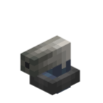

# 皮托管



>皮托管由法国工程师亨利·皮托（Henri Pitot）于 1732 年发明，最初用于测量水流速度，如今是航空、F1 赛车、无人机与气象观测中最常见的测速装置之一。

>皮托管测量的是**总压**（迎面气流的滞止压力 = 动压 + 静压），管口必须正对气流方向；用总压减去静压孔测得的静压，再经伯努利方程换算即得空速：v = √(2·(总压−静压)/ρ)。


**皮托管**（Pitot Tube，`ccpe:pitot_tube`）是一个贴附式、**方向性**的速度传感器方块。装在物理体（Sable sub-level）上时，物理体上的 CC:Tweaked 电脑可以通过 `ccpe.sensor_system` 读取**沿管口轴线的速度分量**——包括对地速度与空速。

皮托管**只测量沿管口轴线方向的速度分量**，返回**有符号**标量（正 = 朝管口方向运动，即气流从管口进入；负 = 背向管口）。运动方向与管口成 90° 时读数 ≈ 0——请把管口对准想要测量的方向。

!!! note "带符号读数是本模组的便利设计"
    现实中的皮托管-静压系统只能测量空速的**大小**——完全无法区分气流是从正前方还是正后方吹来。这里的符号是本模组为了方便脚本区分方向而故意加的（正 = 朝向管口），现实中并无对应物。

## 朝向（24 态）

皮托管的朝向由两个方块状态属性表达：

| 属性 | 取值 | 含义 |
|---|---|---|
| `facing` | 6 向 | 模型**顶面**朝向；放置时 = **点击面** |
| `roll` | 0–3 | 绕顶面法线的滚转（0°/90°/180°/270°） |

- **放置**：右键某个面——`facing` = 点击面，`roll` = 0。管子贴附在其背后（`facing` 反方向）的方块上，支撑方块被拆掉会掉落。
- **扳手**：右键模型的**顶面**（`facing` 方向的面）时，管子绕该面旋转（`roll` +1，`facing` 不变）；右键其它面不旋转。
- 24 种组合覆盖管口的全部朝向——用扳手（配合选择框）把管口转到你想测量的方向。

## 读数基准

`speed`/`air_speed` 的读数基准是**皮托管自身的位置**：

- 速度 = 皮托管位置的**世界点速度**（含旋转贡献 ω×r；与 `simulated:velocity_sensor` 同算法），投影到**管口轴线**（该皮托管 24 态朝向，经物理体姿态转到世界）。
- 一个物理体可以放多个皮托管，每个皮托管都有自己独立的读数。
- 读数每 tick 刷新（最多滞后 1 tick）；Lua 读取零主线程调度，高频调用开销可忽略。

## 皮托管-静压门控

速度读数要求完整的**皮托管-静压系统**：物理体（含约束链）必须**同时**有 **≥1 个皮托管 且 ≥1 个静压孔**。缺任意一个时，`getSpeed()/getAirSpeed()` 返回 `nil`，`getSensors()` 中皮托管项的 `speed/air_speed` 也为 `nil`。

> 物理上，空速由总压（皮托管）与静压（静压孔）之差得出——只有皮托管没有静压孔，无法得出空速读数。

## Lua API

电脑（需与皮托管在同一物理体，含约束链）通过 `require("ccpe.sensor_system")` 使用：

| 方法 | 返回 | 说明 |
|---|---|---|
| `getSpeed()` | number / nil | **最后放置的皮托管**沿管口轴线的**对地速度**（m/s，有符号；正 = 朝向管口）。门控不满足时为 `nil` |
| `getAirSpeed()` | number / nil | 沿管口轴线的**空速**（m/s，有符号；相对空气，已减风速）。门控同上；仅在有风源时才与 `getSpeed()` 不同 |
| `getAverageSpeed()` | number / nil | 全部皮托管对地速度的**简单平均值**（m/s，沿各自管口轴线的有符号分量）。门控同上 |
| `getAverageAirSpeed()` | number / nil | 全部皮托管空速的**简单平均值**（m/s，沿各自管口轴线，相对空气）。门控同上 |
| `getSensors()` | table | 全部传感器快照（同一 tick）；皮托管项为 `{type="pitot_tube", pos={x,y,z}, pos_rel={x,y,z}, speed, air_speed}`（门控不满足时读数为 `nil`） |

共享方法（`isOnBody()`、`getBodyId()` 等）行为与[静压孔](static-port.zh.md)页面一致。

- **对地 vs 空速**：`getSpeed()` 用世界速度；`getAirSpeed()` 用**相对空气**的速度（`Sable.HELPER.getVelocityRelativeToAir`，已减风速）。Sable 本身不注册风——未装提供风的模组（如 PMWeather）时两者数值相同。
- **死区**：|读数| < 0.05 m/s 归零（静止 → 0）。
- 多个皮托管时，`getSpeed()/getAirSpeed()` 取**最后放置**的那个（注册顺序 = 放置顺序——见下方重启警告）；`getAverageSpeed()/getAverageAirSpeed()` 则平均**全部**皮托管（同一 tick 快照），不受顺序影响。

```lua
local ss = require("ccpe.sensor_system")

print("onBody:", ss.isOnBody())
print("沿管口对地速度:", ss.getSpeed())
print("沿管口空速:    ", ss.getAirSpeed())
print("全部皮托管平均对地速度:", ss.getAverageSpeed())
print("全部皮托管平均空速:    ", ss.getAverageAirSpeed())

local sensors = ss.getSensors()
for i, s in ipairs(sensors) do
    if s.type == "pitot_tube" then
        print(i, "pos:", s.pos.x, s.pos.y, s.pos.z,
              "speed:", s.speed, "air_speed:", s.air_speed)
    end
end
```

## 多个皮托管

每个皮托管有自己独立的 `speed/air_speed` 读数（同一 tick 快照）。`getAverageSpeed()/getAverageAirSpeed()` 直接给出全部皮托管的简单平均值（皮托管-静压门控不满足时为 `nil`）。要读**特定**皮托管请用 `getSensors()`：

```lua
local sensors = ss.getSensors()
for _, s in ipairs(sensors) do
    if s.type == "pitot_tube" and math.abs(s.pos_rel.y - 2) < 0.5 then
        print("该皮托管空速:", s.air_speed)
    end
end
```

!!! warning "服务器重启后 `getSpeed()/getAirSpeed()` 可能指向不同的皮托管"
    如果物理体上只有一个皮托管，不需要在意此条警告

    `getSpeed()/getAirSpeed()` 返回**最后放置**的皮托管的数据，其判定依据是注册顺序（= 放置顺序），该顺序**只在当前会话内有效**。服务器重启后，皮托管按区块加载顺序重新注册，这两个方法**可能指向另一个皮托管**，且每次重启之间指向也可能不同。

    如果脚本需要稳定地读取**特定**皮托管，请使用 `getSensors()` 按 `pos_rel`（相对当前电脑的局部坐标）区分——`pos`（相对物理体原点）会在物理体上增删方块时随原点（质心）漂移。
