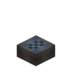

# Static Port

> A lightweight and intelligent way to read aviation data



The **Static Port** (`ccpe:static_port`) is an attachable pressure-sensor block. When installed on a physics body (Sable sub-level), CC:Tweaked computers on that body can read the pressure and altitude at the static port's own position via `ccpe.sensor_system`.

## Reading reference point

`ccpe.sensor_system` reads at the **static port's own position** (not the physics body origin):

- Each static port: project its plot position to world → altitude (world Y) and pressure (Sable `DimensionPhysicsData`, same formula as `simulated:altitude_sensor`; sea level = 1.0) at that point.
- A body can have multiple static ports, each with its own independent readings.

## Lua API

A computer on the same physics body (including constraint chains) uses `require("ccpe.sensor_system")`:

| Method | Returns | Description |
|---|---|---|
| `isOnBody()` | boolean | Whether the computer is on a physics body |
| `getBodyId()` | string / nil | UUID of the containing physics body |
| `getSensors()` | table | Snapshot of all sensors (same tick): `{type, pos={x,y,z}, pos_rel={x,y,z}, altitude, pressure}`; `pos` is relative to the **physics body origin**, `pos_rel` is relative to the **current computer** (recommended for telling ports apart) |
| `getAltitude()` | number / nil | Altitude (world Y) of the **most recently placed** static port |
| `getPressure()` | number / nil | Pressure of the **most recently placed** static port (atmosphere fraction, sea level = 1.0) |
| `getAverageAltitude()` | number / nil | **Simple average** altitude over all static ports |
| `getAveragePressure()` | number / nil | **Simple average** pressure over all static ports |
| `getWeightedAltitude()` | number / nil | **Distance-weighted average** altitude (weight = 1/distance from the body origin, IDW) |
| `getWeightedPressure()` | number / nil | **Distance-weighted average** pressure (weight = 1/distance from the body origin, IDW) |

- With no static port on the body, `getAltitude()/getPressure()` return `nil` and `getSensors()` returns an empty array; the average / weighted-average methods also return `nil`.
- Readings refresh once per tick (at most 1 tick stale); Lua reads perform zero main-thread scheduling, so high-frequency calls are effectively free.
- Weighted-average edge cases: a port exactly at the body origin (distance ≈ 0) has infinite weight, so its reading is returned directly; with a single port, the average / weighted average equal that port's reading.

```lua
local ss = require("ccpe.sensor_system")

print("onBody:", ss.isOnBody())
print("bodyId:", ss.getBodyId())

local sensors = ss.getSensors()
for i, s in ipairs(sensors) do
    print(i, s.type,
          "pos:", s.pos.x, s.pos.y, s.pos.z,
          "pos_rel:", s.pos_rel.x, s.pos_rel.y, s.pos_rel.z,
          s.altitude, s.pressure)
end

-- Convenience: most recently placed static port
print("alt:", ss.getAltitude(), "press:", ss.getPressure())

-- Averages / distance-weighted averages (weight = 1/distance from body origin)
print("avg alt:", ss.getAverageAltitude(), "avg press:", ss.getAveragePressure())
print("wavg alt:", ss.getWeightedAltitude(), "wavg press:", ss.getWeightedPressure())
```

## Multiple static ports

A body can carry several static ports, each with independent `altitude/pressure` readings (same-tick snapshot, e.g. for differential-pressure math):

```lua
local sensors = ss.getSensors()
if #sensors >= 2 then
    print("pressure difference:", sensors[1].pressure - sensors[2].pressure)
end
```

!!! warning "After a server restart, `getAltitude()/getPressure()` may point at a different static port"
    If the body has only one static port, this warning does not apply.

    `getAltitude()/getPressure()` return data from the **most recently placed** static port, determined by registration order (= placement order), which is only valid **within the current session**. After a server restart, static ports re-register in chunk-load order, so these two methods **may point at a different static port**, and the target may differ between restarts.

    If your script must reliably read a **specific** port, use `getSensors()` and identify it by `pos_rel` (position relative to the current computer) — `pos` (relative to the body origin) drifts when blocks are added to or removed from the body, since the origin (center of mass) moves:

    ```lua
    local sensors = ss.getSensors()
    for _, s in ipairs(sensors) do
        if math.abs(s.pos_rel.y - 2) < 0.5 then  -- e.g. the port 2 blocks above the computer
            print("that port's pressure:", s.pressure)
        end
    end
    ```
